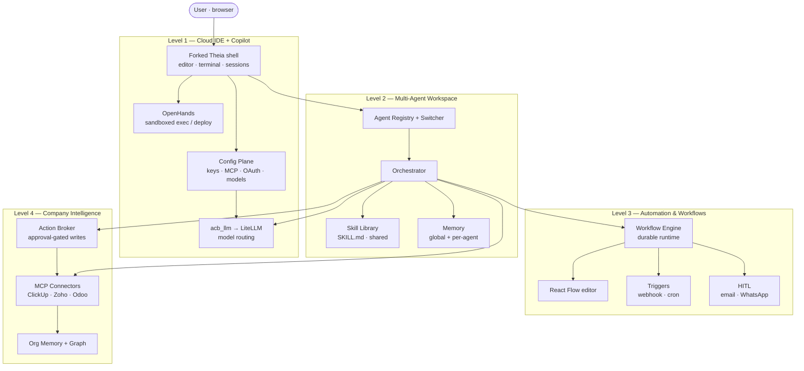

# Project Plan — Jannet.AI

> **Organisation:** Fracktal Works · **Product:** Jannet.AI · **Date:** 2026-05-31 · **Version:** 1.0

---

## 1. Overview

**Jannet.AI** is a self-hosted, browser-accessible **agent platform**. At its base it is a cloud IDE that feels like VS Code with copilots; on top of that it becomes a multi-agent workspace, then an automation engine, then a company co-pilot that reasons over the organisation's own data.

The platform is built **top-down in four levels**, each independently valuable and demoable. This is both the dependency chain and the build order — a usable IDE first, multi-agent on top, automation on top of that, company intelligence last.

```
Level 4 — Company Intelligence   Agentic layer over ClickUp/Zoho/Odoo + org memory; the "company co-pilot"
Level 3 — Automation & Workflows Agent-native workflow engine; triggers (webhook/schedule); HITL over email/WhatsApp
Level 2 — Multi-Agent Workspace  Many named agents, switchable; create agents + skills; shared skills; long-term memory
Level 1 — Cloud IDE + Copilot    Browser IDE (Theia) + copilot UX + config plane (keys, MCP, OAuth, models) + sessions
```

There is no fixed calendar deadline; **level gates** control progression. Each level ships behind a demo against its success criteria. **L1 — a usable cloud IDE with a config plane — is the first shippable milestone.**

---

## 2. Platform decisions

These decisions are fixed for v1.0 and govern all four levels.

| # | Decision | Rationale |
|---|---|---|
| PD-01 | **IDE shell = Eclipse Theia**, forked into this repo. Customisation is delivered as Theia *extensions*; core is patched only when an extension genuinely cannot reach. | Theia is a framework purpose-built for building custom IDEs: browser-native, VS Code-grade UX, Open VSX extension support, and already AI-native (Agent Skills, custom agents, MCP, model selection). Extensions-first keeps us upgradeable instead of stuck on a permanent rebase treadmill. |
| PD-02 | **OpenHands = sandboxed execution backend**, not the shell. | OpenHands is an agent-primary runtime that writes/compiles/deploys code safely. It is the muscle behind the IDE, not the human-facing surface. |
| PD-03 | **Workflows are agent-native**, run on a durable engine, with **one execution model**. | A Jannet.AI workflow is "run these agents/skills in this order, with these triggers and human-in-the-loop steps." Orchestration is agent-native end to end — no second, integration-native runtime. |
| PD-04 | **Workflow specs live in Git**, executed on a durable runtime, and are **visualised/edited on a React Flow (`@xyflow`) canvas** embedded in the Theia shell. | Git stays the source of truth. The canvas is for composing and operating workflows and dropping existing skills/agents onto nodes. The durable-execution engine (LangGraph vs Temporal vs Windmill) is chosen at the L3 design gate. |
| PD-05 | **Integrations via MCP servers + skills first.** | MCP is the agent-native universal integration layer for ClickUp/Zoho/Odoo and beyond. |
| PD-06 | **Git is the source of truth** for every agent-editable artefact — agent definitions, skills (`SKILL.md`), workflow specs, model-routing config. Promotion flows through PRs with an eval gate. | Versioned, reviewable, reversible. |
| PD-07 | **Anti-hallucination & approval-gating are first-class at L4**, where the platform touches real systems of record. | Citation enforcement, schema validation, authority tiers, and an Action Broker protect company data. |
| PD-08 | **No external agent framework at L1.** L1 ships on Theia AI (copilot/MCP/model selection) + OpenHands (execution) + `acb_llm` (routing). A multi-agent runtime (OpenClaw, CrewAI, LangGraph, AutoGen, Claude SDK) is adopted **later, at L2, behind a normalised adapter** — never as a foundation. | L1 is a single copilot and needs no fleet runtime. The runtime choice is genuinely open and is better made at L2/L3; an adapter keeps any one framework pluggable instead of load-bearing. Agent definitions stay framework-agnostic (Git-backed) so any runtime can consume them. |
| PD-09 | **Mission Control is prior art to borrow from, not a dependency.** Its operator surface (task board, activity feed, cost tracking), skills security scanner, quality-gate (sign-off) pattern, NL recurring tasks, framework-adapter pattern, and eval framework are absorbed **level by level**. Its SQLite/Next-only foundation is **not** adopted. | These are proven answers to "manage agents/tasks," map cleanly onto L2–L4, and are MIT-licensed. Our foundation (Postgres + Theia + Python) is a deliberate, different choice. |

### Prior art — Mission Control (what to borrow, and when)

[Mission Control](https://github.com/builderz-labs/mission-control) is an open-source (MIT) **operator dashboard for AI agent fleets** — it *manages and dispatches* agents but does **not author/create** them. It is complementary to Jannet.AI, which *builds* agents (L1–L2) and *reasons over company data* (L4). We borrow its operator patterns, mapped to our levels:

| Borrow | Maps to | Adopt at |
|---|---|---|
| Framework **adapter pattern** (normalise any runtime to one interface) | L2 agent registry / runtime | L2 (PD-08) |
| **Task board** (Kanban: inbox → assigned → in-progress → review → quality-review → done) + activity feed | L2/L3 operator surface | L2–L3 |
| **Cost / token tracking** dashboard | cross-cutting | as early as L1 (cheap, high value) |
| **Skills Hub + security scanner** (prompt-injection / secret-leak / dangerous-shell scan before install) | `acb_skills` + `SKILL.md` | L2 |
| **Quality gates** (sign-off before a task is "done") | Action Broker + authority tiers | L3–L4 |
| **Natural-language recurring tasks** ("every morning at 9am" → cron) | triggers | L3 |
| **Agent eval framework** (output / trace / component / drift) | `evals/` | ongoing |

---

## 3. Repository layout

The active platform (L1–L2) lives at the repo root. The Level-4 company-intelligence subtree is self-contained under `level4/` and comes online when L4 work begins.

```
ide/                     L1 — forked Theia shell (browser app + custom extensions)
packages/                Active shared Python packages (acb_common, acb_schemas, acb_llm,
                         acb_audit, acb_auth, acb_skills)
skills/                  Skill registry (SKILL.md convention) + examples + upstream sync
deploy/openhands/        OpenHands execution backend
infra/                   LiteLLM, Langfuse, Postgres, docker-compose
evals/                   Promptfoo + Inspect AI eval harness
workbench/control_plane/ Next.js admin surface (config-plane candidate)
tests/                   Platform tests
ai-company-brain/        Planning + design docs (this plan, PRD, architecture, etc.)
level4/                  Shelved company-brain subtree (apps, acb_graph, company skills,
                         scripts, tests, n8n workflows) — reused at Level 4
```

---

## 4. Scope & objectives

### 4.1 In scope (platform v1 = L1 → L4)

- **L1 — Cloud IDE + Copilot.** Forked Theia browser IDE; editor + terminal; chat/session management; `AGENTS.md` + `SKILL.md` awareness; code write/compile/deploy via OpenHands; a **config plane** for API keys, MCP servers, OAuth tokens, and per-agent model selection (backed by `acb_llm`/LiteLLM).
- **L2 — Multi-Agent Workspace.** Agent registry + agent switcher (switching agent switches workspace/context); agent creation UI; skill authoring + sharing across agents; global and per-agent long-term memory; self-healing (an agent detects/repairs its own broken skills or retries failed steps).
- **L3 — Automation & Workflows.** Agent-native, durable workflow engine; webhook + cron triggers; autonomous multi-agent runs; human-in-the-loop pause/approve over email and WhatsApp; a **React Flow** visual editor embedded in Theia with skills/agents as draggable nodes.
- **L4 — Company Intelligence.** MCP-first connectors to ClickUp, Zoho, Odoo and other systems; org knowledge + long-term memory; intelligence capabilities — prioritise the user's day, build project plans, deploy tasks to ClickUp, understand team workload, assign by role/hierarchy, follow up on deadlines, escalate, and provide sales/BI insight with approval-gated writes.

### 4.2 Out of scope (platform v1)

- Customer-facing / external-party access (internal use only).
- Rebuilding the Theia editor surface from scratch (we extend, not rebuild).
- The Microsoft VS Code Marketplace (legally unavailable to any fork; Open VSX only).
- Autonomous writes to systems of record before authority tiers + the Action Broker land (L4).

### 4.3 Success criteria (per level)

- **L1:** A user opens Jannet.AI in a browser, authenticates, edits/compiles/runs code with copilot assistance, saves and reloads chat sessions, and configures models/MCP/keys/OAuth in the config plane — entirely self-hosted.
- **L2:** A user creates a new named agent and a new skill, shares that skill with a second agent, switches between agents (each with its own context/memory), and an agent recovers from a failed skill run without manual repair.
- **L3:** A user composes a workflow on the canvas by dropping existing skills/agents onto nodes, sets a webhook/schedule trigger, runs it autonomously, and the workflow pauses for human approval via email/WhatsApp and resumes on reply.
- **L4:** A user asks "what should I focus on today / what's the status of project X / who can take this task" and receives a cited, hierarchy-aware answer; the system drafts a project plan and (approval-gated) deploys tasks to ClickUp; follow-ups and escalations fire per deadline.

---

## 5. Requirements summary

Full functional + non-functional requirements live in the PRD: [`product_requirements.md`](product_requirements.md). High-level functional themes by level:

| Level | Theme | Key capabilities |
|---|---|---|
| L1 | Cloud IDE + Copilot | Browser IDE, editor/terminal, code exec/deploy (OpenHands), chat sessions, `AGENTS.md`/`SKILL.md` awareness, config plane (keys/MCP/OAuth/models) |
| L2 | Multi-agent workspace | Agent registry + switcher, agent/skill authoring, skill sharing, global + per-agent memory, self-healing |
| L3 | Automation & workflows | Workflow engine + spec format, webhook/cron triggers, React Flow editor, HITL over email/WhatsApp |
| L4 | Company intelligence | MCP connectors (ClickUp/Zoho/Odoo/…), org memory, prioritisation/delegation/follow-up/escalation, sales + BI co-pilot, approval-gated writes |

Non-functional requirements (latency, availability, cost ceilings, audit retention, privacy/DPDP compliance) are specified in the PRD.

---

## 6. Architecture (summary)



Detailed container/component diagrams, data models, and the L4 design (entity graph, reconciler, memory layers) live in [`system_architecture.md`](system_architecture.md) and are revised at each level's design gate.

---

## 7. Work plan by level

Effort is indicative (engineer-weeks, 2 engineers + AI assistance). A detailed WBS is regenerated per level at each level's design gate.

### Level 1 — Cloud IDE + Copilot (first shippable)

| WP | Work package | Notes |
|---|---|---|
| 1.1 | Forked Theia: reproducible browser build + self-host deploy | Discipline: extensions over core patches |
| 1.2 | Branding/shell extension (Jannet.AI workbench) | Theia extension, not core fork |
| 1.3 | Wire model selection to `acb_llm`/LiteLLM | Reuse existing routing |
| 1.4 | **Config Plane**: secrets-aware UI for API keys, MCP servers, OAuth tokens, model routing | The L1 differentiator |
| 1.5 | OpenHands integration for write/compile/deploy from the IDE | Reuse `deploy/openhands/` |
| 1.6 | Chat + session management (save/restore typed sessions) | Theia AI sessions extended |
| 1.7 | `AGENTS.md` + `SKILL.md` loading from the workspace | Theia AI Agent Skills + our `skills/` |
| 1.8 | Open VSX extension support verified; auth (SSO) + reverse proxy | Self-host hardening |
| 1.9 | L1 design gate + demo | Exit = §4.3 L1 criteria |

### Level 2 — Multi-Agent Workspace

| WP | Work package |
|---|---|
| 2.1 | Agent registry + data model (agent = persona + skills + memory + model policy) |
| 2.2 | Agent switcher UX (switch agent ⇒ switch workspace/context) |
| 2.3 | Agent creation UI + agent definition format (Git-backed) |
| 2.4 | Skill authoring + **skill sharing across agents** |
| 2.5 | Memory layers: global store + per-agent long-term memory |
| 2.6 | Self-healing: failed-step retry + agent-repairs-own-skill loop |
| 2.7 | L2 design gate + demo |

### Level 3 — Automation & Workflows

| WP | Work package |
|---|---|
| 3.1 | **Workflow spec format** (declarative, Git-versioned beside skills) |
| 3.2 | **Durable workflow engine** (LangGraph vs Temporal vs Windmill — decided at gate) |
| 3.3 | Triggers: webhook receiver + cron scheduler |
| 3.4 | **React Flow** visual editor embedded in Theia; skills/agents as nodes |
| 3.5 | HITL steps: durable "wait for signal" over email + WhatsApp; resume on reply |
| 3.6 | Autonomous multi-agent run execution + run history/observability |
| 3.7 | L3 design gate + demo |

### Level 4 — Company Intelligence

| WP | Work package |
|---|---|
| 4.1 | MCP connectors (ClickUp, Zoho, Odoo) — ingest into org memory/graph |
| 4.2 | Org knowledge graph + long-term org memory (`level4/packages/acb_graph`) |
| 4.3 | Reconciler + Action Broker (approval-gated writes) — `level4/apps/reconciler`, `level4/apps/action_broker` |
| 4.4 | Authority tiers (read / suggest / suggest+apply / autonomous) |
| 4.5 | Intelligence skills: prioritise day, build project plan, deploy to ClickUp, assign by role/hierarchy, follow-up, escalate |
| 4.6 | Sales + BI co-pilot skills |
| 4.7 | Anti-hallucination guardrails (citations, schema validation) at company scale |
| 4.8 | L4 design gate + v1.0 release |

---

## 8. Milestones

| ID | Milestone | Definition |
|---|---|---|
| M1 | **L1 live** | Self-hosted Theia IDE in browser, copilot + config plane + OpenHands exec; sessions persist |
| M2 | **L2 live** | Create/switch agents, author + share skills, per-agent memory, self-healing |
| M3 | **L3 live** | Visual workflow editor + durable engine + webhook/cron triggers + email/WhatsApp HITL |
| M4 | **L4 live (v1.0)** | Company co-pilot over ClickUp/Zoho/Odoo with approval-gated writes, prioritisation, delegation, follow-up, escalation, sales/BI |

No fixed calendar dates; each milestone is a level gate with a demo against §4.3 criteria.

---

## 9. Resource plan

| Resource | Allocation |
|---|---|
| Engineer A | ~80%; primary on Theia shell/extensions, config plane, workflow engine |
| Engineer B | ~80%; primary on agent registry, skills, memory, L4 connectors |
| Founder / sponsor | ~2 hrs/week reviews, level gates, policy |
| External | LLM API spend (within cap; prompt caching); VM(s) for Theia + OpenHands; GitHub for repos + CI |

---

## 10. Risks (top)

| ID | Risk | Strategy |
|---|---|---|
| R-A | Theia fork drift — deep core patches make upstream merges painful | Deliver as extensions; patch core only when forced; track the patch set; periodic upstream merge |
| R-B | Two-runtime creep — re-introducing a second execution model | Hold the line: one agent-native engine; workflows are specs over the orchestrator |
| R-C | Open VSX gap — a needed extension only runs on true VS Code internals | Accept ~95–98% compatibility; port the rare extension or run a `code-server` sidecar as escape hatch |
| R-D | L1 scope creep into "rebuild VS Code" | Adopt Theia as-is; differentiate only in config/agent/skill/workflow layers |
| R-E (L4) | Unauthorised writes to systems of record | Action Broker + authority tiers + rollback + kill switch |
| R-F (L4) | Hallucination at company scale | Citation enforcement + schema validation + second-pass verify |
| R-G (L4) | Privacy / DPDP compliance | Consent policy, retention limits, RBAC, audit |

Full register: [`risk_register.md`](risk_register.md).

---

## 11. Quality plan

- **Per-PR (skills/agents/workflows):** eval gate (Promptfoo + Inspect AI) on the changed skill/agent; no skill merges without at least one golden case; workflow specs validated against schema.
- **Per-level gate:** demo against §4.3 criteria; for L4, reconciler stable 7+ days and cost within budget.
- **Continuous:** self-hosted Langfuse traces sampled weekly; per-skill success rate dashboarded; self-healing/retry metrics tracked.
- **Theia fork hygiene:** patch set reviewed each upstream bump; extensions preferred; core-patch count is a tracked metric.

---

## 12. Open questions (settle at the L1 design gate)

1. **Config plane storage** — where secrets/keys/OAuth tokens live at rest (vault choice) and how the AI consumes them safely.
2. **Workflow engine choice (L3)** — LangGraph vs Temporal vs Windmill; recommendation made at the L3 gate.
3. **Config plane vs `workbench/control_plane`** — absorb the existing Next.js control plane as the config/admin surface, or rebuild as a Theia view.
4. **LLM monthly cost ceiling** — confirm budget envelope (drives model-routing tiers).
