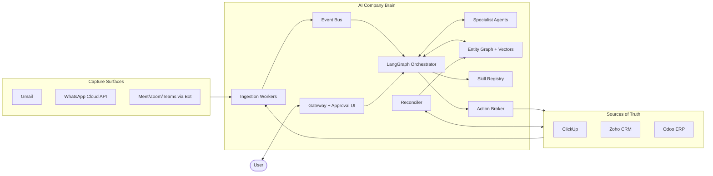

# Project Plan — AI Company Brain

> **Organisation:** Fracktal Works · **Project Slug:** `ai-company-brain` · **Author:** Technical Project Planner (DOE Framework agent) · **Date:** 2026-05-25 · **Version:** 0.4 (Workflow Editor pane + pervasive AI chat in every Control Plane pane, pre-PDR)

---

## 1. Executive Summary

The **AI Company Brain** is an internal operating system for Fracktal Works: a self-improving, multi-agent layer that mirrors ClickUp, Zoho CRM, and Odoo ERP; captures email, WhatsApp, and meeting context; and helps the ~20-person company stay coordinated through pull queries, push notifications, and ambient automation.

Three architectural principles are non-negotiable:

1. **ClickUp/Zoho/Odoo remain the source of truth.** The brain is a read-mostly mirror with approval-gated writes.
2. **Anti-drift by construction.** Every external system has a nightly reconciler that escalates any divergence — no silent disagreement is tolerated.
3. **Annealable.** Following the [Hermes Agent](https://github.com/nousresearch/hermes-agent) pattern (Nous Research, Feb 2026), the system mines its own audit log for repeated human interventions and crystallises them into reviewed, gated skills.

The plan is delivered iteratively in **six phases over ~12 months** with two engineers + AI assistance. MVP (cited Q&A over ClickUp) lands in ~2 months; first proactive value (push + ambient) in ~5 months; v1.0 with full scope in ~12 months. There is no hard deadline; phase gates control progression.

---

## 2. Scope & Objectives

### 2.1 In Scope (v1.0)

- Mirror of ClickUp, Zoho CRM, and Odoo ERP into a unified entity graph (People · Projects · Tasks · Deals · Customers · Goals · Meetings · Messages).
- Ingestion from internal Gmail, internal WhatsApp Business community, and meetings (Google Meet / Zoom / Teams via a bot that joins on invite).
- Pull, push, and ambient interaction modes.
- Specialist agents: Sales, Delivery, HR/Utilization, Strategy, Triage.
- Suggest+Apply write authority by default, per-action authority tier configurable up to autonomous.
- Tiered LLM routing (classify → extract → reason) for cost control.
- Hermes-style annealing loop for self-improvement under human-reviewed gating.
- Nightly reconciliation with escalation queue.

### 2.2 Out of Scope (v1.0)

- Customer-facing chat or external-party access.
- Full RBAC beyond executive vs employee (deferred to v2).
- Autonomous Odoo writes (read-only in v1).
- Per-user time tracking (utilization derived from ClickUp stage staleness instead).
- Non-English language processing beyond English/Hindi (Fracktal's working languages).

### 2.3 Success Criteria

- Executive can ask "status of customer X / project Y / person Z" and receive a cited answer in under 10 seconds.
- Stale ClickUp tasks (no stage change beyond per-stage threshold) reach the owner via WhatsApp/email within 24 hours.
- Meeting action items are drafted into ClickUp with ≥90% assignee-resolution accuracy.
- Reconciler shows zero silent drift over 30 consecutive days at v1.0.
- LLM cost stays within agreed monthly budget (set at PDR).
- At least three annealed skills in production by M6 with documented success rate.

---

## 3. Requirements Summary

### 3.1 Functional Requirements

| ID | Requirement |
|---|---|
| FR-01 | Mirror ClickUp tasks, projects, kanban stages, and stage-transition timestamps. |
| FR-02 | Mirror Zoho CRM deals, contacts, activities, owners, and stages. |
| FR-03 | Mirror Odoo ERP MO/PO/inventory/finance entities (read-only v1). |
| FR-04 | Ingest internal Gmail via domain-wide delegation + Pub/Sub. |
| FR-05 | Ingest WhatsApp Business community messages via Meta Cloud API. |
| FR-06 | Auto-join any meeting where `agent@fracktal.in` is invited; transcribe + diarise. |
| FR-07 | Pull mode: cited Q&A over the unified graph. |
| FR-08 | Push mode: targeted notifications via WhatsApp/email per user preferences. |
| FR-09 | Ambient mode: event-driven workflows (stale task, quiet deal, sentiment-flagged email). |
| FR-10 | Suggest+Apply ClickUp task creation from meeting action items. |
| FR-11 | Suggest+Apply Zoho follow-up email drafts. |
| FR-12 | Per-action authority tier configurable: read / suggest / suggest+apply / autonomous. |
| FR-13 | Nightly reconciler diffs graph vs each source; escalates ambiguities. |
| FR-14 | Annealer mines audit log; drafts skills; maintainer-approved; gated rollout. |
| FR-15 | Strategy agent generates weekly digest covering deals, delivery, utilization, hiring/firing signals. |

### 3.2 Non-Functional Requirements

| ID | Requirement | Target |
|---|---|---|
| NFR-01 | Pull latency p50 | < 5 s |
| NFR-02 | Pull latency p95 | < 15 s |
| NFR-03 | Ambient trigger to push delivery | < 5 min |
| NFR-04 | Graph staleness vs source (event-driven path) | < 60 s |
| NFR-05 | Reconciler runtime (nightly) | < 30 min |
| NFR-06 | Action-item assignee-resolution accuracy | ≥ 90% |
| NFR-07 | Hallucination rate (claims without valid citation) | < 1% |
| NFR-08 | System availability (business hours IST) | ≥ 99% |
| NFR-09 | Monthly LLM cost | within budget set at PDR |
| NFR-10 | Audit log retention | ≥ 1 year |
| NFR-11 | Raw transcript / message body retention | configurable, default 90 days |

### 3.3 Constraints

- Team: 2 engineers + AI assistance.
- Internal use only; data stays within company control or named third-party processors (Anthropic, OpenAI, Meta, etc.). All other components (orchestration, inference, memory, observability, meeting bot) are self-hosted OSS.
- Source systems (ClickUp, Zoho, Odoo) remain authoritative; the brain must not corrupt them.
- Iterative build; no hard release date; phase gates govern progression.
- **Git is the single source of truth for every agent-editable artefact** (directives, sub-agent prompts, skills, LiteLLM router config, n8n workflow JSON, Langfuse dataset definitions). All edits flow through PRs with an eval gate. No live-editing of running prompts outside the Skill Workbench (ADR-015).
- **Skill format = Anthropic `SKILL.md`** (ADR-013). Skills are versioned in a dedicated repo (`ai-company-brain-skills`) and may be drafted by humans *or* by the Annealer sub-agent.

### 3.4 Regulatory & Compliance

- Indian DPDP Act (Digital Personal Data Protection Act, 2023) for employee data handling.
- Written employee consent and policy required before Phase 1 ingestion of email/WhatsApp.
- Quarterly access audit; encryption at rest and in transit; retention policy enforced.

---

## 4. Research Findings (Summary)

Full detail in `research_summary.md`. Highlights:

- **Orchestration:** LangGraph as the substrate; Deep Agents v0.6.3 (langchain-ai/deepagents, MIT) as the batteries-included harness providing sub-agents, HITL, Skills, context management, and MCP support on top of LangGraph (ADR-001).
- **Annealing:** Hermes Agent (Nous Research, MIT, Feb 2026) is the reference *pattern* for self-improving skill loops. We adopt the pattern (audit-log mining → skill draft → maintainer approval → gated rollout), not the code, and implement it as a Deep Agents Annealer sub-agent in Phase 4 (~5 ew vs 10 ew without Deep Agents).
- **Memory:** Three-layer: (1) Postgres + pgvector + Apache AGE for the entity graph (ADR-002); (2) Mem0 (Apache-2.0) for episodic/per-user memory; (3) Graphiti (Apache-2.0) for bi-temporal entity KG — both sit on top of Postgres, no new DB required.
- **Document/knowledge retrieval:** LightRAG (MIT) for self-hosted GraphRAG over internal docs when needed (Phase 5).
- **Meeting bot:** Vexa (Apache-2.0, github.com/Vexa-ai/vexa) from Day 1 — self-hosted on a dedicated 4 vCPU VM at ~€0.05–0.15/meeting (ADR-004 updated; Recall.ai removed).
- **LLM gateway:** LiteLLM (MIT) proxies all model calls; enables tiered routing, Anthropic/OpenAI prompt caching (50–90% cost cut), and unified observability without code changes.
- **LLM routing intelligence:** RouteLLM (Apache-2.0, lmsys) trained on logged traffic replaces hand-coded tier rules in Phase 3.5 (~1 ew).
- **Local inference:** vLLM (Apache-2.0) replaces Ollama in production; enables Automatic Prefix Caching (85–95% latency/cost savings on repetitive agent prompts) and 5–10× higher throughput. Qwen3-8B replaces Llama-3-8B as Tier-1 model (BFCL v3 tool-calling score mid-60s% vs high-40s% for Llama-3-8B).
- **Semantic cache:** GPTCache (MIT, Zilliz) in front of LiteLLM for 30–70% cost savings on repeated/near-duplicate triage queries.
- **Token compression:** LLMLingua-2 (MIT, CPU-only) post-processes long tool outputs before they enter model context; ~50–60% token reduction at >99% accuracy.
- **WhatsApp:** Meta Cloud API + n8n webhook ingestion; OpenBSP as fallback.
- **CRM/ERP integration:** MCP servers where available (ClickUp, Zoho, Odoo all have 2026 MCP servers); n8n for webhook pipelines and transformations.
- **Observability:** Langfuse (MIT, self-hosted via docker-compose on Postgres + ClickHouse) + OpenTelemetry via openllmetry SDK. LangSmith removed (ADR-009).
- **Guardrails:** Schema-validated outputs, citation enforcement, entity-resolution checks, second-pass verification, per-action authority tier.
- **Cost summary:** With prompt caching + semantic cache + LLMLingua-2 + RouteLLM + Qwen3 expanding Tier-1 share, projected LLM API spend is 10–20% of a naïve single-model deployment.
- **Skill format & ecosystem:** Anthropic Agent Skills (`SKILL.md` with YAML frontmatter) has emerged as the de-facto standard. Deep Agents reads it natively; the `anthropics/skills` repo and the community `VoltAgent/awesome-agent-skills` collection (1000+ curated skills) are pulled as upstreams (ADR-013).
- **Skill Workbench:** Self-hosted online control plane backed by **OpenHands** (Apache-2.0, top-ranked OSS coding agent) plus a custom **Next.js** UI using **CopilotKit + AG-UI Protocol** for chat and the **LangGraph Agent Inbox** pattern for HITL queues. **Four panes:** (1) Chat / Agent Inbox · (2) Skill Studio (Monaco + OpenHands + Promptfoo runner) · (3) Observability (Langfuse embed) · (4) **Workflow Editor (n8n embed)** — full visual canvas, active/inactive toggle, execution log (ADR-014, ADR-018).
- **Pervasive AI chat:** CopilotKit `useCopilotReadable` injects each pane’s current context (open skill YAML, Langfuse trace, n8n workflow JSON) into a floating chat overlay in every pane. Pane 1 (Chat) is fully usable standalone. Slash commands like `/explain`, `/improve`, `/why did this fail` work in-context from any pane (ADR-019).
- **Sandbox runner:** Self-hosted **E2B** on Firecracker microVMs for code execution in both the workbench ("Try it" runs) and CI eval pipelines. Same runtime everywhere (ADR-016).
- **Skill regression evals:** **Promptfoo** (golden cases, regression diffs) + **Inspect AI** (UK AISI, graded scenario tests). Required pass to merge a skill PR (ADR-017).

See `references.md` for the full bibliography (~90 entries including the Skill Workbench stack).

---

## 5. System Architecture

Full detail in `system_architecture.md`. Summary diagram (Containers):

Key architecture decisions (ADRs in `system_architecture.md`):

- ADR-001 LangGraph + Deep Agents as orchestration substrate.
- ADR-002 Postgres + pgvector + Apache AGE for entity graph + vectors.
- ADR-003 External systems = source of truth; brain = read-mostly mirror.
- ADR-004 Vexa (Apache-2.0, self-hosted) as meeting bot from Day 1.
- ADR-005 Tiered LLM routing via LiteLLM + RouteLLM from day one.
- ADR-006 Skill annealing requires human approval gate.
- ADR-007 WhatsApp via Meta Cloud API + dedicated agent number.
- ADR-008 LiteLLM gateway + RouteLLM + Anthropic/OpenAI prompt caching.
- ADR-009 Langfuse (MIT, self-hosted) for LLM observability; LangSmith removed.
- ADR-010 vLLM as local inference runtime; Qwen3-8B as Tier-1 model.
- ADR-011 Mem0 + Graphiti for agent memory layers.
- ADR-012 GPTCache semantic cache + LLMLingua-2 output compression.
- ADR-013 Anthropic `SKILL.md` as the skill format; fork `anthropics/skills` + `VoltAgent/awesome-agent-skills` as upstreams.
- ADR-014 Skill Workbench = self-hosted OpenHands + Next.js control plane (CopilotKit + AG-UI + Agent Inbox).
- ADR-015 Git is the source of truth for every editable agent artefact; PR + eval gate required for promotion.
- ADR-016 Self-hosted E2B (Firecracker) as the sandbox runtime for workbench "Try it" and CI evals.
- ADR-017 Promptfoo + Inspect AI for skill regression evals; CI-gated.
- ADR-018 n8n UI embed as Workflow Editor (Pane 4 of the Control Plane); iframe of self-hosted n8n; full workflow canvas + active/inactive + execution log in-browser.
- ADR-019 Pervasive AI chat via CopilotKit `useCopilotReadable`; context-aware floating overlay in every pane; Pane 1 (Chat) usable standalone.

---

## 6. Work Breakdown Structure

Full detail in `wbs.md`. Phase totals (PERT engineer-weeks):

| Phase | Capability slice | PERT (ew) | Calendar (2 eng) |
|---|---|---|---|
| 0 | Foundation: ClickUp mirror + Pull Q&A + vLLM/Qwen3/Langfuse setup | 16 | 8 weeks |
| **0.5** | **Skill Workbench MVP: skills repo + OpenHands + Control Plane UI + Skill Studio + Workflow Editor + pervasive AI chat** | **6.5** | **3.25 weeks** |
| 1 | Capture expansion: Zoho + Email + semantic cache | 14 | 7 weeks |
| **1.9** | **Skill eval harness (Promptfoo + Inspect AI + CI gate)** | **1.5** | **0.75 weeks** |
| 2 | Meetings (Vexa Day 1) + Ambient + Push + Mem0/Graphiti | 15.5 | 7.75 weeks |
| **2.9** | **Self-hosted E2B sandbox runner (Firecracker)** | **1** | **0.5 weeks** |
| 3 | Write authority + WhatsApp ingest | 15 | 7.5 weeks |
| 3.5 | RouteLLM training pass on logged traffic | 1 | 0.5 weeks |
| 4 | Annealing loop + Skill registry + workbench drafting + promotion pipeline | **7** | **3.5 weeks** |
| 5 | Odoo + Strategy + LightRAG + v1.0 | 14 | 7 weeks |
| **Total** | | **~92.5 ew** | **~46 weeks → ~13 months with buffer** |

---

## 7. Project Schedule

Full detail in `gantt_chart.md`. Milestones:

| ID | Name | Target |
|---|---|---|
| M1 | MVP — Internal ClickUp Q&A | ~2026-08-05 |
| **M1.5** | **Skill Workbench live (4 panes + pervasive chat + first hand-authored skill)** | **~2026-09-01** |
| M2 | First exec value (Sales + Email) | ~2026-10-14 |
| M3 | Proactive (push + ambient) | ~2026-12-02 |
| M4 | Suggest+Apply live (writes) | ~2027-01-26 |
| M5 | Annealing loop active (Annealer drafts skills into Workbench) | ~2027-03-02 |
| M6 | v1.0 Release | ~2027-04-26 |

Critical path runs through ingestion → graph → reconciliation → Pull agent → **Skill Workbench (parallel)** → write authority → annealer (now writes PRs into the Workbench) → strategy/Odoo.

---

## 8. Resource Plan

| Resource | Allocation |
|---|---|
| Engineer A | ~80% on this project; primary focus on orchestration, action broker, annealer |
| Engineer B | ~80% on this project; primary focus on ingestion, graph, agents |
| Founder / sponsor | ~2 hours/week for reviews, phase gates, policy decisions |
| Ops lead | ~1 hour/day on reconciler escalation queue (from Phase 1 onward) |
| External | Anthropic + OpenAI API spend (within monthly cap; prompt caching applied); Hetzner VMs (~€25/month total for 2 VMs, +€6/mo for the Workbench VM); Vexa compute ~€0.05–0.15/meeting; WhatsApp 1K conv/mo free on Meta Cloud API; GitHub Team (existing) for repo hosting + CI |
| GitHub repos | `ai-company-brain` (infra, scripts, prompts, configs) and `ai-company-brain-skills` (skill registry, Anthropic-format `SKILL.md`); both private under the org; weekly upstream-sync workflow from `anthropics/skills` and `VoltAgent/awesome-agent-skills` |

Cross-pair on each phase; rotate ownership; documentation is a phase deliverable. Skill authoring is a *shared* activity from M1.5 onwards — both engineers, founder, and (eventually) ops can author skills through the Workbench UI without touching the repo directly.

---

## 9. Risk Register (Top 5)

Full detail in `risk_register.md`.

| ID | Risk | P×I | Strategy |
|---|---|---|---|
| R-04 | Agent makes unauthorized writes to source systems | 3×4=12 | Mitigate via Action Broker, per-action authority, rollback, kill switch |
| R-01 | Entity resolution failures (duplicate nodes per person/customer) | 3×3=9 | Mitigate via deterministic rules + LLM fallback + human review queue |
| R-02 | Agent hallucinations | 3×3=9 | Mitigate via citation enforcement + schema validation + second-pass verify |
| R-05 | WhatsApp Business API verification delay | 3×3=9 | Start in parallel; OpenBSP/Whapi as fallback |
| R-11 | Privacy/compliance breach | 2×4=8 | Mitigate via consent policy, retention limits, RBAC, audit |

---

## 10. Quality Plan (V&V)

- **Per-PR (skills repo):** Promptfoo golden-case suite + Inspect AI scenario tests for the changed skill must pass; eval scores published as PR check; merge blocked on regression. No `SKILL.md` may merge without at least one golden case.
- **Per-PR (main repo):** Lint, type check, unit tests for deterministic code, prompt regression suite for agent outputs.
- **Per-phase exit:** Demo against acceptance criteria; reconciler stable for 7+ days; cost within budget for the phase.
- **Continuous:** Langfuse traces (self-hosted, OTel-instrumented via openllmetry) sampled and reviewed weekly; failed actions logged and triaged; citation-coverage metric and per-tier token cost tracked; semantic cache hit-rate monitored. **Per-skill success rate** surfaced in the Skill Studio dashboard; auto-flagged skills below threshold are queued back to the Annealer.
- **Quarterly:** Security review, secrets rotation, access audit, privacy compliance review.
- **Annealing-specific:** Every newly-registered skill enters at 10% **shadow** (runs but doesn't return), then 50% canary, then 100%; auto-deprecate below threshold; maintainer review log retained. Annealer-drafted skills appear as PRs in the Workbench Agent Inbox — humans review, edit in-browser, approve.

---

## 11. Communication Plan

| Cadence | Audience | Format |
|---|---|---|
| Daily | Engineering pair | Async standup (text) |
| Weekly | Founder + engineers | 30-min review + demo of week's work |
| Per phase gate | Founder + engineers + ops | Demo + retro + sign-off |
| Monthly | Whole company | Brief update + invite to use new capabilities |
| Ad-hoc | Affected parties | Incident notifications per privacy/compliance policy |

Directives in `directives/` are updated continuously by the engineering team as learnings accrue (DOE Framework annealing principle).

---

## 12. Open Questions / Items for Next Discussion

These should be settled before or at the M1 PDR-equivalent review:

1. **Monthly LLM cost ceiling** — confirm budget envelope; informs tier thresholds.
2. **Retention policy specifics** — exact retention windows for raw transcripts, message bodies, derived facts; need legal sign-off.
3. **Confidence thresholds for autonomous promotion** — what success rate per agent justifies promoting from Suggest+Apply to autonomous?
4. **WhatsApp community read posture** — confirm Meta TOS interpretation for the agent reading group messages as a participant.
5. **Meeting policy** — which meetings is the bot invited to? Default-in or default-out? Consent UI?
6. **Killer use case for M1** — the *one* thing that proves value to executives in the MVP. (Recommended: customer-360 query with deal + project + open tasks.)

---

## 13. References

See `references.md` (60 entries). Key starting points:

- Hermes Agent (Nous Research): [github.com/nousresearch/hermes-agent](https://github.com/nousresearch/hermes-agent)
- OpenHands: [openhands.dev](https://openhands.dev/)
- LangGraph: [langchain-ai.github.io/langgraph](https://langchain-ai.github.io/langgraph/)
- Vexa: [github.com/Vexa-ai/vexa](https://github.com/Vexa-ai/vexa)
- Recall.ai: [recall.ai/product/meeting-bot-api](https://www.recall.ai/product/meeting-bot-api)
- Zep on agent memory: [blog.getzep.com/stop-using-rag-for-agent-memory](https://blog.getzep.com/stop-using-rag-for-agent-memory/)
- Meta WhatsApp Cloud API: [developers.facebook.com/.../whatsapp/webhooks/overview](https://developers.facebook.com/documentation/business-messaging/whatsapp/webhooks/overview/)

---

## Companion Deliverables

| File | Purpose |
|---|---|
| `system_architecture.md` | Full architecture: containers, sequences, data model, ADRs |
| `wbs.md` | Detailed work breakdown with PERT estimates |
| `gantt_chart.md` | Mermaid Gantt + milestones + critical path |
| `risk_register.md` | Risk register with heat map, mitigations, contingencies |
| `research_summary.md` | State-of-the-art research synthesis with citations |
| `references.md` | Full bibliography |

All under `outputs/ai-company-brain/`.
