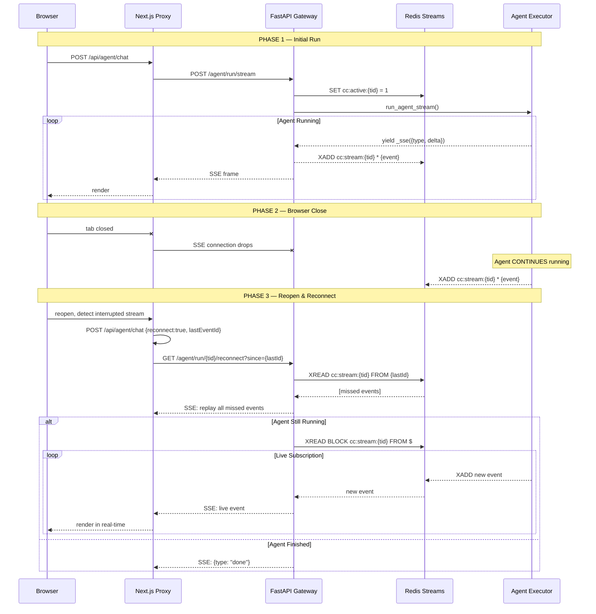

# Fire-and-Forget Chat with Live Stream Reconnection

> **Status:** Implemented (2026-06-11)
> **Owner:** CommandCenter Core
> **Files:** `stream_relay.py`, `executor.py`, `agent.py`, `route.ts`, `useAgentChat.ts`, `chatStore.ts`

## Why We Built This

CommandCenter agents run long tasks — research, multi-step tool calls, sub-agent delegation, self-mutation. A single run can take 2–5 minutes. Before this feature, **closing the browser tab meant losing the stream permanently.** The user would return to a frozen chat with no way to see what the agent did or if it was still running.

We needed **fire-and-forget chat**: the agent keeps running in the cloud regardless of browser state, and when the user returns, they see everything that happened — reasoning, tool calls, sub-agent progress — and if the agent is still running, the stream resumes live.

### Design Goals

1. **Agent continues after disconnect.** Browser close must not interrupt agent execution.
2. **Full state recovery.** On return, see ALL events: thinking/reasoning cascade, tool calls, tool results, sub-agent delegation progress, final text.
3. **Live reconnection.** If the agent is still running, the stream resumes token-by-token — not chunk-polling.
4. **Graceful degradation.** If the live reconnect path is unavailable (Redis down, stream expired), fall back to Postgres polling.
5. **Zero blocking.** Event buffering must never slow down the primary SSE stream.

## Architecture

### Event Flow

```
Agent (executor.py)
  │  yield _sse({type: "TEXT_MESSAGE_CONTENT", delta: "Hello"})
  │
  ├─→ Gateway SSE Response ──→ Next.js Proxy ──→ Browser
  │    (primary path)
  │
  └─→ Redis Stream cc:stream:{threadId}
       (tee path — background, non-blocking)
```

Every SSE event the agent emits is:
1. **Yielded** to the gateway's `StreamingResponse` (primary path — reaches the browser)
2. **Pushed** to a Redis Stream keyed by `thread_id` (tee path — enables reconnection)

The tee is implemented via a `contextvars.ContextVar` in `executor.py`. When set, every call to `_sse()` automatically schedules a background `XADD` to Redis. This means **zero code changes** to the existing event emission logic — all 50+ yield points in the agent execution engine benefit automatically.

### Redis Stream Naming

| Key | Purpose | TTL |
|---|---|---|
| `cc:stream:{threadId}` | Ordered event log (MAXLEN 10,000) | 1 hour |
| `cc:active:{threadId}` | `"1"` while agent is running, deleted on finish | 1 hour |

### Reconnection Flow



### Fallback Chain

```
Reconnect attempt (SSE, live)
  │
  ├─ Success → replay + live subscription
  │
  └─ Failure (Redis down, stream expired, network error)
       │
       └─ Postgres polling (existing, every 1.5s when recovering)
            │
            └─ Recovers content, tool events, reasoning blocks
               from chat_message table (persisted every 3s during streaming)
```

## Key Design Decisions

### 1. Redis Streams (not just Postgres)

| Concern | Redis Streams | Postgres-only |
|---|---|---|
| Write latency | <1ms (XADD) | ~5ms (UPSERT) |
| Ordered replay | Native cursor (XREAD FROM id) | ORDER BY + pagination |
| Live subscription | XREAD BLOCK (push-based) | Polling only |
| Auto-cleanup | MAXLEN + EXPIRE | Manual vacuum |
| Already in stack | Yes (event bus, history) | Yes |

Postgres is the **safety net** — it persists the final accumulated message state every 3 seconds (via `persistAssistantMessage`). Redis Streams provide the **low-latency event log** for instant replay and live subscription.

### 2. Context Variable for Teeing (not generator wrapping)

Instead of wrapping the entire async generator with a tee layer (which would require restructuring 450+ lines of agent execution logic), we use a `contextvars.ContextVar`:

```python
_stream_relay_thread_id: ContextVar[str | None] = ContextVar(...)

def _sse(payload: dict) -> str:
    line = f"data: {json.dumps(payload)}\n\n"
    tid = _stream_relay_thread_id.get(None)
    if tid is not None:
        asyncio.get_running_loop().create_task(
            _push_sse_to_stream(tid, line)
        )
    return line
```

- **Zero changes** to existing event emission code
- **Non-blocking** — Redis push is a background task
- **Scoped** — context var resets automatically when the generator is garbage-collected
- **Best-effort** — Redis failures are silently swallowed; the primary SSE stream is never affected

### 3. Frontend Reconnect-First Strategy

On mount, `useAgentChat.ts` detects interrupted streams (assistant message with `streaming=true` or incomplete content). Instead of immediately falling back to polling, it:

1. Sends `POST /api/agent/chat` with `reconnect: true` and `lastEventId`
2. The Next.js proxy routes this to `GET /agent/run/{threadId}/reconnect?since={lastId}`
3. If the reconnect stream succeeds, events are processed through the same handler as a live stream (token-by-token rendering)
4. If the reconnect stream fails (404, 502, timeout), `recovering` stays `true` and the existing polling effect takes over

## Component Map

| Layer | File | Responsibility |
|---|---|---|
| **Event Buffer** | `apps/orchestrator/orchestrator/stream_relay.py` | Redis Streams wrapper: push, replay, subscribe, active/inactive tracking |
| **Tee Integration** | `apps/orchestrator/orchestrator/executor.py` | Context var in `_sse()`; mark active/inactive around `run_agent_stream()` |
| **Reconnect Endpoint** | `apps/gateway/gateway/routes/agent.py` | `GET /agent/run/{thread_id}/reconnect?since={id}` |
| **Proxy Routing** | `workbench/.../route.ts` | Reconnect mode detection; forward `_stream_id` through translation layer |
| **Reconnect Logic** | `workbench/.../useAgentChat.ts` | Reconnect-first on mount; SSE event processing; fallback to polling |
| **State Tracking** | `workbench/.../chatStore.ts` | `lastEventId` per session for cursor-based resume |

## Edge Cases & Failure Modes

| Scenario | Behavior |
|---|---|
| Redis unavailable | `_push_sse_to_stream` fails silently; primary SSE stream unaffected. Reconnect falls back to Postgres polling. |
| Stream expired (>1h) | `stream_exists()` returns false; reconnect endpoint returns 404-like empty response; frontend falls back to polling. |
| Agent still running on reconnect | Live SSE subscription via `XREAD BLOCK` (30s timeout per read, loops until agent finishes). |
| Agent finished on reconnect | All remaining events replayed; synthetic `{"type":"done"}` emitted. |
| Multiple browser tabs | Each tab gets independent consumer group cursor via `GET /reconnect?since={lastId}`. No shared state needed. |
| Gateway restart mid-run | Stream in Redis survives; new gateway instance picks up active status; reconnect works. |
| Copilot SDK session timeout | Agent returns `RUN_ERROR`; `mark_inactive` called in `finally`; reconnect replays events up to the error. |
| LiteLLM mode | Currently does NOT go through stream relay (uses separate `streamLiteLLM` path in route.ts). Only Postgres polling recovery applies. |

## Testing

### Unit/Integration: `stream_relay.py`

```bash
uv run python -c "
from orchestrator.stream_relay import *
# push → replay → verify order → midpoint replay → active/inactive toggling
"
```

### End-to-End: Full HTTP reconnect flow

```bash
uv run python .tmp/test_e2e_reconnect.py
```

Tests 6 phases:
1. Simulate agent events (push directly to Redis)
2. Reconnect from beginning — verify all events replayed
3. Assertions: count, stream IDs, monotonicity, type matching
4. Midpoint reconnect — verify only events after cursor
5. Finished-stream reconnect — verify graceful termination
6. Active/inactive state transitions

### Manual Smoke Test

1. Open chat, start a named agent run (e.g., task-manager)
2. While agent is responding, close the browser tab
3. Wait 10 seconds
4. Reopen the chat — verify the "Reconnecting…" banner appears briefly, then the stream resumes live with all missed thinking, tool calls, and text

## Future Improvements

1. **Wire LiteLLM path to stream relay.** Currently `streamLiteLLM()` in route.ts bypasses the agent executor and thus has no Redis buffering. Add a tee layer to the LiteLLM SSE proxy.

2. **Persist `_stream_id` in initial SSE frames.** Currently `_stream_id` only appears in replayed events (from Redis). The initial live stream doesn't include it because `_sse()` is synchronous and can't await the Redis push result. This means the client can't do precise cursor-based resume from the initial stream — it falls back to `since=0-0` (replay all). Options: (a) make `_sse()` async, (b) use a sequence-number-based fallback, (c) client-side dedup to handle full replays.

3. **Stream compression for long runs.** Agents that run for 10+ minutes with verbose tool output could produce thousands of events. Consider batching or truncating tool results in the stream.

4. **Multi-gateway support.** The current `cc:active:{threadId}` key in Redis is a simple string — it works across multiple gateway instances. Verified.

5. **TTL configurability.** Currently hardcoded at 1 hour. Could be made per-agent via `config.json`.
