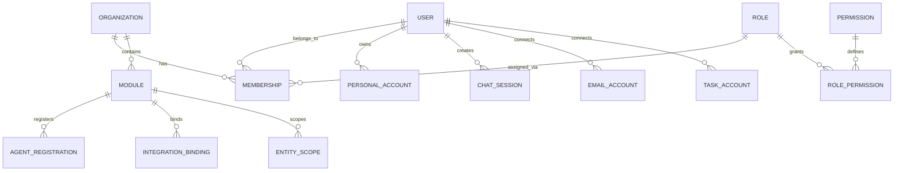
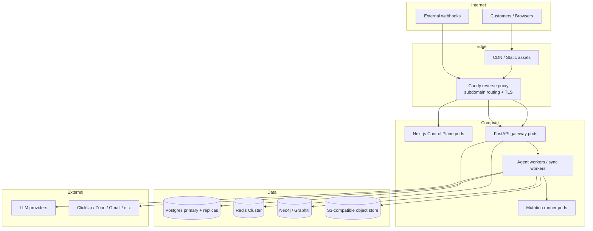

# Multi-User / Organization Architecture Research

> **Status:** Research & design proposal — not implemented.  
> **Created:** 2026-07-07  
> **Scope:** How CommandCenter evolves from a single-tenant "internal company brain" into a multi-user organization account where personal data stays private, shared resources are selectively visible, and an administrator controls settings, modules, and agents.  
> **Companion docs:** [`project_plan.md`](../project_plan.md) · [`system_architecture.md`](../system_architecture.md) · [`learning-resources/05-auth-and-oauth.md`](../../learning-resources/05-auth-and-oauth.md) · [`specs/permissions_sandbox_b6.md`](permissions_sandbox_b6.md)

---

## 1. Why this matters now

CommandCenter today is effectively **single-tenant with coarse RBAC**:

- One Microsoft Entra ID tenant gates sign-in (`@fracktal.in`).
- `app_user` stores `email`, `display_name`, `avatar_url`, and a binary `role` (`executive` | `employee`).
- `UserContext` carries `email` + `UserRole` through the gateway.
- `require_role(UserRole.EXECUTIVE)` guards sensitive routes.
- Chat sessions, email accounts, task-manager GTD data, and reply memories are already keyed by `user_id` — but there is **no organization boundary**, no member lifecycle, no invitation flow, and no data-sharing model between users.

The product roadmap explicitly lists *"RBAC beyond admin/operator/contributor"* as a non-goal for v2.0. This document does **not** change that scope. It is a research and design artifact so that when multi-user becomes a priority, the work is grounded in existing schemas, comparable products, and a phased plan that respects CommandCenter's agent-first architecture.

---

## 2. Current-state audit

### 2.1 Identity & auth (what exists)

| Layer | File | What it does | Multi-user gap |
|---|---|---|---|
| SSO | `workbench/control_plane/src/auth.ts` | NextAuth v5 + Microsoft Entra ID; copies `email`/`name` into session. | No org switcher; no invitation; no guest/external user path. |
| Gateway auth | `packages/acb_auth/acb_auth/deps.py` | Resolves `UserContext` from `Authorization: Bearer` + `X-User-Email` + `X-User-Role`. | Roles are hard-coded enum; no DB-backed membership; no per-org resolution. |
| Roles | `packages/acb_auth/acb_auth/roles.py` | `EXECUTIVE`, `EMPLOYEE`, `AGENT`. | Two user-facing roles only; no custom roles or permissions. |
| App user table | `infra/postgres/09_app_user.sql` | `app_user(id, email, display_name, avatar_url, role, last_login_at, created_at, updated_at)`. | No `org_id`, no `status`, no `invited_by`, no `last_active_at`. |

### 2.2 Data already scoped to a user

These tables already carry a `user_id` or equivalent and are therefore **easy to migrate** into an org + user model:

- `chat_session.user_id` — currently defaults to `'default'`; comment says "future multi-tenant".
- `email_accounts.user_id` — a user's connected Gmail/Outlook/IMAP mailboxes.
- `email_rules.user_id` (implied by account ownership).
- `task_accounts.user_id` — connected ClickUp/Asana/Jira workspaces.
- `gtd_contexts.user_id`, `gtd_horizons.user_id`, `gtd_projects.user_id`, `gtd_items.user_id` — Task Manager GTD store.
- `email_learned_patterns.account_id` — scoped through the email account, which is user-owned.

### 2.3 Data that is implicitly shared / global

These are currently **org-wide by default** with no visibility controls:

- `person`, `customer`, `project`, `task`, `deal`, `message`, `meeting` — the entity graph. `task.owner_id` and `deal.owner_id` exist but are business owners (sales rep / PM), not access-control owners.
- `dynamic_agents` / `agents.json` — the agent registry. Any registered agent is visible and runnable by anyone with gateway access.
- `provider_keys` — LLM/integration credentials. Stored encrypted; today effectively shared across all users.
- `mcp_servers` — has `agent_scope` but no user/org scope.
- `audit_event` — actor is a string (`email`); no `org_id`.
- `mem0_memories` — Mem0 creates this table automatically; by default memories are not scoped to a user or org unless the Mem0 `user_id`/`agent_id`/`run_id` metadata is set consistently.
- `approval_queue` — pending HITL actions; no ownership/visibility model.

### 2.4 Agent execution context (the hard part)

Today the orchestrator builds a run context that includes:

1. The user's `email` and `role`.
2. Resolved integration credentials from the Integration Registry.
3. Session-scoped memory enrichment.
4. The agent's `config.json` (`skill_repos`, `integrations`, `model_tier`, `own_tool_scope`).

For multi-user, this context must become **membership-aware**:

- Which integrations is *this user* authorized to use?
- Which agents can *this user* see and invoke?
- Which memories (org vs. personal) should be injected?
- Which entity-graph rows can the agent read or write on behalf of this user?

The agent itself is just code loaded from a Git repo; the platform must enforce the boundary **before** the context is assembled.

---

## 3. Research: how comparable products model multi-user

### 3.1 Clerk Organizations (reference model for SaaS auth)

Clerk's organization model is the cleanest reference for a modern multi-user SaaS:

- **Organization** = the account/company boundary.
- **Membership** = a user belongs to an organization with one or more roles.
- **Default roles:** `org:admin` (full access), `org:member` (limited).
- **Custom roles** up to 10 per instance, each granted a set of **permissions**.
- **Permissions** are keyed as `org:<feature>:<action>` (e.g., `org:invoices:create`).
- **Role Sets** control which roles are available to which organizations.
- **Creator role** must have `manage members`, `read members`, `delete organization`.
- **Authorization checks** happen server-side; system permissions are *not* in session claims.

**Takeaway for CommandCenter:** separate the concepts of **organization**, **membership**, **role**, and **permission**. Do not overload `app_user.role` as both global role and org role.

### 3.2 Auth0 RBAC

Auth0's model reinforces:

- A **role is a collection of permissions**.
- Permissions can span multiple APIs/features.
- Overlapping role assignments are **additive** (union of permissions).
- Organization-specific roles can be added to members, so a user can be admin in one org and viewer in another.

**Takeaway:** support multiple roles per user per organization, and compute effective permissions as the union.

### 3.3 AWS IAM (reference for policy-based authorization)

AWS IAM is overkill for a UI but useful for naming the authorization primitives:

- **Identity-based policies** — what a user/role can do.
- **Resource-based policies** — who can access a specific resource.
- **Permissions boundaries / SCPs** — maximum available permissions for an identity or resource.
- **Session policies** — temporary scoped-down credentials.
- **Evaluation logic:** explicit deny overrides allow; union of allows.

**Takeaway for CommandCenter:** a small policy engine (even a JSON allowlist) for agent/resource access is more future-proof than hard-coded role checks. The existing `tool_annotations` (`read_only`, `destructive`, `idempotent`, `open_world`) are a good seed for action-level permissions.

### 3.4 Asana, Jira, ClickUp — workspace/project/role patterns

| Product | Boundary | Sharing model |
|---|---|---|
| **Asana** | Organization → Team → Project | Projects can be private, public to team, or public to org. Tasks inherit project visibility. |
| **Jira** | Site → Project | Permission schemes (global + project). Space roles let admins delegate without giving full admin. |
| **ClickUp** | Workspace → Space → Folder → List | Roles: Owner, Admin, Member, Guest. Spaces can be private. |
| **Zoho CRM** | Organization account | Users, roles, profiles, data-sharing rules, field-level permissions. |

Common pattern:

1. **Organization/Workspace** is the billing and admin boundary.
2. **Modules/Projects/Spaces** are containers inside the org.
3. **Visibility** is per container: private, team-visible, org-visible.
4. **Roles** are a separate axis from containers: a user can be admin of one project and viewer of another.

**Takeaway for CommandCenter:** introduce an **organization** table and a **module** concept. Agents, integrations, and entity-graph data live inside modules. Visibility is set per module (private / team / org). Roles grant permissions; module visibility controls data access.

---

## 4. Proposed conceptual model

### 4.1 Core entities



#### `organization`

The company/tenant boundary. One row per deployed CommandCenter account.

```sql
CREATE TABLE organization (
    id              UUID PRIMARY KEY DEFAULT gen_random_uuid(),
    slug            TEXT UNIQUE NOT NULL,          -- e.g. "fracktal"
    display_name    TEXT NOT NULL,
    domain          TEXT,                          -- e.g. "fracktal.in" for auto-provisioning
    billing_email   TEXT,
    settings        JSONB NOT NULL DEFAULT '{}',   -- org-wide defaults
    created_at      TIMESTAMPTZ NOT NULL DEFAULT now(),
    updated_at      TIMESTAMPTZ NOT NULL DEFAULT now()
);
```

#### `user`

Replaces/extends `app_user`. A user can belong to multiple organizations (future), but for CommandCenter v1 of multi-user, one active org at a time is sufficient.

```sql
CREATE TABLE user_account (
    id              UUID PRIMARY KEY DEFAULT gen_random_uuid(),
    email           TEXT UNIQUE NOT NULL,
    display_name    TEXT,
    avatar_url      TEXT,
    auth_provider   TEXT NOT NULL DEFAULT 'microsoft-entra-id',
    auth_subject    TEXT,                          -- IdP subject id
    last_login_at   TIMESTAMPTZ,
    created_at      TIMESTAMPTZ NOT NULL DEFAULT now(),
    updated_at      TIMESTAMPTZ NOT NULL DEFAULT now()
);
```

#### `organization_membership`

```sql
CREATE TABLE organization_membership (
    id              UUID PRIMARY KEY DEFAULT gen_random_uuid(),
    organization_id UUID NOT NULL REFERENCES organization(id) ON DELETE CASCADE,
    user_id         UUID NOT NULL REFERENCES user_account(id) ON DELETE CASCADE,
    status          TEXT NOT NULL DEFAULT 'active'
                        CHECK (status IN ('invited', 'active', 'suspended', 'removed')),
    invited_by      UUID REFERENCES user_account(id),
    joined_at       TIMESTAMPTZ,
    created_at      TIMESTAMPTZ NOT NULL DEFAULT now(),
    updated_at      TIMESTAMPTZ NOT NULL DEFAULT now(),
    UNIQUE(organization_id, user_id)
);
```

#### `role` and `role_permission`

Roles are org-level (or global templates copied per org). Permissions are fine-grained strings.

```sql
CREATE TABLE role (
    id              UUID PRIMARY KEY DEFAULT gen_random_uuid(),
    organization_id UUID REFERENCES organization(id) ON DELETE CASCADE,
    slug            TEXT NOT NULL,
    display_name    TEXT NOT NULL,
    is_system       BOOLEAN NOT NULL DEFAULT false,
    description     TEXT,
    created_at      TIMESTAMPTZ NOT NULL DEFAULT now(),
    updated_at      TIMESTAMPTZ NOT NULL DEFAULT now(),
    UNIQUE(organization_id, slug)
);

CREATE TABLE role_permission (
    role_id         UUID NOT NULL REFERENCES role(id) ON DELETE CASCADE,
    permission      TEXT NOT NULL,
    granted_at      TIMESTAMPTZ NOT NULL DEFAULT now(),
    PRIMARY KEY (role_id, permission)
);
```

#### `membership_role`

Many-to-many: a membership can have multiple roles; effective permissions are the union.

```sql
CREATE TABLE membership_role (
    membership_id   UUID NOT NULL REFERENCES organization_membership(id) ON DELETE CASCADE,
    role_id         UUID NOT NULL REFERENCES role(id) ON DELETE CASCADE,
    assigned_by     UUID REFERENCES user_account(id),
    assigned_at     TIMESTAMPTZ NOT NULL DEFAULT now(),
    PRIMARY KEY (membership_id, role_id)
);
```

### 4.2 Default roles for CommandCenter

| Role | Key permissions | Notes |
|---|---|---|
| **Owner** | `org:*`, `admin:*`, `settings:manage`, `billing:manage` | The creator of the organization. Cannot be deleted without transferring ownership. |
| **Admin** | `admin:*`, `settings:manage`, `members:manage`, `agents:manage` | Can change settings, modules, agents; cannot delete org or change billing unless granted. |
| **Operator** | `agents:run`, `integrations:use`, `memory:read_org`, `tasks:manage_own`, `email:manage_own` | Day-to-day user. Personal data private; can run shared agents. |
| **Viewer** | `agents:run_readonly`, `memory:read_org_limited` | Read-only access to shared dashboards/reports. |
| **Agent Service** | `agent:run_internal` | Service-to-service role (replaces today's `UserRole.AGENT`). |

### 4.3 Permission vocabulary (starter set)

Use a colon-separated namespace. Examples:

```text
org:settings:read
org:settings:write
org:members:read
org:members:invite
org:members:remove
org:roles:manage
org:billing:read
org:billing:manage

agents:read
agents:run
agents:manage        # register, update, delete
agents:share         # change visibility of an agent
agents:run_internal  # service-to-service

integrations:read
integrations:use
integrations:manage  # add/remove credentials
integrations:admin   # view decrypted credentials / rotate keys

memory:read_personal
memory:write_personal
memory:read_org
memory:write_org
memory:admin         # audit/delete any memory

tasks:read_own
tasks:manage_own
tasks:read_org
tasks:manage_org

email:read_own
email:send_own
email:manage_own
email:read_org       # shared mailboxes / delegated access

audit:read
audit:admin
```

---

## 5. Module & visibility model

### 5.1 Why modules?

CommandCenter is not just one app — it is a **platform of apps**: chat/orchestrator, email client, task manager, future sales/reconciler dashboards. Each app has different sharing expectations:

- **Chat** is mostly private (my sessions, my model picks).
- **Email** is private by default (my mailbox), but some mailboxes are shared (support@, sales@).
- **Task Manager** is personal GTD + shared project tasks.
- **Entity graph** (customers, deals, projects) is org data with row-level ownership.
- **Agents** can be private experiments, team tools, or org-wide utilities.

A **module** is a bounded functional area inside an organization. Visibility is set per module instance.

### 5.2 Module table

```sql
CREATE TABLE module (
    id              UUID PRIMARY KEY DEFAULT gen_random_uuid(),
    organization_id UUID NOT NULL REFERENCES organization(id) ON DELETE CASCADE,
    slug            TEXT NOT NULL,                 -- e.g. "email", "tasks", "sales"
    display_name    TEXT NOT NULL,
    visibility      TEXT NOT NULL DEFAULT 'organization'
                        CHECK (visibility IN ('private', 'team', 'organization')),
    owner_user_id   UUID REFERENCES user_account(id),
    settings        JSONB NOT NULL DEFAULT '{}',
    is_enabled      BOOLEAN NOT NULL DEFAULT true,
    created_at      TIMESTAMPTZ NOT NULL DEFAULT now(),
    updated_at      TIMESTAMPTZ NOT NULL DEFAULT now(),
    UNIQUE(organization_id, slug)
);
```

### 5.3 Module membership (optional, for team visibility)

```sql
CREATE TABLE module_membership (
    module_id       UUID NOT NULL REFERENCES module(id) ON DELETE CASCADE,
    membership_id   UUID NOT NULL REFERENCES organization_membership(id) ON DELETE CASCADE,
    role            TEXT NOT NULL DEFAULT 'member'
                        CHECK (role IN ('admin', 'member', 'viewer')),
    created_at      TIMESTAMPTZ NOT NULL DEFAULT now(),
    PRIMARY KEY (module_id, membership_id)
);
```

### 5.4 Mapping existing apps to modules

| App | Module slug | Default visibility | Notes |
|---|---|---|---|
| Chat / orchestrator | `chat` | `private` | Sessions are private; shared agents appear in the picker. |
| Email assistant | `email` | `private` | Per-user mailboxes; shared mailboxes via `email_accounts` row-level sharing. |
| Task Manager | `tasks` | `team` | Personal GTD + shared project tasks. |
| Sales / CRM | `sales` | `organization` | Org-wide pipeline; row-level ownership on `deal.owner_id`. |
| Reconciler | `reconciler` | `organization` | Nightly org-wide diff. |
| Settings / Integrations | `admin` | `organization` (admin-only) | Only Owner/Admin can change. |

---

## 6. Agent sharing model

### 6.1 Agent visibility levels

Agents are registered in `dynamic_agents` (DB) and `agents.json` (file). Add a visibility column:

```sql
ALTER TABLE dynamic_agents
    ADD COLUMN IF NOT EXISTS visibility TEXT NOT NULL DEFAULT 'organization'
        CHECK (visibility IN ('private', 'team', 'organization')),
    ADD COLUMN IF NOT EXISTS owner_user_id UUID REFERENCES user_account(id),
    ADD COLUMN IF NOT EXISTS module_id UUID REFERENCES module(id);
```

| Visibility | Who can see | Who can run | Use case |
|---|---|---|---|
| `private` | Owner + org admins | Owner + org admins | Personal experiment agent. |
| `team` | Module members | Module members | Team-specific agent (e.g., sales team). |
| `organization` | All org members | All org members (with `agents:run`) | Org-wide utility agent. |

### 6.2 Agent execution authorization

Before running an agent, the gateway checks:

1. Does the user have `agents:run` (or `agents:run_internal` for service calls)?
2. Is the agent visible to this user (private → owner only; team → module member; org → any member)?
3. Does the agent's declared `integrations` intersect with integrations the user is authorized to use?
4. For destructive agents or agents with `open_world` tools, is there an additional approval tier?

The agent code itself does not enforce this; the **orchestrator's context assembler** filters the injected integrations and memories based on the resolved membership.

---

## 7. Memory scoping: personal vs. organizational

### 7.1 The problem

Memories today are extracted at the run boundary and stored via Mem0/Graphiti. In a multi-user org:

- "I prefer concise email replies" → **personal** memory.
- "Fracktal's standard payment terms are Net 30" → **organizational** memory.
- "Acme Corp is a strategic customer" → **organizational** memory, but maybe sales-team only.

If every user's personal memory leaks into another user's agent context, the product is unusable. If org memories are not shared, the product is not valuable.

### 7.2 Proposed memory scope taxonomy

| Scope | Key | Injected when | Stored in |
|---|---|---|---|
| `personal` | `user_id` | The user is the actor. | Mem0 `user_id=<user_id>`; Graphiti with `scope='personal'` + `owner_id`. |
| `team` | `module_id` | The user is a member of the module. | Graphiti with `scope='team'` + `module_id`. |
| `organization` | `organization_id` | Any org member runs an org-visible agent. | Mem0 `agent_id=<org-agent>` or dedicated org memory namespace; Graphiti with `scope='organization'`. |
| `shared_resource` | `resource_id` | The user has access to a shared mailbox/project/etc. | Graphiti edge from resource node. |

### 7.3 Schema additions for memory scope

Mem0 uses metadata fields. Ensure every memory write includes:

```json
{
  "user_id": "<uuid>",
  "agent_id": "<agent_name>",
  "run_id": "<thread_id>",
  "metadata": {
    "organization_id": "<uuid>",
    "scope": "personal|team|organization",
    "module_id": "<uuid>|null",
    "resource_id": "<uuid>|null"
  }
}
```

For Graphiti, add a `memory_scope` node/edge label or property:

```sql
-- Conceptual; Graphiti is property-graph backed by Neo4j/Postgres.
-- Add properties to memory nodes:
--   scope: 'personal' | 'team' | 'organization'
--   owner_user_id, module_id, organization_id
```

### 7.4 Memory retrieval policy

At run-start, the context assembler queries memories with this priority:

1. **Personal** memories of the acting user.
2. **Team** memories for the module the current agent belongs to.
3. **Organization** memories.
4. **Shared resource** memories for any resource explicitly referenced in the user's prompt or the agent's task.

Never return another user's `personal` memories. Never return `team` memories from a module the user does not belong to.

---

## 8. Integration credential scoping

### 8.1 Current state

`provider_keys` and `email_accounts.credentials_encrypted` store credentials encrypted at rest. Today they are effectively global: any agent that declares the integration name receives the credential.

### 8.2 Proposed model

Add an ownership/scope column to credentials:

```sql
ALTER TABLE provider_keys
    ADD COLUMN IF NOT EXISTS scope TEXT NOT NULL DEFAULT 'organization'
        CHECK (scope IN ('organization', 'team', 'personal')),
    ADD COLUMN IF NOT EXISTS owner_user_id UUID REFERENCES user_account(id),
    ADD COLUMN IF NOT EXISTS module_id UUID REFERENCES module(id);
```

| Scope | Use case | Injection rule |
|---|---|---|
| `organization` | Shared Zoho CRM, shared ClickUp workspace, shared LLM keys. | Injected for any org member running an org-visible agent that declares the integration. |
| `team` | Sales team's dedicated outreach API key. | Injected only if the user is a member of the module and the agent is in that module. |
| `personal` | User's personal Gmail OAuth token. | Injected only when the acting user matches `owner_user_id`. |

### 8.3 On-behalf-of vs. service credentials

Open question from `project_plan.md` Q7: *"OAuth provider registration — one shared org-level app per service vs per-operator tokens."*

Recommendation:

- **Service credentials** (`organization` scope): one OAuth app per service, tokens stored centrally, used for server-to-server sync and org-wide reads.
- **On-behalf-of credentials** (`personal` scope): each user consents individually; the platform stores the token against that user. Required for sending email as the user, posting as the user in Slack/Teams, etc.

The Integration Registry UI should distinguish these two modes.

---

## 9. Entity graph access control

### 9.1 Row-level ownership

The entity graph already has `owner_id` on `task` and `deal`. Extend this model:

```sql
ALTER TABLE task
    ADD COLUMN IF NOT EXISTS visibility TEXT NOT NULL DEFAULT 'organization'
        CHECK (visibility IN ('private', 'team', 'organization')),
    ADD COLUMN IF NOT EXISTS team_module_id UUID REFERENCES module(id);

ALTER TABLE deal
    ADD COLUMN IF NOT EXISTS visibility TEXT NOT NULL DEFAULT 'organization',
    ADD COLUMN IF NOT EXISTS team_module_id UUID REFERENCES module(id);
```

### 9.2 Read policy

A user can read an entity row if any of:

1. `visibility = 'organization'`.
2. `visibility = 'team'` AND the user is a member of `team_module_id`.
3. `visibility = 'private'` AND the user is `owner_id` (or an admin).
4. The user has `audit:admin` or `memory:admin`.

### 9.3 Write policy

Writes to source systems go through the Action Broker. The broker records the acting `user_id` and `organization_id` and checks:

1. Does the user have the module-level write permission?
2. Does the user own the row or have admin rights?
3. Is the action within the user's authority tier (suggest → apply → autonomous)?

---

## 10. Control Plane UI implications

### 10.1 New screens needed

| Screen | Route | Audience | Purpose |
|---|---|---|---|
| Organization settings | `/settings/organization` | Owner/Admin | Name, domain, billing, delete org. |
| Members management | `/settings/members` | Owner/Admin | Invite, suspend, change roles, remove. |
| Roles & permissions | `/settings/roles` | Owner/Admin | Create custom roles, assign permissions. |
| Modules | `/settings/modules` | Owner/Admin | Enable/disable modules, set default visibility. |
| Agent sharing | `/agents/{id}/sharing` | Agent owner/Admin | Set visibility, choose module, manage access. |
| Personal settings | `/settings/profile` | Everyone | Name, avatar, default model, notification prefs. |
| Organization switcher | Global | Multi-org users (future) | Switch between organizations. |

### 10.2 NextAuth session enrichment

The NextAuth session callback should fetch the user's active organization membership and roles from Postgres and include:

```typescript
session.user = {
  id: user.id,
  email: user.email,
  name: user.display_name,
  org: {
    id: org.id,
    slug: org.slug,
    name: org.display_name,
  },
  roles: ['operator'], // resolved from membership_role + role
  permissions: ['agents:run', 'tasks:manage_own', ...],
};
```

The Next.js proxy then forwards:

```http
Authorization: Bearer <INTERNAL_TOKEN>
X-User-Id: <user_id>
X-User-Email: <email>
X-Organization-Id: <org_id>
X-User-Roles: operator
X-User-Permissions: agents:run,tasks:manage_own,...
```

### 10.3 Gateway `UserContext` evolution

Extend `UserContext` to carry the resolved membership:

```python
@dataclass(slots=True, frozen=True)
class UserContext:
    user_id: UUID | None
    email: str | None
    organization_id: UUID | None
    roles: frozenset[str]
    permissions: frozenset[str]

    def has_permission(self, permission: str) -> bool:
        return permission in self.permissions

    def is_member_of_module(self, module_id: UUID) -> bool:
        ...
```

`require_role` can be supplemented with `require_permission(...)`.

---

## 11. Security considerations

### 11.1 Agent context isolation

The most critical security property: **an agent must never receive another user's personal context.**

Concrete controls:

1. **Credential scoping** (§8): only inject credentials the acting user is authorized to use.
2. **Memory scoping** (§7): filter memory queries by `user_id`/`module_id`/`organization_id`.
3. **Chat session isolation**: `chat_session.user_id` + `organization_id`; never allow cross-user session access.
4. **Workspace file visibility**: today only `inputs/`, `outputs/`, `agent-data/` are visible. Add `user_id` subdirectories or prefix scoping for private agents.
5. **Audit attribution**: every `audit_event` records `actor_user_id`, `organization_id`, `module_id`.
6. **Sub-agent inheritance**: when an agent delegates to a sub-agent, the sub-agent receives the **same** scoped `UserContext`; it cannot escalate.

### 11.2 Prompt injection defense

Multi-user increases the attack surface because users may share agents. Mitigations already in flight:

- `tool_annotations` + risk-aware permission handler (`permissions_sandbox_b6.md`) gates destructive ops.
- Per-run credential scoping (B6 Tier 0) prevents secret accumulation.
- Container isolation (B6 Phase 5) is the long-term boundary.
- For multi-user, add: **do not let a user-invoked agent access another user's credentials even if the agent's `config.json` declares the integration.** The platform resolves credentials per user, not per agent.

### 11.3 Data residency & compliance

- Indian DPDP Act 2023 (constraint C-07) requires written employee consent before ingesting email/WhatsApp.
- Multi-user makes consent tracking harder. Add a `consent_record` table:

```sql
CREATE TABLE consent_record (
    id              UUID PRIMARY KEY DEFAULT gen_random_uuid(),
    user_id         UUID NOT NULL REFERENCES user_account(id),
    organization_id UUID NOT NULL REFERENCES organization(id),
    purpose         TEXT NOT NULL,                 -- e.g. "email_ingestion"
    granted         BOOLEAN NOT NULL,
    granted_at      TIMESTAMPTZ,
    ip_address      INET,
    user_agent      TEXT
);
```

---

## 12. Phased implementation roadmap

This is a **research proposal**, not a committed plan. If prioritized, suggested phases:

### Phase A — Foundation (4–6 weeks)

1. Create `organization`, `user_account`, `organization_membership`, `role`, `role_permission`, `membership_role` tables.
2. Migrate `app_user` → `user_account` + membership.
3. Add `organization_id` to all existing tables (default to a single seeded org for current deployments).
4. Update `UserContext` to carry `user_id`, `organization_id`, `roles`, `permissions`.
5. Update NextAuth session callback to resolve active org + permissions.
6. Add `require_permission(...)` dependency.

### Phase B — Modules & agent sharing (4–6 weeks)

1. Create `module` and `module_membership` tables.
2. Map existing apps to modules.
3. Add visibility/ownership columns to `dynamic_agents`.
4. Build agent sharing UI (`/agents/{id}/sharing`).
5. Enforce agent visibility at run time.
6. Add org admin settings screens.

### Phase C — Memory & integration scoping (4–6 weeks)

1. Add scope metadata to all memory writes (Mem0 + Graphiti).
2. Update context assembler to filter memories by scope.
3. Add `scope`/`owner_user_id`/`module_id` to `provider_keys` and `email_accounts`.
4. Update Integration Registry UI to distinguish org/team/personal credentials.
5. Enforce credential injection per user.

### Phase D — Entity graph & Action Broker (6–8 weeks)

1. Add visibility/team columns to entity graph tables.
2. Apply row-level read filters in all graph queries.
3. Update Action Broker to record `user_id`/`organization_id`/`module_id` and enforce write policy.
4. Add HITL approval ownership (users approve actions they have permission to approve).

### Phase E — Hardening & compliance (4–6 weeks)

1. Consent tracking for ingestion.
2. Audit log completeness review.
3. Security review of cross-user agent boundaries.
4. Evals for multi-user isolation invariants.

**Total rough estimate:** 22–32 weeks for a full multi-user org model, depending on how much existing code assumes a single user.

---

## 13. Open questions

1. **Single org vs. multi-org per user.** Should a `user_account` belong to exactly one organization (simpler) or many (future SaaS)? The schema above supports many; the UI can start with one active org.
2. **Custom roles limit.** Clerk caps at 10 custom roles per instance. Should CommandCenter impose a limit?
3. **Permission granularity.** Is the proposed permission vocabulary too fine, too coarse, or just right for an agent platform?
4. **Agent ownership transfer.** When a user leaves, what happens to their private agents?
5. **Shared mailboxes in email.** How does a user get access to `support@fracktal.in`? Via module membership or explicit mailbox sharing?
6. **Graphiti multi-tenancy.** Does Graphiti support labels/properties for tenant isolation efficiently, or do we need separate graph instances per org?
7. **Mem0 multi-tenancy.** Mem0's `user_id`/`agent_id` metadata is flexible, but does its retrieval API support `(org_id, module_id, user_id)` filtering efficiently?
8. **Billing.** Is billing per organization, per user, or per usage? This affects `organization.settings` and module enablement.
9. **Guest/external users.** Do we need a `guest` role for customers/partners to see limited data?
10. **Self-mutation and multi-user.** If a user triggers an agent that self-mutates, who owns the resulting PR? The user or the organization?

---

## 14. References

- Clerk Organizations — Roles and Permissions: https://clerk.com/docs/organizations/roles-permissions
- Auth0 RBAC: https://auth0.com/docs/manage-users/access-control/rbac
- AWS IAM Policies and Permissions: https://docs.aws.amazon.com/IAM/latest/UserGuide/access_policies.html
- Jira Permission Schemes: https://support.atlassian.com/jira-cloud-administration/docs/manage-project-permissions/
- ClickUp User Roles: https://support.clickup.com/hc/en-us/articles/6310561022999-User-roles-and-permissions
- CommandCenter `project_plan.md` — v2.0 non-goals include "RBAC beyond admin/operator/contributor"
- CommandCenter `permissions_sandbox_b6.md` — current sandbox/permission workstream
- CommandCenter `learning-resources/05-auth-and-oauth.md` — existing auth architecture

---

## 15. Summary

CommandCenter can become multi-user without replacing its architecture, but the change is **cross-cutting**: identity, auth, data model, agent execution, memory, integrations, entity graph, Action Broker, and UI all need to become organization-aware.

The key design decisions are:

1. **Organization** is the tenant boundary; **membership** links users to orgs; **roles** carry **permissions**.
2. **Modules** partition the product (chat, email, tasks, sales, etc.) and provide team-level visibility.
3. **Agents** have visibility (`private` / `team` / `organization`) and belong to a module.
4. **Memories** are scoped as `personal`, `team`, `organization`, or `shared_resource`.
5. **Integration credentials** are scoped as `organization`, `team`, or `personal`.
6. **Entity graph rows** get visibility + team-module columns.
7. **Action Broker** enforces write policy using the acting user's resolved permissions.
8. **Agent context assembly** is the enforcement point — the agent code itself remains unprivileged.

This document is the starting point for a future design spec and implementation plan.

---

## 16. Data-heavy apps: email and task management

Email and task management are the two most data-intensive modules in CommandCenter. They also have the sharpest privacy expectations: a user's mailbox is personal, but a `support@` mailbox is shared; a user's GTD inbox is private, but a project task board is team-visible. The multi-user model must work at volume without turning every list query into a cross-user scan.

### 16.1 Volume and access-pattern reality

| App | Data volume | Hot data | Cold data | Typical query |
|---|---|---|---|---|
| **Email** | 10k–1M+ messages per account | Last 30–90 days | Older mail, large attachments | "Show unread in INBOX" / "Search for Acme quote" |
| **Task Manager** | 100–50k items per user | Active inbox + current projects | Completed/archive projects | "What are my next actions?" / "Project X status" |

Both apps are **account-centric** today:

- `email_accounts.user_id` owns the account; `email_messages.account_id` owns the messages.
- `task_accounts.user_id` owns the connected workspace; `gtd_items.user_id` owns items, with `account_id` for synced rows.

This is a strong starting point. The multi-user work is mostly **adding org/team scope around the existing account boundary**, not replacing it.

### 16.2 Schema additions for multi-user scoping

#### Email

```sql
ALTER TABLE email_accounts
    ADD COLUMN IF NOT EXISTS organization_id UUID REFERENCES organization(id),
    ADD COLUMN IF NOT EXISTS visibility TEXT NOT NULL DEFAULT 'private'
        CHECK (visibility IN ('private', 'team', 'organization')),
    ADD COLUMN IF NOT EXISTS module_id UUID REFERENCES module(id),
    ADD COLUMN IF NOT EXISTS shared_with UUID[] NOT NULL DEFAULT '{}'; -- explicit delegates

ALTER TABLE email_messages
    ADD COLUMN IF NOT EXISTS organization_id UUID REFERENCES organization(id);

-- Shared-mailbox membership (who can access a team/organization mailbox)
CREATE TABLE IF NOT EXISTS email_account_member (
    account_id      UUID NOT NULL REFERENCES email_accounts(id) ON DELETE CASCADE,
    user_id         UUID NOT NULL REFERENCES user_account(id) ON DELETE CASCADE,
    can_send        BOOLEAN NOT NULL DEFAULT false,
    can_manage      BOOLEAN NOT NULL DEFAULT false,
    added_by        UUID REFERENCES user_account(id),
    created_at      TIMESTAMPTZ NOT NULL DEFAULT now(),
    PRIMARY KEY (account_id, user_id)
);
```

#### Task Manager

```sql
ALTER TABLE task_accounts
    ADD COLUMN IF NOT EXISTS organization_id UUID REFERENCES organization(id),
    ADD COLUMN IF NOT EXISTS visibility TEXT NOT NULL DEFAULT 'private'
        CHECK (visibility IN ('private', 'team', 'organization')),
    ADD COLUMN IF NOT EXISTS module_id UUID REFERENCES module(id);

ALTER TABLE gtd_items
    ADD COLUMN IF NOT EXISTS organization_id UUID REFERENCES organization(id),
    ADD COLUMN IF NOT EXISTS visibility TEXT NOT NULL DEFAULT 'private'
        CHECK (visibility IN ('private', 'team', 'organization')),
    ADD COLUMN IF NOT EXISTS team_module_id UUID REFERENCES module(id);

ALTER TABLE gtd_projects
    ADD COLUMN IF NOT EXISTS organization_id UUID REFERENCES organization(id),
    ADD COLUMN IF NOT EXISTS visibility TEXT NOT NULL DEFAULT 'team'
        CHECK (visibility IN ('private', 'team', 'organization')),
    ADD COLUMN IF NOT EXISTS team_module_id UUID REFERENCES module(id);
```

### 16.3 Indexing strategy: scope columns first

For high-volume tables, the leading column of every index should be the filter that eliminates the most rows. In a multi-user org that is almost always `organization_id` or `account_id`/`user_id`.

Replace existing indexes with scoped versions:

```sql
-- Email: account is the natural boundary; org_id is a safety filter
CREATE INDEX IF NOT EXISTS idx_email_messages_org_account_folder
    ON email_messages(organization_id, account_id, folder, received_at DESC);

-- Task items: user_id for personal, org_id + visibility for shared views
CREATE INDEX IF NOT EXISTS idx_gtd_items_org_user_disposition
    ON gtd_items(organization_id, user_id, disposition, created_at DESC);

CREATE INDEX IF NOT EXISTS idx_gtd_items_org_team
    ON gtd_items(organization_id, team_module_id, disposition, created_at DESC)
    WHERE visibility = 'team';

-- Full-text search must be scoped too
CREATE INDEX IF NOT EXISTS idx_email_messages_fts_scoped
    ON email_messages
    USING GIN(
        to_tsvector('english',
            coalesce(subject, '') || ' ' ||
            coalesce(snippet, '') || ' ' ||
            coalesce(from_address->>'name', '') || ' ' ||
            coalesce(from_address->>'email', '')
        )
    )
    WHERE organization_id IS NOT NULL;
```

### 16.4 Query patterns

Every read query should follow one of these shapes:

**Personal data (my mailbox, my tasks):**

```sql
SELECT * FROM email_messages
WHERE organization_id = :org_id
  AND account_id IN (:my_account_ids)
  AND folder = 'INBOX'
ORDER BY received_at DESC
LIMIT 50;
```

**Team-visible data:**

```sql
SELECT * FROM gtd_items
WHERE organization_id = :org_id
  AND visibility = 'team'
  AND team_module_id = :module_id
  AND disposition = 'NEXT'
ORDER BY created_at DESC;
```

**Org-wide data (with permission check):**

```sql
SELECT * FROM deal
WHERE organization_id = :org_id
  AND visibility = 'organization'
ORDER BY last_activity_at DESC;
```

The gateway should reject any query that does not include an `organization_id` filter. This is defense-in-depth against accidental cross-tenant leaks.

### 16.5 Row-level security (RLS) as a safety net

Postgres RLS can enforce the above rules at the database layer. It is not a replacement for application filters (RLS can be bypassed by superusers and adds query-plan risk), but it is a valuable safety net.

Example policy for `email_messages`:

```sql
ALTER TABLE email_messages ENABLE ROW LEVEL SECURITY;

CREATE POLICY email_messages_org_isolation ON email_messages
    USING (organization_id = current_setting('app.current_org_id')::UUID);

CREATE POLICY email_messages_account_access ON email_messages
    USING (
        account_id IN (
            SELECT id FROM email_accounts
            WHERE user_id = current_setting('app.current_user_id')::UUID
               OR id IN (
                   SELECT account_id FROM email_account_member
                   WHERE user_id = current_setting('app.current_user_id')::UUID
               )
        )
    );
```

Set the context variables at the start of every request:

```python
await db.execute(
    "SET LOCAL app.current_org_id = :org_id; SET LOCAL app.current_user_id = :user_id;",
    {"org_id": str(user.organization_id), "user_id": str(user.user_id)},
)
```

Use RLS in **audit mode** first (`POLICY ... FOR SELECT USING (true)`) to measure performance impact before enforcing.

### 16.6 Sync architecture

Both email and tasks sync large datasets from external APIs. The sync worker must remain **account-scoped**:

1. One sync job per `email_accounts` / `task_accounts` row.
2. The worker decrypts credentials using the account owner's key or an org service key.
3. Fetched rows are stamped with `organization_id` and `account_id` at insert time.
4. Shared mailboxes / team workspaces sync once into the org account, not per user.
5. Delta sync (Gmail `historyId`, Outlook delta token, ClickUp cursor) avoids full re-fetches.

**Critical:** do not let a user's personal sync job write rows with another user's `user_id`. The account row is the owner; row-level sharing is handled by `email_account_member` / `module_membership` / visibility columns.

### 16.7 Shared resources

| Resource | Ownership model | Access grant |
|---|---|---|
| `support@fracktal.in` | Org-owned account | `email_account_member` grants `can_send` / `can_manage` |
| Sales team's ClickUp workspace | Team-owned `task_accounts` row | `module_membership` in the `sales` module |
| Shared project board | Team-owned `gtd_project` | `visibility = 'team'` + `team_module_id` |
| Personal Gmail | User-owned account | Only the owner sees it |

The UI should make ownership obvious: "This mailbox belongs to the Sales team" vs. "This is your personal Gmail."

### 16.8 Agent context limits

An agent cannot load a user's entire mailbox or every task into context. The platform must pre-filter:

1. **Time window:** default to last 30 days unless the user asks for older data.
2. **Relevance:** vector/FTS search over scoped data, return top-k results.
3. **Aggregation:** for status questions, run SQL aggregations first ("42 unread emails", "17 next actions") and feed the summary to the agent.
4. **Pagination:** if the agent needs to iterate, use cursor-based pagination, not `OFFSET`.

The agent's tools (e.g., `search_email`, `list_tasks`) should accept `organization_id`, `account_id`, `module_id`, and `visibility` filters and reject cross-scope queries.

### 16.9 Caching and materialized views

For high-volume list views, maintain per-user/per-account caches:

```sql
-- Per-account inbox summary (cheap to refresh on sync)
CREATE TABLE email_inbox_summary (
    account_id      UUID PRIMARY KEY REFERENCES email_accounts(id),
    total_count     INT NOT NULL DEFAULT 0,
    unread_count    INT NOT NULL DEFAULT 0,
    last_message_at TIMESTAMPTZ,
    updated_at      TIMESTAMPTZ NOT NULL DEFAULT now()
);

-- Per-user GTD dashboard snapshot
CREATE TABLE gtd_dashboard_snapshot (
    user_id         UUID PRIMARY KEY REFERENCES user_account(id),
    next_count      INT NOT NULL DEFAULT 0,
    waiting_count   INT NOT NULL DEFAULT 0,
    inbox_count     INT NOT NULL DEFAULT 0,
    stale_count     INT NOT NULL DEFAULT 0,
    updated_at      TIMESTAMPTZ NOT NULL DEFAULT now()
);
```

Refresh these asynchronously after sync or on write. The Control Plane reads the snapshot for instant dashboard rendering; the agent reads it for status summaries.

### 16.10 Archival and cold storage

Not all mail/tasks need to live in the hot Postgres store forever:

1. **Email:** after 90–180 days, move message bodies and attachments to object storage (S3/MinIO), keep metadata + snippet in Postgres. The agent can fetch the full body on demand.
2. **Tasks:** completed items older than 1 year can be moved to an `gtd_items_archive` table or Parquet files, with a unified search index that spans hot + cold.
3. **Retention policy** per organization: `organization.settings -> 'data_retention_days'`.

### 16.11 Search scoping

Full-text search must respect the same boundaries:

```python
async def search_email(
    user: UserContext,
    query: str,
    account_ids: list[UUID] | None = None,
    folder: str | None = None,
    limit: int = 20,
):
    # Resolve accessible accounts
    accessible = await resolve_email_accounts(user)
    account_filter = account_ids or accessible

    sql = """
        SELECT * FROM email_messages
        WHERE organization_id = :org_id
          AND account_id = ANY(:account_ids)
          AND to_tsvector('english', coalesce(subject,'') || ' ' || coalesce(snippet,''))
              @@ plainto_tsquery('english', :query)
        ORDER BY received_at DESC
        LIMIT :limit
    """
    ...
```

Never run a global `email_messages` search without `organization_id` and `account_id` filters.

### 16.12 Write authority in data-heavy apps

Email sends and task updates are high-stakes writes. The Action Broker must know:

1. **Who** is acting (`user_id`).
2. **On behalf of which account** (`email_accounts.id` or `task_accounts.id`).
3. **Whether the user has send/manage permission** for that account.
4. **Whether the action is autonomous, suggest+apply, or suggest-only** for this module.

Example approval metadata:

```json
{
  "action_type": "email_send",
  "organization_id": "<uuid>",
  "user_id": "<uuid>",
  "account_id": "<uuid>",
  "on_behalf_of_email": "support@fracktal.in",
  "requires_approval": true,
  "approvers": ["admin", "module_admin"]
}
```

### 16.13 Summary for data-heavy apps

- **Keep the account-centric model.** `email_accounts` and `task_accounts` are already the right ownership boundary.
- **Add org/team scope as a layer around accounts**, not a replacement.
- **Lead indexes with `organization_id` / `account_id` / `user_id`.**
- **Use RLS as a safety net**, not the primary filter.
- **Pre-filter before the agent sees data:** time windows, top-k search, aggregations.
- **Maintain per-user/per-account snapshots** for fast UI and agent status queries.
- **Archive cold data** to keep the hot store bounded.
- **Action Broker must account-scope every write**, especially for shared mailboxes and team workspaces.

---

## 17. SaaS multi-tenancy: CommandCenter as a multi-customer platform

So far this document has treated "organization" as an internal company account (Fracktal Works and its employees). The next step is using CommandCenter as a **software-as-a-service platform** where many external organizations sign up, each with their own users, data, agents, integrations, and billing. This changes the architecture from "one big org on one VM" to "many isolated tenants on a scalable platform."

### 17.1 Internal multi-user vs. SaaS multi-tenant

| Concern | Internal multi-user | SaaS multi-tenant |
|---|---|---|
| **Trust boundary** | Employees of one company | Unrelated external customers |
| **Data isolation requirement** | Strong, but single IdP | Very strong; customers expect no cross-tenant leakage |
| **Provisioning** | Manual/admin invite | Self-service signup + onboarding |
| **Billing** | Usually none (internal cost center) | Per-tenant subscription or usage-based |
| **Customization** | One global config | Per-tenant settings, models, agents, branding |
| **Compliance** | Internal policy + DPDP | SOC 2, GDPR, DPDP, HIPAA (depending on market) |
| **Operations** | One deployment, one DB | Shared infrastructure with tenant isolation |

The internal multi-user model is a **prerequisite** for SaaS: the same `organization`, `user_account`, `membership`, `role`, and `permission` tables become the tenant boundary.

### 17.2 Tenant isolation models

There are three classic multi-tenancy patterns. CommandCenter should start with **shared database, row-level isolation** and move to hybrid only when a tenant outgrows it.

#### Option A: Shared database, row-level isolation (recommended starting point)

All tenants share one Postgres database and one Redis instance. Every table has an `organization_id` column; every query filters by it.

**Pros:**
- Simplest operations: one schema migration, one backup strategy.
- Best resource utilization for small tenants.
- Fastest to ship.

**Cons:**
- A runaway tenant query can impact others (mitigated by RLS + query timeouts + connection pooling).
- Harder to offer tenant-level data residency or dedicated compute.
- Compliance auditors may ask for proof of isolation.

**When to use:** MVP through first ~100 tenants.

#### Option B: Schema-per-tenant

Each tenant gets a separate Postgres schema in the same database. The application sets `search_path` per request.

**Pros:**
- Stronger isolation than row-level.
- Easier to migrate one tenant to dedicated infrastructure later.
- Tenant-specific migrations/extensions possible.

**Cons:**
- Schema management complexity (migrations must run N times).
- Connection pooling harder (each schema needs its own prepared statements).
- Redis still shared unless also partitioned.

**When to use:** When you need stronger isolation but not yet dedicated databases.

#### Option C: Database-per-tenant / cluster-per-tenant

Each tenant gets their own Postgres database or even their own Kubernetes namespace/VM.

**Pros:**
- Maximum isolation.
- Per-tenant scaling, backups, and data residency.
- Easier enterprise sales.

**Cons:**
- Highest operational cost and complexity.
- Slower onboarding.
- Connection management, migrations, and monitoring multiply.

**When to use:** Enterprise tier, regulated industries, or very large tenants.

**Recommendation for CommandCenter:**

1. **Phase 1:** Shared DB + row-level isolation + RLS safety net.
2. **Phase 2:** Offer schema-per-tenant as an enterprise option.
3. **Phase 3:** Database-per-tenant for dedicated enterprise customers.

### 17.3 Tenant-aware application architecture

#### Request routing

Every HTTP request must resolve a tenant. Options:

| Method | Example | Best for |
|---|---|---|
| **Subdomain** | `fracktal.commandcenter.app` | Clean, supports custom domains later |
| **Path prefix** | `commandcenter.app/o/fracktal/...` | Simple, works with static hosting |
| **Header** | `X-Organization-Id: <uuid>` | API-first, internal services |

**Recommendation:** subdomain for the workbench, header for the gateway API. The Next.js middleware reads the subdomain and looks up the org slug.

```typescript
// middleware.ts
export async function middleware(req: NextRequest) {
  const host = req.headers.get('host') || '';
  const slug = host.replace('.commandcenter.app', '').split(':')[0];
  const org = await lookupOrgBySlug(slug);
  req.headers.set('X-Organization-Id', org.id);
  req.headers.set('X-Organization-Slug', org.slug);
}
```

#### Gateway tenant resolution

Extend `UserContext` to always carry `organization_id`. The gateway rejects any request without a resolvable tenant.

```python
async def resolve_tenant(
    x_organization_id: Annotated[str | None, Header(alias="X-Organization-Id")] = None,
    x_organization_slug: Annotated[str | None, Header(alias="X-Organization-Slug")] = None,
) -> Organization:
    if x_organization_id:
        return await get_org_by_id(x_organization_id)
    if x_organization_slug:
        return await get_org_by_slug(x_organization_slug)
    raise HTTPException(status_code=400, detail="Tenant not specified")
```

Every route that touches tenant data should depend on both `get_current_user` and `resolve_tenant`.

#### Database connection handling

For shared-DB row-level isolation:

1. Use a single connection pool.
2. At the start of every request/transaction, set:
   ```sql
   SET LOCAL app.current_org_id = '<uuid>';
   SET LOCAL app.current_user_id = '<uuid>';
   ```
3. RLS policies use these variables as a safety net.
4. Application queries always include explicit `WHERE organization_id = :org_id`.

For schema-per-tenant:

1. Maintain a pool per schema or use `SET search_path = tenant_<id>, public` per request.
2. PgBouncer in transaction mode is problematic with `SET` commands; use session mode or set `search_path` via `SET LOCAL` inside each transaction.

### 17.4 Scaling the compute layer

CommandCenter today runs on a single Hostinger VPS with systemd services. For SaaS, move to container orchestration:

#### Short term: single VM → multiple VMs

- Keep Docker Compose but run **gateway replicas** behind Caddy load balancing.
- Move Postgres and Redis to managed services (e.g., AWS RDS, Upstash Redis) or a dedicated DB VM.
- Use a shared filesystem or S3 for agent workspaces (`inputs/`, `outputs/`, `agent-data/`).

#### Medium term: Kubernetes

- Deploy gateway pods with HPA (Horizontal Pod Autoscaler) based on CPU/memory/request queue depth.
- Separate "control plane" workloads (web requests) from "data plane" workloads (sync workers, reconciler, mutation runners).
- Use a message queue (Redis Streams today; consider Kafka/RabbitMQ at scale) for event routing.

#### Long term: tenant-aware scheduling

- Large tenants get dedicated gateway worker pools.
- Agent runs are scheduled to pods that have no cross-tenant state (stateless workers).
- Mutation runners run in isolated ephemeral containers per tenant.

### 17.5 Scaling the data layer

#### Postgres

Current state: single Postgres 16 + pgvector on the same VM.

Scaling path:

1. **Read replicas** for analytics, audit log queries, and Control Plane list views.
2. **Connection pooling** with PgBouncer or RDS Proxy to handle many gateway workers.
3. **Partitioning** for high-volume tenant tables:
   - `email_messages` partitioned by `organization_id` + `received_at`.
   - `audit_event` partitioned by `at` (time-based).
   - `chat_message` partitioned by `created_at`.
4. **Tenant-aware sharding** only when a single Postgres instance saturates.
5. **Managed Postgres** (RDS, Cloud SQL, AlloyDB) for backups, HA, and patching.

#### Redis

Current state: single Redis 7 for streams, session state, and context.

Scaling path:

1. **Redis Cluster** for horizontal scaling.
2. **Separate Redis instances** by concern:
   - Streams / event bus (high throughput, can tolerate some loss).
   - Session / context (low latency, persistence enabled).
   - Cache (eviction allowed).
3. **Key prefixing by tenant** to simplify debugging and bulk cleanup:
   ```
   cc:<org_id>:stream:<thread_id>
   cc:<org_id>:session:<session_id>
   ```

#### Object storage

Agent workspaces, email attachments, meeting transcripts, and generated artifacts should move to S3-compatible storage (MinIO self-hosted or AWS S3):

```
s3://commandcenter-tenants/<org_id>/agents/<agent_name>/inputs/
s3://commandcenter-tenants/<org_id>/agents/<agent_name>/outputs/
s3://commandcenter-tenants/<org_id>/agents/<agent_name>/agent-data/
s3://commandcenter-tenants/<org_id>/email/attachments/
s3://commandcenter-tenants/<org_id>/meetings/transcripts/
```

This removes the single-VM disk bottleneck and makes gateway workers stateless.

#### Neo4j / Graphiti

Current state: single Neo4j Community instance.

Scaling path:

1. **Label-based tenant isolation** in Neo4j (prefix node labels with tenant id or use `tenant_id` property).
2. **Neo4j Enterprise** with causal clustering for HA.
3. **Separate graph instances** for enterprise tenants if needed.

### 17.6 Customer onboarding and provisioning

#### Self-service signup flow

```
1. Visitor lands on commandcenter.app
2. Clicks "Create organization"
3. Enters company name, subdomain (slug), admin email
4. Verifies email / completes OAuth (Google, Microsoft, SAML later)
5. Platform creates:
   - organization row
   - user_account row
   - organization_membership (owner)
   - default roles (owner, admin, operator, viewer)
   - default modules (chat enabled, others trial/off)
   - seeded agent registry (orchestrator + a few starter agents)
6. Redirects to https://<slug>.commandcenter.app
```

#### Trial and plan tiers

| Tier | Organizations | Users | Storage | Agents | Support |
|---|---|---|---|---|---|
| **Free** | 1 | 1 | 1 GB | 3 built-in | Community |
| **Team** | 1 | 10 | 10 GB | 10 | Email |
| **Business** | 1 | 50 | 100 GB | Unlimited | Priority |
| **Enterprise** | Multiple | Unlimited | Custom | Custom | Dedicated |

Store plan limits in `organization.settings`:

```json
{
  "plan": "business",
  "max_users": 50,
  "max_storage_bytes": 107374182400,
  "max_agents": null,
  "features": ["email", "tasks", "sales", "reconciler", "saml"]
}
```

#### Custom domains and branding (enterprise)

- Allow `fracktal.com` → `fracktal.commandcenter.app` via CNAME + SSL (Caddy on-demand TLS).
- Optional white-label: custom logo, colors, email sender domain.

### 17.7 Billing and metering

#### Metering dimensions

CommandCenter has several billable axes:

1. **Seats** — number of active users per organization.
2. **LLM usage** — tokens consumed, by tier/model.
3. **Storage** — object storage for workspaces, attachments, transcripts.
4. **Compute** — agent run minutes, sync job minutes, mutation runner minutes.
5. **Premium features** — modules enabled (email, tasks, sales, meetings).
6. **API calls** — external API calls (web search, integrations).

#### Metering implementation

Add a `usage_event` table:

```sql
CREATE TABLE usage_event (
    id              UUID PRIMARY KEY DEFAULT gen_random_uuid(),
    organization_id UUID NOT NULL REFERENCES organization(id),
    user_id         UUID REFERENCES user_account(id),
    dimension       TEXT NOT NULL,        -- 'llm_tokens', 'storage_bytes', 'agent_run_seconds'
    quantity        NUMERIC(20,6) NOT NULL,
    unit            TEXT NOT NULL,        -- 'tokens', 'bytes', 'seconds'
    resource_id     TEXT,                 -- agent name, model name, file path
    period          DATE NOT NULL,        -- billing period rollup
    metadata        JSONB NOT NULL DEFAULT '{}',
    created_at      TIMESTAMPTZ NOT NULL DEFAULT now()
);
CREATE INDEX idx_usage_event_org_period ON usage_event(organization_id, period, dimension);
```

Emit usage events at:
- Every LLM call (from `acb_llm` client).
- Every agent run boundary (start/end timestamps).
- Every file write to object storage.
- Every external API call.

Roll up nightly into `usage_rollup`:

```sql
CREATE TABLE usage_rollup (
    organization_id UUID NOT NULL REFERENCES organization(id),
    period          DATE NOT NULL,
    dimension       TEXT NOT NULL,
    quantity        NUMERIC(20,6) NOT NULL,
    updated_at      TIMESTAMPTZ NOT NULL DEFAULT now(),
    PRIMARY KEY (organization_id, period, dimension)
);
```

Integrate with Stripe/Paddle for:
- Subscription management (plans, seats).
- Usage-based billing (LLM overage, storage).
- Invoicing and tax.

### 17.8 Security and compliance for external tenants

#### Isolation guarantees

1. **No cross-tenant reads:** every query includes `organization_id`.
2. **RLS as safety net:** Postgres policies enforce tenant isolation even if application code misses a filter.
3. **No shared credentials:** each tenant's integration credentials encrypted with tenant-aware keys.
4. **Encryption at rest:** Postgres disk encryption + object storage SSE.
5. **Encryption in transit:** TLS everywhere; internal service mTLS in Kubernetes.
6. **Key separation:** consider per-tenant data encryption keys (DEK) wrapped by a master key (KMS).

#### Compliance checklist

| Requirement | Implementation |
|---|---|
| **GDPR** | Data processing agreement, right to erasure, data portability, EU data residency option. |
| **DPDP 2023 (India)** | Employee consent for ingestion, data localization option, breach notification. |
| **SOC 2 Type II** | Audit logging, access reviews, change management, monitoring. |
| **HIPAA** | BAA, encryption, access controls, audit logs (only if entering healthcare). |

#### Tenant data lifecycle

- **Right to erasure:** on org deletion, async purge all rows with `organization_id`, S3 objects, Redis keys, and Mem0/Graphiti data.
- **Data export:** provide JSON/Parquet export of tenant data.
- **Retention policies:** per-tenant configurable retention for emails, transcripts, audit logs.

### 17.9 Operational model

#### Deployments

Current state: single VM, `git pull`, Docker Compose restart.

SaaS state:

1. **Immutable container images** built in CI.
2. **Blue/green or rolling deployments** with Kubernetes.
3. **Database migrations** run before app deployment; backward-compatible migrations required.
4. **Feature flags per tenant** for gradual rollouts:
   ```json
   {
     "features": {
       "new_email_ui": true,
       "sales_module": false
     }
   }
   ```

#### Monitoring and observability

- **Per-tenant dashboards:** usage, errors, active agents, LLM spend.
- **Alerts:** tenant hitting plan limits, sync failures, mutation runner failures.
- **Audit logs:** every admin action, every agent run, every credential rotation.
- **Tracing:** OpenTelemetry with tenant id in every span.

#### Backups and disaster recovery

- Postgres continuous backups (WAL archiving) with point-in-time recovery.
- Cross-region replication for object storage.
- Per-tenant restore capability for enterprise plans.

#### Migrations

For shared-DB:

1. Write idempotent migrations.
2. Run migrations in a job before deployment.
3. Add `organization_id` columns with default values carefully to avoid locking large tables.
4. Use `pt-online-schema-change` or similar for zero-downtime changes on hot tables.

### 17.10 Agent and integration marketplace

A SaaS CommandCenter can offer a marketplace:

- **Built-in agents:** orchestrator, task manager, email assistant.
- **Community agents:** vetted agent repos from third parties.
- **Tenant-private agents:** each org can register its own `agent-*` repos.
- **Integration templates:** pre-built OAuth apps for Zoho, ClickUp, Salesforce, HubSpot, etc.

Each marketplace agent declares:

```json
{
  "name": "agent-sales",
  "required_integrations": ["zoho-crm"],
  "required_permissions": ["sales:read", "sales:write"],
  "data_access": ["deal", "customer", "activity"],
  "pricing": "included|premium|per_use"
}
```

The platform checks the tenant's plan and permissions before allowing installation.

### 17.11 Network and infrastructure architecture (target state)



### 17.12 Scaling challenges specific to CommandCenter

#### Agent runtime isolation

Today agents run in-process in the gateway. For SaaS this is unacceptable because:

- One tenant's agent can consume all CPU/memory.
- In-process imports are not isolated.
- Shared `os.environ` leaks credentials across tenants (even after B6 Tier 0).

**Required evolution:**

1. **Short term:** per-run credential scoping (B6 Tier 0) + resource quotas per tenant.
2. **Medium term:** run agents in ephemeral containers or sandboxed subprocesses per tenant.
3. **Long term:** dedicated worker pools per tenant tier; Kubernetes jobs for agent runs.

#### Self-mutation in multi-tenant SaaS

Self-mutation is powerful but risky with external tenants:

- A tenant's agent should only mutate **their own agent clone**, not platform code or other tenants' agents.
- Mutation PRs should be owned by the tenant's organization, not the platform.
- Platform-owned agents should not self-mutate based on tenant input.
- Consider disabling self-mutation on free/trial tiers.

Recommendations:

1. Each tenant gets an isolated clone directory: `repos/<org_id>/agent-<name>/`.
2. Tenant agents declare `tenant_mutable: true` in `config.json`.
3. Platform agents are immutable; updates come through platform releases.
4. Mutation PRs are opened to a tenant-specific repo or branch namespace.

#### Integration credential model

External tenants bring their own OAuth apps:

- **Platform-managed OAuth apps:** simpler onboarding, but tenants share rate limits and branding.
- **Tenant-owned OAuth apps:** each tenant registers their own client_id/secret with Zoho/ClickUp/Google.

Recommendation: support both. Small tenants use platform apps; enterprise tenants bring their own.

#### LLM cost control

LLM usage is the biggest variable cost. Per-tenant controls:

1. **Spend caps:** hard monthly limit per tenant.
2. **Tier enforcement:** free tier only uses cheaper models.
3. **Budget alerts:** notify at 50%, 80%, 100% of cap.
4. **Per-agent budgets:** limit expensive agents.
5. **Caching:** prompt caching (already implemented) and semantic cache reduce redundant spend.

### 17.13 Phased SaaS roadmap

This assumes the internal multi-user model (§4–§16) is already in place.

#### Phase S1 — Tenant isolation foundation (6–8 weeks)

1. Add `organization.slug` and subdomain routing.
2. Enforce `organization_id` on all existing tables.
3. Add RLS policies to critical tables.
4. Move object storage to S3/MinIO with tenant-prefixed paths.
5. Add `usage_event` and `usage_rollup` tables.
6. Implement plan/tier enforcement.

#### Phase S2 — Self-service onboarding (4–6 weeks)

1. Public signup flow.
2. Email verification.
3. Default org + user + roles creation.
4. Trial provisioning.
5. Stripe subscription integration.

#### Phase S3 — Scale compute (6–10 weeks)

1. Containerize gateway and workers.
2. Move to Kubernetes or managed container service.
3. Separate sync workers from web gateway.
4. Implement per-tenant rate limiting and resource quotas.
5. Add read replicas and connection pooling.

#### Phase S4 — Enterprise features (6–8 weeks)

1. SAML/SCIM provisioning.
2. Custom domains.
3. Audit log export.
4. Data residency options.
5. Schema-per-tenant or database-per-tenant option.

#### Phase S5 — Marketplace and ecosystem (8–12 weeks)

1. Agent marketplace.
2. Integration templates.
3. Third-party agent publishing.
4. Usage-based billing for premium agents.

**Total rough estimate:** 30–44 weeks after internal multi-user is complete.

### 17.14 Business model options

| Model | Description | Best for |
|---|---|---|
| **Per-seat subscription** | Fixed monthly price per user. | Predictable revenue; simple sales. |
| **Usage-based** | Bill by LLM tokens, storage, compute. | Cost-conscious customers; aligns with value. |
| **Hybrid** | Base platform fee + usage overage. | Most SaaS businesses end up here. |
| **Enterprise** | Custom contract, dedicated infra, SLA. | Large customers with compliance needs. |

Recommended starting model for CommandCenter:

- **Team/Business tiers:** per-seat subscription with included LLM credits and storage.
- **Overage:** additional LLM tokens and storage billed monthly.
- **Enterprise:** custom contract with dedicated support and infra options.

### 17.15 Open questions for SaaS

1. **Tenant isolation level at launch.** Shared DB + RLS, or schema-per-tenant from day one?
2. **Hosting provider.** Stay on Hostinger/VPS, move to AWS/GCP/Azure, or multi-cloud?
3. **OAuth app strategy.** Platform-managed vs. tenant-owned vs. both?
4. **Self-mutation policy.** Allow tenant agents to self-mutate? If so, how is it sandboxed?
5. **Data residency.** Which regions first? EU, India, US?
6. **Compliance priorities.** SOC 2, GDPR, ISO 27001 — which comes first?
7. **Support model.** Self-service docs, community, or dedicated CSM?
8. **Free tier limits.** How generous to avoid abuse while enabling adoption?
9. **Agent marketplace governance.** Who reviews third-party agents for security?
10. **Exit strategy.** How does a tenant export all data and leave?

### 17.16 Summary for SaaS multi-tenancy

- **The internal `organization` table becomes the tenant boundary.** The same identity/role/permission model scales from one company to many customers.
- **Start with shared database + row-level isolation + RLS.** It is the fastest path and sufficient for the first 100 tenants.
- **Move to containers and Kubernetes** to scale compute and make workers stateless.
- **Use object storage (S3/MinIO)** for agent workspaces, attachments, and transcripts.
- **Meter everything:** seats, LLM tokens, storage, compute. Build billing into the platform early.
- **Agent runtime must become tenant-isolated.** In-process execution is not acceptable for external customers.
- **Self-mutation needs tenant boundaries.** Tenant agents mutate only tenant-owned clones.
- **Compliance is a product feature.** GDPR, DPDP, SOC 2, and data residency must be designed in, not bolted on.
- **SaaS is a 30–44 week journey** after internal multi-user is complete, but the foundation can be laid incrementally.
