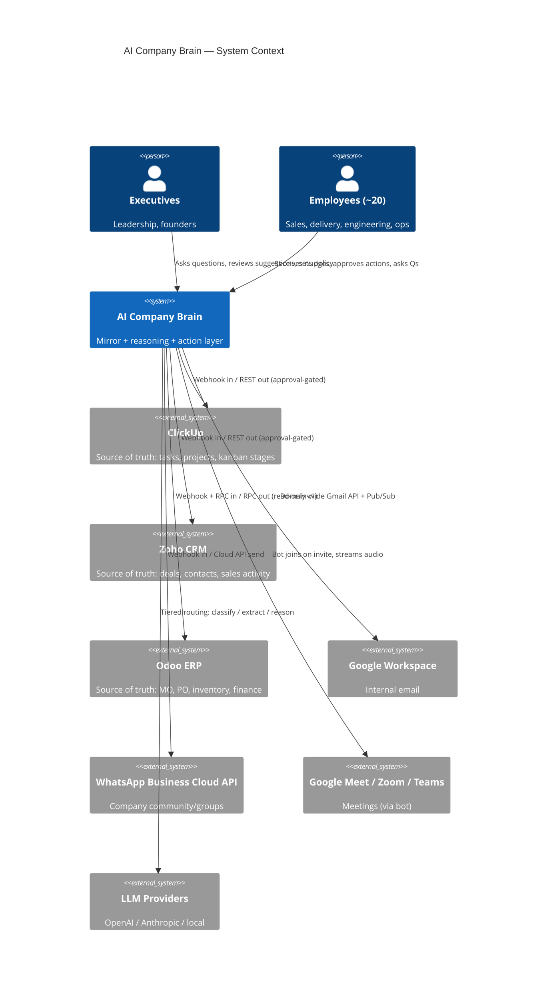
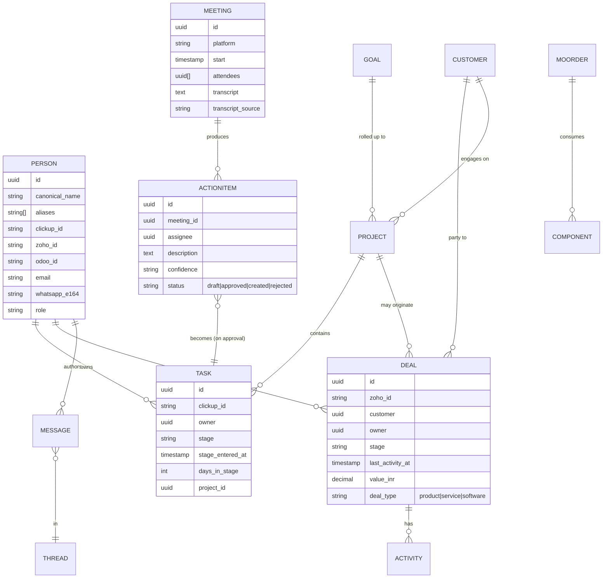
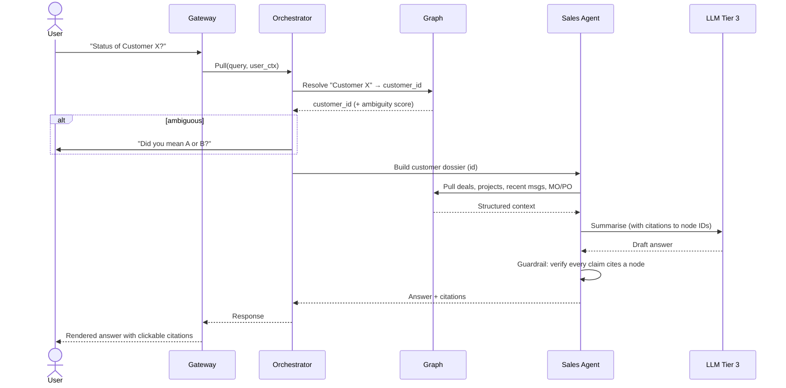
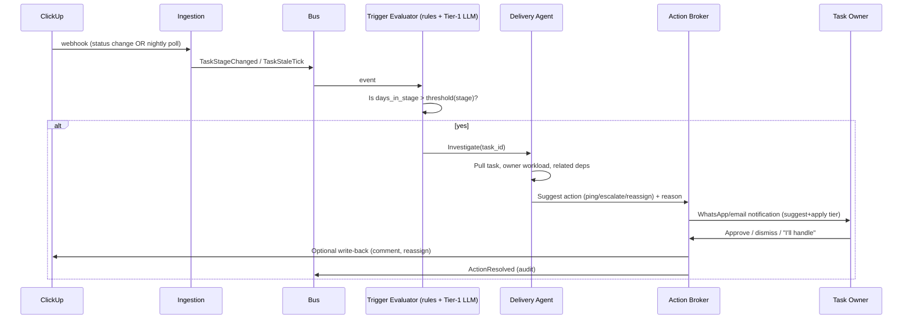
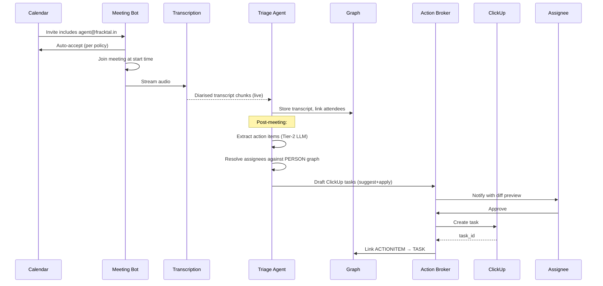
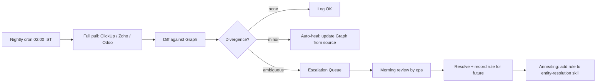
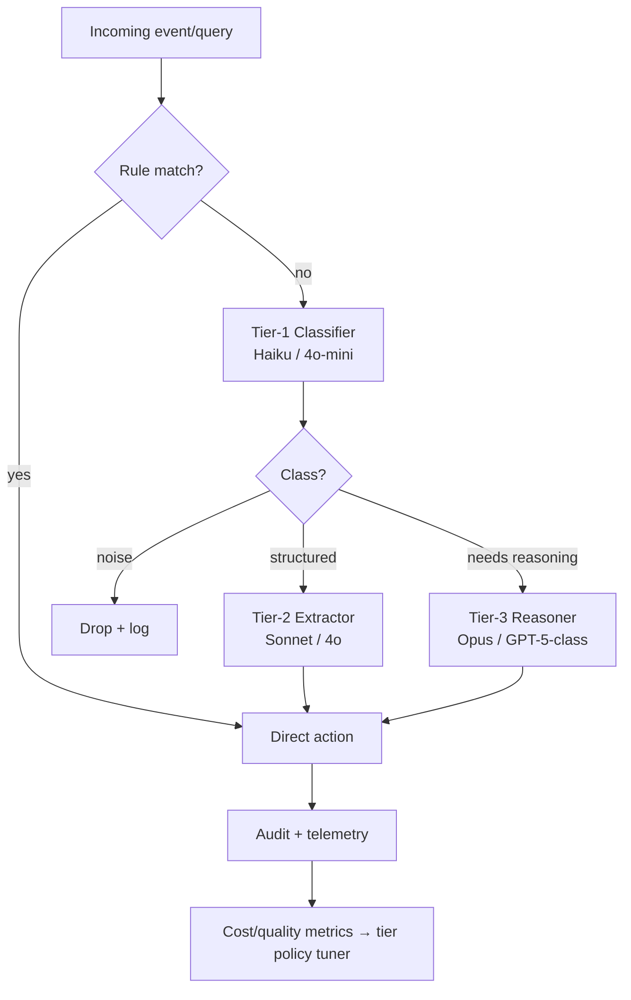
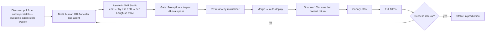

# System Architecture — AI Company Brain

> Project: AI Company Brain · Org: Fracktal Works · Date: 2026-05-25
> Status: v0.4 architecture (Workflow Editor pane + pervasive AI chat in every pane added). Will be revised at PDR.

---

## 1. Architectural Drivers

From requirements:
- **Source of truth lives in ClickUp, Zoho, Odoo.** The brain is a *read-mostly mirror* with approval-gated writes.
- **Pull + Push + Ambient** interaction modes must all be supported.
- **Suggest+Apply** by default; per-action authority tier configurable up to autonomous.
- **Anti-hallucination guardrails** are first-class, not bolt-on.
- **Periodic reconciliation** with escalation on drift is mandatory.
- **Tiered LLM routing** (cheap classifier → expensive reasoner) for cost.
- **Self-improving / annealable** per Hermes-pattern (skill creation loop, persistent memory).
- **MVP-first iterative build** with ~2 engineers + AI assistance, no hard deadline.
- **Internal-only scope** (employee email, internal WhatsApp community); executive-level RBAC sufficient at v1.

## 2. C4 — Level 1: System Context



## 3. C4 — Level 2: Container View

```mermaid
C4Container
    title AI Company Brain — Containers
    Person(user, "User", "Executive / Employee")

    Container_Boundary(brain, "AI Company Brain") {
        Container(gw, "Interaction Gateway", "FastAPI + WebSocket", "Pull queries, push notifications, approval UI")
        Container(orch, "Orchestrator", "LangGraph + Deep Agents v0.6", "State machines per workflow; sub-agents, HITL, Skills, context mgmt, MCP")
        Container(agents, "Specialist Agents", "Deep Agents sub-agents", "Sales, Delivery, HR/Utilization, Strategy, Triage, Annealer")
        Container(ingest, "Ingestion Workers", "Python + MCP servers + LangGraph skills", "Webhook receivers, Pub/Sub consumers, meeting bot drivers; ClickUp/Zoho/Odoo MCP")
        Container(graph, "Entity Graph + Memory", "Postgres + pgvector + Apache AGE + Mem0 + Graphiti", "Entity graph; episodic memory (Mem0); bi-temporal entity KG (Graphiti)")
        Container(skills, "Skill Registry", "Deep Agents Skills API + DB", "Annealed skills (executable Python + metadata); gated rollout tracking")
        Container(actions, "Action Broker", "Python", "Approval queue, audit log, write-back to source systems")
        Container(recon, "Reconciler", "Python (cron)", "Nightly diff; escalation queue")
        Container(bot, "Meeting Bot Fleet", "Vexa (Apache-2.0, self-hosted)", "Joins Meet/Teams/Zoom on invite; streams audio for transcription")
        Container(stt, "Transcription", "Whisper-large (self-hosted) + Pyannote diarization", "STT + speaker diarization via WhisperX")
        Container(bus, "Event Bus", "Redis Streams (v1) / Kafka (v3)", "Decouples ingestion from processing")
        Container(gw_llm, "LLM Gateway", "LiteLLM proxy (MIT)", "Unified API; prompt caching config; RouteLLM tier routing; cost metering")
        Container(infer, "Local Inference", "vLLM + Qwen3-8B (Tier 1)", "Automatic Prefix Caching; 5-10x Ollama throughput; OpenAI-compatible API")
        Container(scache, "Semantic Cache", "GPTCache (MIT)", "30-70% cost saving on repeated triage queries; vector-similarity keyed; 1h TTL")
        Container(compress, "Token Compressor", "LLMLingua-2 (MIT, CPU)", "50-60% compression of long tool outputs before model context")
        Container(obs, "Observability", "Langfuse (MIT, self-hosted) + OpenTelemetry", "LLM traces, cost per tier, eval scores; OTel via openllmetry SDK")
        Container(wb, "Skill Workbench (Control Plane)", "Next.js + CopilotKit + AG-UI + Agent Inbox", "Three-pane online UI: (1) Chat / Agent Inbox · (2) Skill Studio (Monaco + OpenHands embed + Promptfoo runner) · (3) Observability (Langfuse embed). Pervasive AI chat assistant in every pane via CopilotKit useCopilotReadable.")
        Container(oh, "OpenHands (Skill IDE backend)", "OpenHands (Apache-2.0, self-hosted)", "Sandboxed editor + terminal + filesystem + LLM-assisted code drafting; scoped to the skills repo")
        Container(e2b, "Sandbox Runner", "E2B (Firecracker microVMs, self-hosted)", "Code execution sandbox for 'Try it' runs in Workbench and CI eval pipelines")
        Container(evals, "Eval Harness", "Promptfoo + Inspect AI", "Per-skill golden cases + scenario tests; CI gate on skill PRs")
    }

    System_Ext(gh, "GitHub (single source of truth)", "Two repos: ai-company-brain (infra/prompts/configs) · ai-company-brain-skills (Anthropic SKILL.md format). Weekly upstream sync from anthropics/skills and VoltAgent/awesome-agent-skills.")

    System_Ext(src, "ClickUp / Zoho / Odoo / Gmail / WhatsApp / Meet", "Sources of truth + capture surfaces")
    System_Ext(llms, "LLM tier 1/2/3", "Haiku / Sonnet / Opus class")

    Rel(user, gw, "HTTPS / WS")
    Rel(gw, orch, "Invoke workflow")
    Rel(orch, agents, "Delegate specialist tasks")
    Rel(orch, graph, "Query / write")
    Rel(orch, skills, "Lookup + invoke skill")
    Rel(orch, actions, "Submit action for approval")
    Rel(agents, gw_llm, "All LLM calls via gateway")
    Rel(gw_llm, scache, "Check cache first")
    Rel(gw_llm, infer, "Tier-1 (local, Qwen3-8B via vLLM)")
    Rel(gw_llm, llms, "Tier-2/3 (Haiku / Sonnet via API)")
    Rel(compress, gw_llm, "Compressed tool outputs")
    Rel(ingest, src, "Webhooks / API / MCP")
    Rel(ingest, bus, "Publish events")
    Rel(bus, orch, "Trigger ambient workflows")
    Rel(bot, stt, "Audio")
    Rel(stt, ingest, "Transcript")
    Rel(recon, src, "Full pull diff")
    Rel(recon, graph, "Compare + escalate")
    Rel(actions, src, "Approved writes")
    Rel(orch, obs, "OTel spans")
    Rel(user, wb, "Chat + edit skills + review HITL queue (HTTPS/WS)")
    Rel(wb, oh, "Embed IDE pane")
    Rel(wb, evals, "Run skill evals")
    Rel(wb, gh, "Read/write skill PRs")
    Rel(oh, e2b, "Sandbox exec")
    Rel(evals, e2b, "Sandbox exec")
    Rel(skills, gh, "Pull latest merged skills")
    Rel(gh, orch, "CI deploys merged config")
    Rel(wb, obs, "Embed traces panel")
```



## 4. Logical Data Model — Entity Graph



**Canonical keys policy:** ClickUp/Zoho/Odoo IDs are authoritative; the graph's own UUID is for cross-system join only. Entity resolution merges duplicates nightly using rules → LLM fallback.

## 5. Hardware / Hosting Partitioning

| Component | v1 | v3 |
|---|---|---|
| Orchestrator + Agents | Single Linux VM (8 vCPU / 32 GB), Docker Compose | K8s cluster (3 nodes) |
| Graph DB | Self-hosted Postgres (Hetzner CPX31, ~€12/mo) | Self-hosted with HA |
| Memory layer | Mem0 + Graphiti on same Postgres | Dedicated memory VM |
| Meeting bot | Vexa (Apache-2.0) on dedicated 4 vCPU VM (Day 1) | Vexa cluster |
| Transcription | WhisperX (Whisper-large-v3 + Pyannote 3.1, self-hosted) | Same |
| LLM tier 0 | Rule-based, no LLM | Same |
| LLM tier 1 | **vLLM** serving **Qwen3-8B** on main VM (with Automatic Prefix Caching) | Dedicated GPU VM |
| LLM tier 2/3 | Haiku / Sonnet via LiteLLM gateway (prompt caching enabled) | Same |
| LLM gateway | LiteLLM proxy + RouteLLM classifier (same VM) | Same |
| Semantic cache | GPTCache (MIT) on Redis, in front of LiteLLM | Same |
| Token compression | LLMLingua-2 (CPU, same VM) | Same |
| Observability | Langfuse (MIT, self-hosted, Postgres + ClickHouse) | Same |
| Event bus | Redis Streams | Kafka |
| Workflow automation | LangGraph (built-in) + MCP servers for ClickUp/Zoho/Odoo | Same |
| Object store | S3-compatible (audio, attachments) | Same |

**Infrastructure cost estimate (v1):** ~€25/month for 2 Hetzner VMs; ~€0.05–0.15/meeting for Vexa compute; 1K WhatsApp conv/mo free; LLM API spend estimated at 10–20% of naïve deployment after caching optimisations.

**No on-prem mandate** (user did not require self-hosted-everything), but the architecture allows progressive in-housing as data sensitivity grows.

## 6. Sequence — Pull: "Status of Customer X?"



## 7. Sequence — Ambient: Stale ClickUp Task



## 8. Sequence — Meeting Capture to Task



## 9. Reconciliation (Anti-Drift)



The annealing arrow (I → J) is critical: every escalation that gets resolved by a human becomes a *new skill or rule* in the registry, so the same class of divergence does not re-escalate.

## 10. Tiered LLM Routing



Routing thresholds are themselves tuned by the annealing loop: if Tier-2 keeps producing answers that get rejected, the router learns to promote that class to Tier-3.

## 11. Skill Registry (Anthropic `SKILL.md` format) + Skill Workbench

Skills are versioned in a dedicated GitHub repo (`ai-company-brain-skills`). The format follows the **Anthropic Agent Skills standard** — the same format Deep Agents reads natively and that `anthropics/skills` and `VoltAgent/awesome-agent-skills` (1000+ community skills) use as upstreams.

**On-disk layout:**

```
skills/<domain>/<skill_id>/
  SKILL.md          # YAML frontmatter (id, name, description, when_to_use, allowed_tools, authority, cost_tier, version) + Markdown instructions
  scripts/          # Python scripts the skill calls (executed in E2B sandbox)
  tests/            # Unit tests
  evals/            # Promptfoo golden cases + Inspect AI scenarios (CI-gated)
  CHANGELOG.md
```

**Example `SKILL.md` (Anthropic format, extended with our governance fields):**

```yaml
---
name: stale_deal_followup
description: Draft a follow-up email for a Zoho deal stalled in Proposal/Negotiation for >14 days.
when_to_use: "User asks 'what should I do about stalled deals?' OR ambient trigger fires on deal.last_activity_at > 14d."
allowed_tools: [zoho.read_deal, zoho.read_contact, graphiti.search, gmail.draft]
authority: suggest+apply
cost_tier: 2
version: 0.3.1
provenance: "annealed from 5 manual escalations 2026-04-{03,07,11,18,25}"
rollout_stage: canary    # shadow | canary | full
success_rate_30d: 0.83
cases_seen_30d: 47
---

# Stale Deal Follow-up

## Steps
1. Read deal and primary contact from Zoho.
2. Search Graphiti for last 30 days of related signals (email replies, meetings, slack mentions).
...
```

**Skill Workbench (Control Plane UI):**

A self-hosted Next.js app, **four panes**, each with a context-aware AI chat assistant accessible via a floating overlay (CopilotKit `useCopilotReadable`):

| Pane | Backed by | AI chat context injected | What you can do |
|---|---|---|---|
| **1 · Chat / Agent Inbox** | CopilotKit + AG-UI Protocol + LangGraph Agent Inbox | Full session context; HITL queue state | Standalone conversation with the agent; review + approve/reject HITL queue items; review Annealer-drafted skill PRs. The primary pane — usable entirely on its own. |
| **2 · Skill Studio** | Embedded OpenHands (sandboxed editor + terminal + LLM-assisted drafting) + Monaco + Promptfoo runner | Current `SKILL.md` content + last eval result + open PR diff | Browse skill catalogue, edit `SKILL.md` and scripts in-browser, ask the AI "improve this skill" or "explain this eval failure", run evals, "Try it" in E2B sandbox, open PR |
| **3 · Observability** | Langfuse embed | Currently visible trace (span tree, cost, scores) | Inspect LLM traces; ask the AI "why did this call cost so much?" or "what went wrong in this trace?"; view per-skill success rate, latency, drift |
| **4 · Workflow Editor** | LangGraph workflow engine (React Flow canvas — L3) | Current workflow spec + execution log | Compose workflows from agents/skills on a visual canvas; toggle active/inactive; view run history; ask the AI to improve or debug a workflow |

**Skill lifecycle:**



The Annealer (Phase 4 sub-agent) scans the audit log for recurring human interventions, drafts a candidate skill *as a Pull Request in the workbench*, and submits it to the Agent Inbox. A maintainer reviews/edits in the Skill Studio, then approves. Rollout is gated 10% → 50% → 100% with success-rate tracking; auto-deprecate if rate drops.

**Why this design:** we don't rebuild an IDE — OpenHands is the SWE-bench-leading OSS coding agent and gives us editor + terminal + sandbox + LLM-assisted drafting essentially for free. We don't rebuild a chat UI — CopilotKit + AG-UI is the canonical OSS pattern with the LangGraph Agent Inbox built in. Our custom code is the *integration shell* and the skill-specific scaffolding/lifecycle. See ADR-013, ADR-014.

## 12. Architecture Decision Records

### ADR-001: LangGraph + Deep Agents as orchestration substrate
- **Context:** Need durable, inspectable workflows with HITL gates, sub-agent management, and a self-improving skills loop.
- **Options:** LangGraph alone, LangGraph + Deep Agents, CrewAI, AutoGen v0.4, Pydantic AI, custom.
- **Decision:** LangGraph as the graph runtime (ADR held); Deep Agents v0.6.3 (langchain-ai/deepagents, MIT) as batteries-included harness on top — provides sub-agents, HITL, Skills registry, context management, and MCP tool support out of the box. Specialist agents (Sales, Delivery, HR, Strategy, Triage, Annealer) become Deep Agents sub-agents.
- **Consequences:** Team learns Deep Agents patterns (1–2 day ramp); gains built-in skills/HITL/MCP; reduces Phase-4 Annealer build from 10 ew to ~5 ew; observability via Langfuse (ADR-009), not LangSmith.

### ADR-002: Postgres + pgvector + Apache AGE for graph + vectors
- **Context:** Need entity graph + vector search; team of 2 cannot run Neo4j + Pinecone + Postgres.
- **Decision:** Single Postgres with `pgvector` for embeddings and Apache AGE for property-graph queries. Re-evaluate at 1M+ nodes.
- **Consequences:** One DB to back up; AGE less mature than Neo4j but sufficient for v1.

### ADR-003: Source-of-truth = external systems; brain is read-mostly mirror
- **Context:** Risk of agent corrupting CRM / ERP is unacceptable.
- **Decision:** Writes only via Action Broker with explicit per-action authority tier; nightly reconciliation; no autonomous tier in v1.
- **Consequences:** Slightly slower for write-heavy workflows; eliminates a class of catastrophic failure.

### ADR-004: Vexa (Apache-2.0) as meeting bot from Day 1
- **Context:** Build-vs-buy. Recall.ai (managed SaaS, ~$0.50/hr) was the original v1 choice. SOTA review confirmed Vexa (github.com/Vexa-ai/vexa) is the only mature OSS self-hosted alternative for Meet/Teams/Zoom in 2026 and explicitly positions itself as a Recall.ai replacement.
- **Options:** Recall.ai (managed), Vexa (self-hosted), WhisperX headless (audio only, no bot), custom Playwright.
- **Decision:** Vexa from Day 1 on a dedicated 4 vCPU Hetzner VM (~€6/mo + ~€0.05–0.15/meeting in compute). Chromium is heavy but a dedicated VM isolates the load. WhisperX (Whisper-large-v3 + Pyannote 3.1) handles transcription + diarization, self-hosted.
- **Consequences:** Zero per-hour SaaS cost; data never leaves own infra (important for NDA meetings from Day 1); 1–2 day setup overhead vs Recall.ai API key; requires ops attention if Vexa bot breaks after platform updates.

### ADR-005: Tiered LLM routing from day one
- **Context:** Naive single-model routing will be 5–10× more expensive.
- **Decision:** Three tiers, deterministic Tier-0 first; router publishes cost/quality metrics; thresholds auto-tuned by annealer.
- **Consequences:** More upfront prompt engineering; significant ongoing cost savings.

### ADR-006: Skill annealing requires human approval gate
- **Context:** Hermes pattern enables autonomous skill creation, which is powerful but unsafe.
- **Decision:** Annealer drafts; maintainer approves; gated rollout (10% → 50% → 100%) with success metric.
- **Consequences:** Slower learning than fully-autonomous; eliminates "agent invented a wrong rule" failure mode.

### ADR-007: WhatsApp via Meta Cloud API + dedicated agent number
- **Context:** Must integrate with the existing company WhatsApp Community.
- **Decision:** Provision new business number; onboard via Meta Cloud API; LangGraph ingestion skill handles webhook processing; OpenBSP held in reserve.
- **Consequences:** Per-conversation pricing applies; community message capture requires agent to be a participant in each group.

### ADR-008: LiteLLM gateway + RouteLLM + prompt caching
- **Context:** All LLM calls need unified routing, cost metering, and provider-switching without code changes.
- **Decision:** LiteLLM proxy (MIT) as the single gateway for all model calls. Anthropic `cache_control` and OpenAI automatic prompt caching enabled on all stable prefixes (system prompts, tool schemas) — 50–90% input-token cost reduction. RouteLLM (Apache-2.0, lmsys) trained on logged traffic (Phase 3.5) replaces hand-coded tier rules with a learned binary classifier.
- **Consequences:** Zero code changes to swap model providers; compound cost saving with semantic cache and LLMLingua-2; ~1 ew for RouteLLM training pass.

### ADR-009: Langfuse (MIT, self-hosted) for LLM observability
- **Context:** LangSmith (original plan) is cloud-only and costs $20–50/seat/month. Need equivalent observability at zero incremental cost.
- **Decision:** Langfuse (MIT) self-hosted via docker-compose on Postgres + ClickHouse. Framework-agnostic via OpenTelemetry; openllmetry SDK instruments Deep Agents automatically. Equivalent features to LangSmith: traces, evals, datasets, annotation.
- **Consequences:** LangSmith removed from plan; Langfuse requires ClickHouse container (~1 GB RAM extra); zero seat cost.

### ADR-010: vLLM + Qwen3-8B as Tier-1 local inference
- **Context:** Ollama (original Tier-1 runtime) is developer-focused and lacks production throughput or prefix caching. BFCL v3 shows Llama-3-8B at high-40s% tool-calling accuracy; Qwen3-8B in mid-60s%.
- **Decision:** Replace Ollama in production with vLLM (Apache-2.0) serving Qwen3-8B-Instruct. vLLM Automatic Prefix Caching (APC) gives 85–95% latency/cost savings on repeated prefixes. 5–10× Ollama throughput enables running Qwen3-14B at same latency if needed. Ollama retained for dev laptops only.
- **Consequences:** vLLM requires 1 Docker container; same OpenAI-compatible API so LiteLLM config unchanged; Qwen3-8B GGUF available via Ollama for local dev testing.

### ADR-011: Mem0 + Graphiti for agent memory layers
- **Context:** Rolling custom episodic memory on pgvector would cost ~2 ew and re-implement what Mem0/Graphiti already provide.
- **Decision:** Mem0 (Apache-2.0, ~55k stars, 67% LOCOMO score, p95 search 200ms) for episodic/per-user memory. Graphiti (Apache-2.0, Zep, 71% LOCOMO score) for bi-temporal entity relationship KG. Both sit on top of the existing Postgres + pgvector — no new database. Deep Agents tools call `mem0.add()` / `mem0.search()` and `graphiti.add_episode()` / `graphiti.search()`.
- **Consequences:** ~1.5 ew integration (Phase 2); eliminates ~2 ew of custom memory CRUD; Graphiti provides temporal-aware queries Postgres/AGE alone would not.

### ADR-012: GPTCache + LLMLingua-2 for token efficiency
- **Context:** Triage loop handles hundreds of near-identical events per day ("is this email a lead?", "is this task stale?"). Long tool outputs from ClickUp/Zoho/Odoo JSON bloat context.
- **Decision:** GPTCache (MIT, Zilliz) in front of LiteLLM as semantic cache (vector-similarity keyed, 1h TTL for triage decisions). LLMLingua-2 (MIT, CPU-only) post-processes tool outputs >1k tokens before they enter model context (50–60% token reduction at >99% accuracy).
- **Consequences:** 30–70% additional cost saving on triage traffic; compound with prompt caching (ADR-008) and vLLM prefix caching (ADR-010); GPTCache adds ~0.5 ew setup; LLMLingua-2 adds ~0.5 ew; both Phase-1 deliverables.

### ADR-013: Anthropic Agent Skills (`SKILL.md`) as the skill format
- **Context:** We need a portable, future-proof skill format the team can hand-author and the Annealer can auto-draft. Reinventing the format would orphan us from the rapidly-growing skills ecosystem.
- **Options:** Custom YAML schema; LangChain Skills (langchain-skills.com); Anthropic `SKILL.md`.
- **Decision:** Adopt **Anthropic `SKILL.md`** (YAML frontmatter + Markdown body + `scripts/` siblings). It is the de-facto standard, Deep Agents reads it natively (no adapter), `anthropics/skills` is the canonical reference, and the community `VoltAgent/awesome-agent-skills` repo curates 1000+ ready-to-adapt skills. We extend the frontmatter with our governance fields (`authority`, `cost_tier`, `rollout_stage`, `success_rate_30d`, `provenance`).
- **Consequences:** Zero adapter code; can pull from upstream weekly; portable across Claude Code, Codex, Gemini CLI, Cursor; team learns one format that's the industry direction.

### ADR-014: Skill Workbench = OpenHands + Next.js Control Plane (CopilotKit + AG-UI + Agent Inbox)
- **Context:** The user wants an *online UI* where they can iteratively work on skills — generate code, run it, access the filesystem, hone the skill, and have the agent pick up the new version. Building this from scratch is multi-month work.
- **Options:** Build custom IDE; use VS Code in browser (code-server); use OpenHands.
- **Decision:** Self-host **OpenHands** (Apache-2.0, top OSS coding agent on SWE-bench) as the Skill Studio backend — it already provides sandboxed editor + terminal + filesystem + LLM-assisted code drafting. Wrap it in a custom **Next.js** control plane that adds three panes (Chat, Skill Studio, Observability) using **CopilotKit + AG-UI Protocol** for the chat surface and the **LangGraph Agent Inbox** pattern for the HITL approval queue. Skills repo is mounted into the OpenHands workspace. "Try it" runs in **E2B** sandbox (ADR-016) so the same runtime is used by CI evals.
- **Consequences:** No bespoke IDE to maintain; ~5 ew Phase-0.5 to ship MVP; the Workbench *is* how skills are authored from M1.5 onward — humans, founder, and (later) the Annealer all use the same UI; OpenHands version pinned and updated on a quarterly cadence.

### ADR-015: Git is the source of truth for every editable agent artefact; PR + eval gate for promotion
- **Context:** The user wants the entire agent editable *and* version-controlled on GitHub. Live-editing running prompts is a recipe for drift and silent regressions.
- **Decision:** Everything human- or agent-editable lives in GitHub: directives (`directives/`), sub-agent prompts, skills (`ai-company-brain-skills/`), LiteLLM router config, Langfuse dataset definitions, Promptfoo eval cases. **No live edits to running prompts** — every change is a PR; CI runs the Promptfoo + Inspect AI eval suite on the affected skill(s); merge gated. Deployment is automatic on merge via webhook → the Skill Registry pulls the new version and stages it at 10% shadow.
- **Consequences:** Full audit trail; rollback = `git revert`; Annealer-drafted skills are PRs like any other; eliminates "who changed the prompt at 11pm" failure mode; requires the Workbench to use GitHub PR API (built into OpenHands).

### ADR-016: Self-hosted E2B (Firecracker) as the sandbox runtime
- **Context:** Skills execute Python (and shell). We need an isolated, fast-spinup sandbox for both "Try it" runs in the Workbench *and* CI eval runs — ideally the same runtime so behaviour is consistent.
- **Options:** E2B (open-source, Firecracker microVMs), Daytona (gVisor), Modal (managed), Docker-in-Docker (insecure), homegrown Firecracker.
- **Decision:** Self-host **E2B** on Firecracker microVMs on a dedicated Hetzner CX31 VM. OSS, ~94% Fortune-100 production use, well-documented Firecracker self-host story. Same SDK is invoked by the Workbench (interactive) and the CI eval runner (batched).
- **Consequences:** ~1 ew Phase-2.9 to set up; eliminates Docker-in-Docker security smell; gives strong isolation for any skill running arbitrary code; Hetzner CX31 adds ~€10/mo.

### ADR-017: Promptfoo + Inspect AI for skill regression evals; CI-gated
- **Context:** Skills will be edited often. Without regression gates we will silently break behaviour.
- **Decision:** Every skill ships with a `evals/` folder. **Promptfoo** runs golden-case input/output assertions (cheap, fast, runs on every commit). **Inspect AI** (UK AISI, MIT) runs richer multi-turn scenario tests with graded scoring (runs on PR open). Both run in E2B sandbox. PR cannot merge unless both suites pass for the changed skills; eval reports posted as PR comments; trend dashboards exposed in the Skill Studio.
- **Consequences:** ~1.5 ew Phase-1.9 for harness + first 10 golden suites; per-skill maintenance burden (~10 min per skill to author cases); pays for itself on the first prevented regression; aligns with industry SOTA for 2026 agent eval.

### ADR-019: Pervasive AI chat via CopilotKit `useCopilotReadable` in every pane
- **Context:** The user wants AI assistance in the context of whatever they're currently doing — explaining a trace, improving a workflow, fixing a skill — not just in a dedicated chat pane that loses context.
- **Options:** Separate chat instance per pane (state explosion, hard to maintain); global chat with manual copy-paste of context; CopilotKit `useCopilotReadable` context injection.
- **Decision:** Use **CopilotKit `useCopilotReadable`** hooks to inject each pane's current state into the shared chat context automatically. Each pane declares its readable context: Skill Studio exposes `{current_skill_yaml, last_eval_result, open_pr_diff}`; Observability exposes `{current_trace_json}`; Workflow Editor exposes `{current_workflow_json, last_execution_log}`; Chat/Inbox pane exposes full session context. A floating chat overlay (persistent button in every pane header) opens the chat pre-seeded with that pane's context. Chat pane (Pane 1) is the standalone entrypoint and is fully usable without any other pane open.
- **Consequences:** ~1 ew to wire context injection in all three panes; enables contextual slash commands per pane (`/explain`, `/improve`, `/why did this fail`); single CopilotKit provider wraps the whole app so session history is shared across panes; context is read-only from the chat side — actual mutations still go through OpenHands (skills) or the LangGraph workflow engine.

## 13. Open Questions for PDR

1. **Confidence thresholds** — what success rate per agent justifies promotion from suggest+apply to autonomous?
2. **Retention** — how long do raw transcripts and message bodies live? (Legal/HR review needed.)
3. **RBAC v2** — when do we add per-team scoping? (Trigger: first non-executive user request, or 6 months, whichever first.)
4. **Odoo writes** — when do we open up write authority to Odoo? (High-risk; v1 read-only is safe.)
5. **WhatsApp community ingestion** — confirm Meta's policy on the agent reading group messages as a participant.
