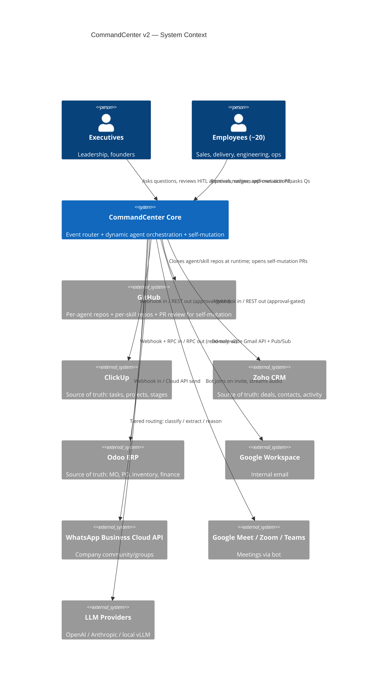
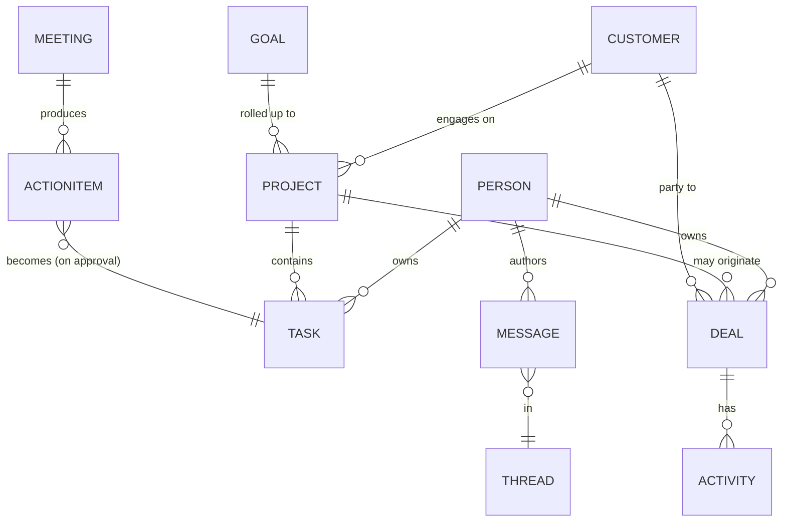
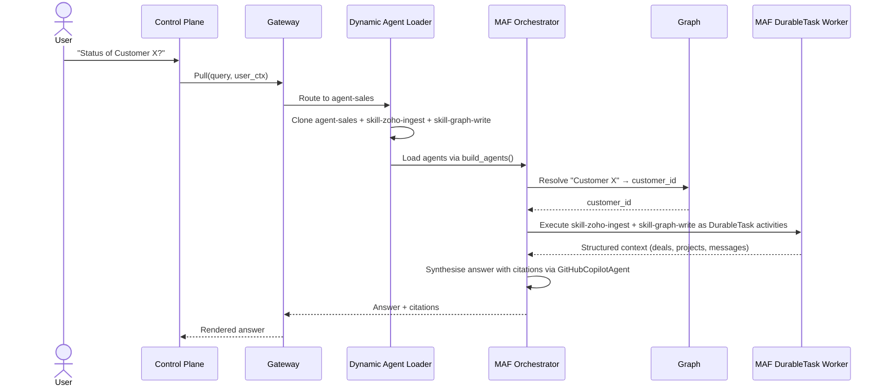
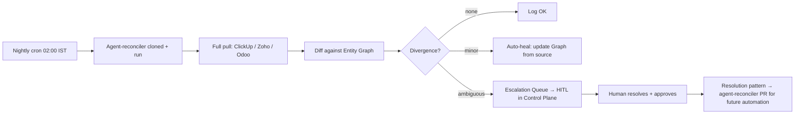

# System Architecture — CommandCenter v2 (Distributed, Self-Mutating Agent Network)

> Project: CommandCenter v2 · Org: Fracktal Works · Date: 2026-06-02  
> Updated: 2026-06-10 — (v2.5) Unified MAF runtime: Copilot SDK agents now run through CommandCenterCopilotAgent (MAF subclass). Package upgrades: agent-framework-core 1.8.0, agent-framework-github-copilot 1.0.0rc1, github-copilot-sdk 1.0.0. Local git tracking for pure MAF agents. Mutation layer enhanced with agent purpose context.
> Status: v2.5 — Single unified MAF runtime. All agents MAF-native. Local git tracking for agent folders.

---

## 1. Architectural Drivers

- **Source of truth lives in ClickUp, Zoho, Odoo.** CommandCenter is a read-mostly mirror with approval-gated writes.
- **Pull + Push + Ambient** interaction modes must all be supported.
- **Decoupled agent and skill repositories.** Every agent and every skill lives in its own GitHub repository. The Core engine contains no agent logic or skill files.
- **Persistent runtime loading.** Agent and skill repos are cloned once into a persistent local cache and refreshed via `git pull` on each event (~0.5 s). No full re-clone per run; no server redeploy to pick up new agent logic.
- **Dual-runtime agent execution — Copilot SDK (direct) + MAF — with a plan to re-unify under MAF.** (1) **`github-copilot` agents** talk to the GitHub Copilot SDK **directly** (bypassing MAF) to enable native BYOK provider support today; the `provider` field in `SessionConfig` routes LLM calls through the user's own API keys via the Copilot CLI (v1.0.2+). (2) **`maf` agents** run through MAF's `Agent.run()` with BYOK via `OpenAIChatCompletionClient` injection when a non-GitHub model is selected. (3) **Future re-integration:** when `agent-framework-github-copilot` relaxes its SDK dependency to allow `github-copilot-sdk >= 1.0.0`, the Copilot SDK direct path will be removed and all agents will run through MAF's `GitHubCopilotAgent` with BYOK passed via `default_options["provider"]`. This is tracked in `project_plan.md` §Open Questions. (4) **CopilotKit** (`@copilotkit/react-*`) is a *React UI library* — the rendering layer for the chat window. AG-UI is CopilotKit's own streaming protocol. The Control Plane chat connects to agents via AG-UI. (5) **DurableTask (DTS) is deferred to Phase 2.** Phase 0-1 agents are short-running (seconds to minutes); HITL uses the Action Broker pattern (Postgres `approval_queue`). See ADR-026. **No LangGraph. No deepagents. No n8n.**
- **Hot-patch self-mutation with an audit gate.** When an agent fails, the Self_Mutation_Node applies a tested code fix directly to the persistent local clone (the fix is live immediately) and opens a GitHub PR as an audit record. A human can **merge** (canonicalise the fix in the remote repo) or **reject/close** (Core reverts the local clone to `origin/main`). `max_mutation_attempts = 1` prevents loops.
- **Platform-owned credentials; agent-declared dependencies.** All integration credentials (API keys, OAuth tokens, webhook secrets) are stored encrypted in Core's Integration Registry. Agent `config.json` declares which integrations it needs by name; the Dynamic Agent Loader injects only those credentials into the MAF orchestration context (via `mcp_servers=` config in `GitHubCopilotAgent`). Copilot-native agents: currently via `_build_agent_env()` (interim — to be wired to Integration Registry in Phase 2). No credential ever lives in an agent or skill repo.
- **No in-app skill/workflow authoring.** All development happens in VS Code + Git. The Control Plane is for chat, observability, and HITL approval — not editing.
- **Tiered LLM routing** (cheap classifier → expensive reasoner) for cost.
- **MVP-first iterative build** with ~2 engineers + AI assistance.
- **Internal-only scope.**

---

## 2. C4 — Level 1: System Context



---

## 3. C4 — Level 2: Container View

```mermaid
C4Container
    title CommandCenter v2 — Containers
    Person(user, "User", "Executive / Employee")

    Container_Boundary(core, "CommandCenter Core") {
        Container(gw, "Interaction Gateway", "FastAPI + WebSocket", "Listens for webhook/cron events; pull queries; push notifications; approval UI. Hosts both MAF agent dispatch and Copilot SDK SSE endpoints.")
        Container(dal, "Dynamic Agent Loader", "Python (importlib + sys.path)", "On event: clones target agent repo + declared skill repos; imports agents.py at runtime; calls build_agents() and runs via MAF native workflow engine (no DTS in Phase 0).")
        Container(orch, "Orchestrator", "MAF HandoffBuilder + native workflow engine", "Executes agent workflows via MAF HandoffBuilder/ConcurrentBuilder/MagenticBuilder. HITL via Action Broker pattern (Postgres approval_queue). Routes to Self_Mutation_Node on error. DurableTask deferred to Phase 2.")
        Container(ag_ui, "MAF AG-UI Endpoint", "agent-framework-ag-ui (FastAPI)", "add_agent_framework_fastapi_endpoint wraps the same MAF agents for interactive operator chat. AG-UI streaming protocol — CopilotKit frontend speaks AG-UI natively. Replaces copilot_chat.py SSE path.")
        Container(mutator, "Self_Mutation_Node + Copilot Mutation Container", "GitHub Copilot SDK (acb-mutation-runner Docker image)", "Spawned on MAF orchestration error; receives failure telemetry + BYOK credentials via env; checks out live clone; applies fix; runs tests; opens GitHub PR. max_mutation_attempts=1; container self-destroys.")
        Container(ingest, "Ingestion Workers", "Python + MCP servers + MAF skills", "Webhook receivers, Pub/Sub consumers, meeting bot drivers; ClickUp/Zoho/Odoo MCP")
        Container(graph, "Entity Graph + Memory", "Postgres + pgvector + Mem0", "Entity graph; episodic memory via Mem0ContextProvider (agent-framework-mem0). Apache AGE and Graphiti deferred to Phase 2.")
        Container(actions, "Action Broker", "Python", "Approval queue, audit log, write-back to source systems")
        Container(recon, "Reconciler Agent", "agent-reconciler (cloned at runtime)", "Nightly diff; escalation queue")
        Container(bot, "Meeting Bot Fleet", "Vexa (Apache-2.0, self-hosted)", "Joins Meet/Teams/Zoom; streams audio for transcription")
        Container(stt, "Transcription", "WhisperX + Pyannote", "STT + speaker diarization")
        Container(bus, "Event Bus", "Redis Streams", "Decouples ingestion from orchestration")
        Container(gw_llm, "LLM Routing", "litellm Python SDK (MIT)", "Unified API; prompt caching; model aliases (tier-1/2/3); cost metering. No proxy container — litellm SDK calls providers directly. All MAF agent calls route through acb_llm.")
        Container(infer, "Local Inference [Phase 2]", "vLLM + Qwen3-8B", "Deferred: requires GPU VM. Phase 0 uses cloud Tier-1 (Haiku / GPT-4o-mini via litellm SDK).")
        Container(scache, "Semantic Cache [Phase 2]", "LiteLLM redis-semantic", "Deferred: redis-stack-server upgrade deferred until LiteLLM semantic cache is actually configured.")
        Container(compress, "Token Compressor [Phase 2]", "LLMLingua-2 (MIT, CPU)", "Deferred: 50-60% compression. Add when context costs become a problem.")
        Container(obs, "Observability", "MAF native OTel [backend TBD]", "MAF emits OpenTelemetry spans automatically via configure_otel_providers() — no Langfuse Python SDK in agent code. OTLP-ready; a self-hosted trace backend (e.g. Langfuse) is deferred and removed from the Phase-0 stack. MCP trace propagation included. Cost per tier via LiteLLM spend tracking.")
        Container(cp, "Control Plane (Workbench)", "Next.js", "Three panes: (1) Chat / Agent Inbox with model picker + agent switcher · (2) Observability (audit log + spend) · (3) HITL Approval Queue. No skill/workflow editor — authoring is done in VS Code + Git.")
    }

    System_Ext(gh, "GitHub", "Agent repos (agent-*) and skill repos (skill-*). PR review for self-mutation PRs.")
    System_Ext(src, "ClickUp / Zoho / Odoo / Gmail / WhatsApp / Meet", "Sources of truth + capture surfaces")
    System_Ext(llms, "LLM Providers", "Haiku / Sonnet / Opus class")
    System_Ext(copilot_api, "GitHub Copilot API", "https://api.githubcopilot.com — model provider for Copilot SDK sessions and copilot/* LiteLLM aliases")

    Rel(user, gw, "HTTPS / WS")
    Rel(user, cp, "HTTPS / WS")
    Rel(gw, dal, "Route webhook/cron event to MAF agent")
    Rel(gw, ag_ui, "Route interactive chat (AG-UI protocol)")
    Rel(dal, gh, "Clone agent repo + skill repos")
    Rel(dal, orch, "Initialise MAF agents from cloned agents.py")
    Rel(orch, mutator, "Route on error (max 1 attempt)")
    Rel(mutator, gh, "Checkout agent repo; open PR with fix")
    Rel(ag_ui, orch, "Same MAF agents; AG-UI streaming wrapper")
    Rel(orch, graph, "Query / write entity graph")
    Rel(orch, actions, "Submit action for approval")
    Rel(gw_llm, scache, "Check cache first")
    Rel(gw_llm, infer, "Tier-1 local (Qwen3-8B via vLLM)")
    Rel(gw_llm, llms, "Tier-2/3 via API")
    Rel(compress, gw_llm, "Compressed tool outputs")
    Rel(ingest, src, "Webhooks / API / MCP")
    Rel(ingest, bus, "Publish events")
    Rel(bus, gw, "Trigger ambient workflows")
    Rel(bot, stt, "Audio")
    Rel(stt, ingest, "Transcript")
    Rel(recon, src, "Full pull diff")
    Rel(recon, graph, "Compare + escalate")
    Rel(actions, src, "Approved writes")
    Rel(orch, obs, "OTel spans + failure telemetry")
    Rel(cp, obs, "Embed traces panel")
    Rel(cp, gw, "Chat queries / HITL approvals")
```



---

## 4. Distributed Repository Layout

```
FracktalWorks/CommandCenter-Core           ← Core engine (this repo). FastAPI, Docker infra, MAF orchestration harness, Postgres entity/memory/audit, LiteLLM, Action Broker.
FracktalWorks/agent-task-manager           ← Agent: ClickUp task management + stale-task escalation
FracktalWorks/agent-billing                ← Agent: billing & invoice workflows
FracktalWorks/agent-sales                  ← Agent: Zoho CRM sales pipeline + deal follow-ups
FracktalWorks/agent-delivery               ← Agent: project delivery monitoring + push notifications
FracktalWorks/agent-triage                 ← Agent: email / WhatsApp / meeting triage + routing
FracktalWorks/agent-reconciler             ← Agent: nightly source-of-truth diff + escalation
FracktalWorks/agent-strategy               ← Agent: weekly digest + planning synthesis
FracktalWorks/skill-clickup-sync           ← Skill: ClickUp read/write via MCP
FracktalWorks/skill-zoho-ingest            ← Skill: Zoho CRM webhooks + REST pull
FracktalWorks/skill-gmail-capture          ← Skill: Gmail Pub/Sub ingest + thread parsing
FracktalWorks/skill-whatsapp-send          ← Skill: WhatsApp Meta Cloud API send
FracktalWorks/skill-meeting-transcribe     ← Skill: Vexa bot + WhisperX + Pyannote
FracktalWorks/skill-graph-write            ← Skill: entity graph upsert (Postgres + pgvector)
FracktalWorks/skill-action-broker          ← Skill: approval queue write + audit logging
```

**Agent repo layout:**
```
agent-<name>/
  config.json        # model tier, execution budget, cron/trigger, required skill repos,
                     #   AND required integrations (by name only — no credentials here)
                     # Example:
                     #   {
                     #     "skill_repos": ["skill-clickup-sync", "skill-graph-write"],
                     #     "integrations": ["clickup", "zoho-crm"],
                     #     "model_tier": "tier-2",
                     #     "max_mutation_attempts": 1
                     #   }
  agents.py          # MAF Agent definitions — exports build_agents() → list[Agent]
                     #   Each Agent wraps a GitHubCopilotAgent (Copilot SDK backend)
                     #   or another MAF-compatible provider (OpenAI, Anthropic, LiteLLM)
                     #   Agents declare tools, MCP servers, and instructions here.
  instructions.md    # Agent persona, operating context, decision guidelines
  tests/             # pytest suite; must pass in CI before any PR can merge
  evals/             # Promptfoo golden cases + Inspect AI scenario tests
  CHANGELOG.md
```

**SECURITY: No credentials in agent repos.** `config.json` lists integration *names*; the Core Integration Registry holds the actual keys. Skills receive credentials via MAF `AgentContext` / MCP server config — never from environment variables directly.

**Skill repo layout:**
```
skill-<name>/
  pyproject.toml     # pip-installable Python package
  src/<skill>/
    __init__.py      # Exports the entry function (well-typed, single function)
    impl.py          # Business logic
  tests/
  evals/
  CHANGELOG.md
```

---

## 5. Operational Lifecycle

### Step 1 — Event Routing
Webhook/cron → Core FastAPI `gw` container → identifies target agent from payload → calls `Dynamic Agent Loader`.

### Step 2 — Resident Repo Cache + Import
Dynamic Agent Loader:
1. Reads agent name from event metadata.
2. **First call:** `git clone` agent repo into `{agents_clone_dir}/repos/agent-<name>/` (full clone, one-time, ~5–20 s).
   **Subsequent calls:** `git pull --ff-only` on the existing clone (< 0.5 s).
3. Reads `config.json` → `skill_repos` list and `integrations` list.
4. Ensures each skill repo is present and up-to-date via the same clone-once / pull-on-demand strategy.
5. `sys.path.insert(0, clone_dir)` for agent + each skill (cleaned up after each run; clone itself persists).
6. `importlib.import_module('agents')` with a unique per-run module name → `build_agents()`.
7. **Credential injection:** queries Core Integration Registry for each name in `config.json["integrations"]`; resolves credentials and injects them into `GitHubCopilotAgent` `mcp_servers=` config so skills receive the correct tokens at runtime — never via environment variables directly.
8. Calls `build_agents()` → returns `list[Agent]` (MAF agents ready for orchestration by the DurableTask worker).

### Step 3 — MAF Workflow Execution (Phase 0: no DTS)
The Dynamic Agent Loader calls `build_agents()` from the cloned repo and runs the returned agents via MAF's native workflow engine (in-process asyncio — no external DTS service in Phase 0). Multi-agent handoffs use `HandoffBuilder`/`ConcurrentBuilder`. For workflows requiring **HITL** (human approval before a write-back): the agent calls the `submit_for_approval(action_type, data)` tool → stores the pending action in the Postgres `approval_queue` table (Action Broker) → the workflow step completes normally. The Control Plane shows pending actions in the HITL queue. When the operator approves, the gateway receives the approval callback and triggers a fresh MAF workflow run that reads the approved action from Postgres and executes the write-back. No long-lived process is held; Postgres survives server restarts.

**DurableTask deferred to Phase 2** — when workflows need genuine multi-day HITL pauses (e.g. "send quote, wait 48 h, follow up"), the DTS emulator service (`mcr.microsoft.com/dts/dts-emulator:latest`) will be added to docker-compose and `agent-framework-durabletask` added to orchestrator dependencies.

### Step 4 — Sandboxed Skill Execution
MAF invokes each skill/tool call inside the agent's toolchain. Skills that require isolation (shell access, file r/w) are invoked via `GitHubCopilotAgent` which spawns the GitHub Copilot SDK subprocess internally. Outputs and errors are captured by the MAF workflow context. Workflow proceeds to the next step once the current one completes or times out.

### Step 5 — Hot-Patch Self-Mutation (on error)
```
Error in worker container
        │
        ▼
MAF Orchestrator routes to Self_Mutation_Node
        │
        ▼
Check: mutation_attempts_this_run >= 1?
   YES → Skip mutation; log + audit; exit.
   NO  → Continue ↓
        │
        ▼
Work from persistent local clone of agent-<name>
(already authenticated via GITHUB_TOKEN in remote URL;
 bot git identity already configured)
        │
        ▼
Read failure telemetry from Postgres (error trace, inputs, stack)
        │
        ▼
Copilot SDK mutation container: propose fix in local clone → run pytest
        │
        ▼
     Tests pass?
     │          │
    NO          YES
     │           │
     ▼           ▼
git reset    git commit fix to local clone main branch
--hard HEAD  (fix is now LIVE — next pull will use it)
     │           │
     ▼           ▼
Log failure  Push new branch auto-fix/{run_id[:8]} to origin
             Open GitHub PR:
               Title: "Auto-fix: <error description>"
               Body:  telemetry + diff + test results +
                      "⚠️ Fix is already live in persistent clone.
                       Merge = canonicalise. Close = rollback."
        │
        ▼
mutation_attempts_this_run = 1 (max reached)
        │
        ▼
Destroy dev sandbox containers → log PR URL in audit
        │
        ▼
     Human reviews PR (async)
     │               │
   MERGE           CLOSE / REJECT
     │               │
     ▼               ▼
Remote main now   PR Event Handler receives GitHub webhook
matches live      → Core: git reset --hard origin/main
clone (no         on the agent's local clone
additional        → agent reverts to pre-fix behaviour
action needed)    → logged in audit as rollback
```

**Hot-patch model rationale:** Applying the fix to the live clone immediately means production recovers in minutes (not hours). The PR is not a gate before recovery — it is an audit record and a rollback trigger. Closing it is the human's "I disagree with this fix" button.

**New infrastructure required:** A `POST /webhooks/github` endpoint in Core that receives `pull_request.closed` (unmerged) events from agent repos, identifies the affected local clone, and issues `git reset --hard origin/main`.

---

## 6. Logical Data Model — Entity Graph



**Canonical keys policy:** ClickUp/Zoho/Odoo IDs are authoritative; the graph's own UUID is for cross-system join only. Entity resolution merges duplicates nightly using rules → LLM fallback.

---

## 7. Hardware / Hosting

| Component | v2 | v3 |
|---|---|---|
| Core engine + agent runtime | Single Linux VM (8 vCPU / 32 GB), Docker Compose | K8s cluster (3 nodes) |
| Postgres (state + entity graph) | Hetzner CPX31 (~€12/mo) | Dedicated HA |
| Memory layer | Mem0 + Graphiti on same Postgres | Dedicated memory VM |
| Meeting bot | Vexa on dedicated 4 vCPU VM | Vexa cluster |
| Transcription | WhisperX + Pyannote, self-hosted | Same |
| LLM Tier-1 | vLLM serving Qwen3-8B (Automatic Prefix Caching) | Dedicated GPU VM |
| LLM Tier-2/3 | Haiku / Sonnet via LiteLLM (prompt caching) | Same |
| LLM gateway | litellm SDK + RouteLLM classifier | Same |
| Semantic cache | GPTCache on Redis | Same |
| Token compression | LLMLingua-2 (CPU, same VM) | Same |
| Observability | MAF native OTel (OTLP backend TBD; Langfuse removed from Phase-0 stack) | OTLP backend self-hosted |
| Event bus | Redis Streams | Kafka |
| GitHub Copilot SDK mutation containers | `acb-mutation-runner` Docker image spawned via host `/var/run/docker.sock` | Same |
| Object store | S3-compatible (audio, attachments) | Same |

**DinD security note:** Core container maps `/var/run/docker.sock` from the host. The Copilot SDK mutation container is spawned through the host Docker daemon. All sandbox containers are network-isolated from each other and from the Core network.

---

## 8. Sequence — Pull: "Status of Customer X?"



---

## 9. Sequence — Hot-Patch Self-Mutation Flow

```mermaid
sequenceDiagram
    participant Orch as MAF Orchestrator
    participant Mut as Self_Mutation_Node
    participant Clone as Persistent Local Clone
    participant OH as Copilot SDK Mutation Container
    participant GH as GitHub (Remote)
    participant PRH as PR Event Handler (Core)
    participant Human as Human Reviewer

    Orch->>Mut: Error in worker (mutation_attempts=0)
    Mut->>OH: Provision Copilot SDK mutation container (mounts local clone)
    Mut->>OH: Inject failure telemetry from Postgres
    OH->>Clone: Implement fix in local clone + run pytest
    alt Tests pass
        OH->>Clone: git commit fix (local main branch)
        Note over Clone: Fix is LIVE on next event
        OH->>GH: git push origin auto-fix/{run_id[:8]}
        OH->>GH: Open PR — body: telemetry + diff + "Merge=persist, Close=rollback"
        Mut->>Orch: mutation_attempts=1; PR URL in audit
        Mut->>OH: Destroy dev sandbox
        Note over Human: Async review
        alt Human merges PR
            Human->>GH: Click Merge
            GH->>GH: CI evals pass
            Note over Clone: Next git pull keeps fix
        else Human closes/rejects PR
            Human->>GH: Close PR without merging
            GH->>PRH: webhook: pull_request.closed (unmerged)
            PRH->>Clone: git reset --hard origin/main
            Note over Clone: Agent reverted to pre-fix state
        end
    else Tests fail
        OH->>Clone: git reset --hard HEAD (discard changes)
        Mut->>Orch: mutation failed; logged in audit
        Mut->>OH: Destroy dev sandbox
    end
```

---

## 10. Reconciliation (Anti-Drift)



Resolved escalations produce a new skill or rule proposed as a PR to `agent-reconciler`, following the same self-mutation flow (human must merge before the agent uses it).

---

## 11. Tiered LLM Routing

```mermaid
flowchart TD
    EV[Incoming event / query] --> T0{Rule match?}
    T0 -- yes --> ACT[Direct action]
    T0 -- no --> T1[Tier-1 Classifier<br/>Qwen3-8B via vLLM / Haiku]
    T1 --> CL{Class?}
    CL -- noise --> DROP[Drop + log]
    CL -- structured --> T2[Tier-2 Extractor<br/>Sonnet / 4o]
    CL -- needs reasoning --> T3[Tier-3 Reasoner<br/>Opus / GPT-5-class]
    T2 --> ACT
    T3 --> ACT
    ACT --> AUD[Audit + OTel telemetry]
    AUD --> METRIC[Cost/quality metrics → RouteLLM training (Phase 5)]
```

---

## 12. Architecture Decision Records

### ADR-001: ~~LangGraph + PostgresSaver as orchestration substrate~~ **Superseded by ADR-026** (2026-06-04)
- **Context:** Need durable, inspectable workflows with HITL gates and state persistence.
- **Original Decision:** LangGraph as the graph runtime; `PostgresSaver` for durable state storage.
- **Superseded by:** ADR-026 (MAF + DurableTask). PostgresSaver was never wired in code. The migration is a pre-load-bearing swap.
- **Kept:** Postgres for entity graph, memory, audit, Integration Registry. Only workflow checkpoint responsibility moves to DTS.

### ADR-002: Postgres + pgvector + Apache AGE for entity graph + vectors
- **Context:** Team of 2 cannot run Neo4j + Pinecone + Postgres separately.
- **Decision:** Single Postgres with `pgvector` for embeddings and Apache AGE for property-graph queries.
- **Consequences:** One DB to back up; AGE sufficient for v2 scale.

### ADR-003: Source-of-truth = external systems; Core = read-mostly mirror with approval-gated writes
- **Context:** Risk of agent corrupting CRM / ERP is unacceptable.
- **Decision:** Writes only via Action Broker with explicit per-action authority tier; nightly reconciliation.
- **Consequences:** Safe; slightly slower for write-heavy workflows.

### ADR-004: Vexa (Apache-2.0) as meeting bot from Day 1
- **Decision:** Vexa on a dedicated 4 vCPU Hetzner VM. WhisperX + Pyannote for transcription + diarization.
- **Consequences:** Zero per-hour SaaS cost; data stays in own infra.

### ADR-005: Tiered LLM routing from day one
- **Decision:** Three tiers + deterministic Tier-0; RouteLLM classifier trained on logged traffic in Phase 5.
- **Consequences:** Significant ongoing cost savings.

### ADR-006: Self-mutation requires human PR merge gate; max_mutation_attempts = 1
- **Context:** Agents that can fix their own code could enter an infinite mutation loop if unconstrained.
- **Decision:** `max_mutation_attempts = 1` per failure event. No further mutation PRs until a human merges and the agent verifies the fix on the next live run.
- **Consequences:** Prevents runaway self-modification; preserves human oversight; slower improvement than fully-autonomous but safe.

### ADR-007: WhatsApp via Meta Cloud API + dedicated agent number
- **Decision:** Provision new business number; MAF skill (`skill-whatsapp-send`) handles webhook processing.

### ADR-008: LiteLLM gateway + RouteLLM + Anthropic/OpenAI prompt caching
- **Decision:** litellm SDK for unified routing; Anthropic `cache_control` + OpenAI automatic caching on stable prefixes (50–90% cost reduction); RouteLLM in Phase 5.

### ADR-009: ~~Langfuse (MIT, self-hosted) for LLM observability~~ **Superseded** (2026-06-05)
- **Original decision:** Langfuse via docker-compose on Postgres + ClickHouse as the OTLP backend.
- **Superseded by:** Langfuse removed from the Phase-0 stack (RAM savings). MAF native OpenTelemetry remains (OTLP-ready); a self-hosted trace backend is deferred. Self_Mutation_Node reads failure telemetry from Postgres.

### ADR-010: vLLM + Qwen3-8B as Tier-1 local inference
- **Decision:** vLLM with Automatic Prefix Caching; Qwen3-8B-Instruct (BFCL v3 mid-60s% tool-calling).

### ADR-011: Mem0 + Graphiti for agent memory layers
- **Decision:** Mem0 for episodic/per-user memory; Graphiti for bi-temporal entity KG; both on existing Postgres.

### ADR-012: GPTCache + LLMLingua-2 for token efficiency
- **Decision:** GPTCache (MIT) semantic cache in front of LiteLLM (1h TTL); LLMLingua-2 (MIT, CPU) post-processes tool outputs >1k tokens.

### ADR-013: Per-agent and per-skill GitHub repos; persistent clone cache at runtime
- **Context:** Monorepo approach couples agent logic to Core deployments and prevents per-agent independent versioning, CI, and self-mutation. Earlier v2 draft cloned fresh on every event (~2–5 s overhead).
- **Decision:** Every agent lives in its own `agent-<name>` GitHub repo. Every skill lives in its own `skill-<name>` GitHub repo (pip-installable Python package). The Core engine contains no agent logic or skill files. Dynamic Agent Loader **clones once** into a persistent directory (`{agents_clone_dir}/repos/{repo-name}/`) and does `git pull --ff-only` on each event (~0.5 s).
- **Consequences:** Any agent or skill can be updated independently. Self-mutation PRs touch only the agent's own repo. First-event latency is ~5–20 s (clone); all subsequent events are ~0.5 s (pull). The persistent clone is also the working tree for Self_Mutation_Node (no separate sandbox clone needed). Bot git identity is configured once in each clone so all commits carry proper authorship.

### ADR-014: No in-app skill/workflow editor; VS Code + Git is the authoring environment
- **Context:** Previously planned OpenHands-backed Skill Studio pane inside the Control Plane.
- **Decision:** Removed. All agent and skill development happens in VS Code (locally or via GitHub Codespaces), committed to the respective agent/skill repo, merged through the standard PR flow. The Control Plane contains Chat, Observability, and HITL approval — not an IDE. Agents themselves open PRs via the Self_Mutation_Node.
- **Consequences:** Simpler Control Plane; no Monaco integration required in the UI; authoring tools (GitHub Copilot, Claude Code, Cursor) available for free in the dev environment; agents use the Copilot SDK mutation container (`acb-mutation-runner`) directly for self-mutation, not via a UI wrapper.

### ADR-015: Git is the single source of truth for all agent-editable artefacts; PR + CI gate required for promotion
- **Decision:** Everything editable (agent `agents.py`, `instructions.md`, `config.json`, skill packages, LiteLLM config, eval dataset definitions) lives in GitHub. All changes via PRs. CI runs evals on the agent's `evals/` folder on every PR. Merge is gated on eval pass.

### ADR-016: ~~OpenHands SDK for worker execution~~ **Superseded** (2026-06-04)
- **Context:** Previously planned E2B (Firecracker) for sandbox execution. OpenHands SDK was adopted as an intermediate choice.
- **Superseded by:** (a) MAF workflow engine + `GitHubCopilotAgent` for all production agent skill execution; (b) GitHub Copilot SDK mutation container (`acb-mutation-runner` Docker image) for self-mutation dev sandboxes. Docker-in-Docker via host `/var/run/docker.sock`. E2B and OpenHands SDK both removed.
- **Consequences:** Consistent runtime under MAF; GitHubCopilotAgent provides autopilot mode with native shell/file/script tool-calling; mutation container is ephemeral and network-isolated.

### ADR-017: Promptfoo + Inspect AI for skill/agent regression evals; CI-gated
- **Decision:** Every agent and skill repo ships an `evals/` folder. Promptfoo (golden-case assertions) + Inspect AI (graded scenario tests). PR cannot merge unless both suites pass.

### ADR-018: importlib + sys.path.append() for safe dynamic agent loading inside FastAPI
- **Context:** Need to load agent repos at runtime without restarting the server; standard Python import system does not support runtime path injection cleanly.
- **Decision:** FastAPI route controllers use `sys.path.append(cloned_agent_path)` and `importlib.import_module('agents')` to load each agent's `agents.py`. The loaded module is called via `build_agents()` which returns `list[Agent]` handed to the MAF workflow engine. Paths are cleaned up after each run; clone persists.
- **Consequences:** Server stays up during agent updates; no monkey-patching of global modules; each run gets a fresh import of the cloned code.

### ADR-019: DinD via host /var/run/docker.sock mapping
- **Decision:** Core container maps `/var/run/docker.sock` from host into the container. The GitHub Copilot SDK mutation container (`acb-mutation-runner`) is launched through the host Docker daemon by `Self_Mutation_Node`. Normal agent execution uses MAF's in-process workflow engine — no Docker required.
- **Consequences:** Enables ephemeral mutation container lifecycle management from within the Core container; standard DinD pattern; containers are isolated at the Docker network level.

### ADR-020: Decoupled per-agent and per-skill GitHub repos
- **See ADR-013.** This is the primary structural decision of v2. Each agent repo is independently deployable, testable, and self-improvable. Each skill repo is a versioned Python package. The Core engine is a pure runtime host.

### ADR-021: Hot-patch self-mutation with audit-gate PR and rollback on rejection
- **Context (revised from ADR-006):** Waiting for human PR merge before a fix is live means production stays broken for hours. The goal of self-mutation is fast recovery — the human gate is for safety and auditability, not for speed.
- **Decision:**
  1. Self_Mutation_Node applies the tested fix directly to the **persistent local clone** (on the live `main` branch). The fix is immediately active for the next event — no wait.
  2. It simultaneously opens a GitHub PR (branch `auto-fix/{run_id[:8]}`) as an **audit record** and a **rollback trigger**.
  3. PR body clearly states: *"This fix is already live in the persistent clone. Merge = persist to remote. Close = Core will revert the clone to `origin/main`."*
  4. `max_mutation_attempts = 1` per failure event — no loop.
  5. A new **PR Event Handler** (`POST /webhooks/github` in Core) receives GitHub `pull_request.closed` events. If closed without merging: `git reset --hard origin/main` on the affected clone.
- **Consequences:** Production recovers in minutes. Human review is still required to canonicalise the fix in the repo. A human who disagrees with the fix closes the PR and the rollback is automatic. CI evals gate the PR merge as normal.

### ADR-022: Platform-level Integration Registry; agent-declared credential dependencies
- **Context:** Integration credentials (API keys, OAuth tokens, webhook secrets) must be accessible to agents and skills at runtime. The naive approaches — storing credentials in agent repos (security risk), or injecting all credentials into all agents (no least-privilege), or per-agent .env files (operational burden) — are all unacceptable.
- **Decision (industry-standard pattern):**
  1. **Core owns the Integration Registry** — all credentials stored encrypted in Postgres (`integrations` table), managed via the Control Plane admin UI and `.env`. Follows the pattern used by n8n, Prefect, Temporal, and GitHub Actions.
  2. **Agent `config.json` declares dependencies** by integration *name* only: `"integrations": ["clickup", "zoho-crm"]`. No credential values ever appear in agent repos.
  3. **Dynamic Agent Loader resolves credentials** from the Integration Registry for each name in `config.json["integrations"]` and injects them into `GitHubCopilotAgent` `mcp_servers=` config so skills receive the correct tokens via the MCP protocol.
  4. **Skills read credentials via MCP** — the MCP server process receives credentials as env vars injected by the loader. Skills call `os.getenv(...)` or use the MCP client — never `state["integrations"]` or raw env vars outside the MCP process.
  5. **OAuth lifecycle** (token refresh, PKCE flows) is managed by Core, not by individual skills. Skills call a `Core.ensure_token("zoho-crm")` helper that handles refresh transparently.
- **Consequences:** Credentials never in agent repos (no GitHub secret leak risk). Least-privilege enforced at load time. Adding a new integration to an agent is a one-line `config.json` change + admin UI registration. OAuth rotation happens once in Core and propagates to all agents automatically. Skills remain stateless and testable without real credentials (mock env vars in tests).

### ADR-026: MAF replaces LangGraph + deepagents; DurableTask deferred; AG-UI unifies chat paths (2026-06-04, updated v2.4)
- **Context:** LangGraph + deepagents required hand-written sub-graph boilerplate. PostgresSaver was never wired. MAF provides native multi-agent patterns and a rich package ecosystem. Overlap analysis (2026-06-04 v2.4) found that DurableTask, the separate Copilot SDK SSE path, the Langfuse Python SDK, and the redis-stack-server upgrade were all unnecessary for Phase 0.
- **Decision (MAF adoption):** Replace `langgraph`, `langgraph-checkpoint-postgres`, `deepagents`, `langchain-core` with `agent-framework`, `agent-framework-github-copilot --pre`, `agent-framework-ag-ui`, `agent-framework-mem0 --pre`, `agent-framework-redis --pre`. Agent repos export `build_agents() → list[Agent]`.
- **Decision (DTS deferred):** Do NOT add DTS emulator to `infra/docker-compose.yml` for Phase 0-1. HITL uses the Action Broker pattern (Postgres `approval_queue`). Short-running agent workflows (< 5 min) do not need distributed checkpoint storage. Add `agent-framework-durabletask` + DTS Docker service in Phase 2 when multi-day wait patterns are needed.
- **Decision (AG-UI unification):** `add_agent_framework_fastapi_endpoint(app, agent, "/copilot/chat")` replaces the separate `copilot_chat.py` Copilot SDK SSE path. CopilotKit frontend natively speaks AG-UI. Interactive and background agents are the same MAF agents — one runtime.
- **Decision (observability):** Call `configure_otel_providers(OTEL_EXPORTER_OTLP_ENDPOINT=..., OTEL_EXPORTER_OTLP_HEADERS=...)` at orchestrator startup. MAF emits OTel spans automatically. Remove Langfuse Python SDK from agent code entirely.
- **Decision (redis image):** Revert `infra/docker-compose.yml` Redis from `redis/redis-stack-server:7.4.0-v0` to `redis:7-alpine`. RediSearch/RedisJSON only needed for LiteLLM semantic cache, which is Phase 2.
- **Consequences:** Single unified MAF runtime. No DTS Docker service in Phase 0-1. No separate `copilot_chat.py`. No `langfuse` SDK in agent code. Simpler docker-compose (4 services vs 6). Phase 2 additions clearly delineated.

--- — Control Plane

The Control Plane (`workbench/control_plane`) exposes a dedicated **`/chat` page** as the primary human-facing interface to Jannet. This is a full-page chat (not just the floating CopilotSidebar overlay) with session management.

**Technology:** CopilotKit v1.57 (`@copilotkit/react-core`, `@copilotkit/react-ui`, `@copilotkit/runtime`). CopilotKit also developed the **AG-UI Protocol** — the emerging standard for bi-directional agent↔UI streaming — which is used as the upgrade path to a full MAF streaming backend.

**Chat page layout:**
```
+--chat page-------------------------------------------+
| Left panel (w-72)          | Main chat area           |
|   - Session list           |   - CopilotChat          |
|   - "New session" button   |   - Session header       |
|   - Memory panel           |   (per-session threadId) |
|     (Mem0 stored facts)    |                          |
+-----------------------------+--------------------------+
```

**Session isolation:** Each `ChatSession` is assigned a UUID stored in localStorage. `CopilotKitProvider` receives this UUID as `threadId`, isolating message history per session. For the MAF AG-UI endpoint, this UUID is passed as the `thread_id` parameter — MAF uses the `RedisHistoryProvider` (agent-framework-redis) to persist conversation history across page refreshes.

### 13.2 Memory stack (how memory improves over time)

```
User sends a message
        │
        ▼
CopilotKit frontend
  useCopilotReadable injects:
    • Stored Mem0 memories (fetched from /api/chat/memories)
    • Current session context
        │
        ▼
/api/copilot (Next.js route)
  → CopilotRuntime → BuiltInAgent (now) / LangGraphAgent (upgrade)
  → LLM receives memories as readable context
        │
        ▼
User switches session or navigates away
        │
        ▼
Chat page auto-saves conversation
  → POST /api/chat/memories { userId, messages }
        │
        ▼
Mem0 extracts semantic facts from conversation
  (e.g. "User prefers weekly project summaries on Monday morning")
        │
        ▼
Facts stored in Mem0 (self-hosted, backed by Postgres)
        │
        ▼
Next conversation: facts retrieved and injected as context ↑
Next orchestrator run: executor.py queries Mem0 for user context ↑
```

**Improvement loop:** Every conversation enriches Mem0. The orchestrator and agents query Mem0 at run-start so accumulated knowledge improves *all* interactions — not just the chat UI. A delivery agent scheduling a push notification, for example, will know the user prefers WhatsApp over email because that preference was captured in a past chat session.

### 13.5 Local Git Tracking for MAF Agents

Pure MAF agents that don't have GitHub repositories (e.g., agents under development, or agents registered via `local_path`) now get **local-only git version control** automatically.

**How it works:**
1. When `load_agent()` is called with a `local_path`, the source directory is synced into the persistent cache at `{agents_clone_dir}/repos/{agent_name}/`
2. If no `.git` exists, `git init` is run and an initial commit is created as a rollback baseline
3. On subsequent loads, only changed files are synced (timestamp + size check)
4. The cache directory becomes the agent's working directory — isolated from the source

**Benefits:**
- **Version control** — every agent change is tracked, committable, and revertible
- **Mutation sandbox compatibility** — the cache dir is a proper git repo that can be mounted into the Docker sandbox
- **Inbox approval flow** — commits surface in the Control Plane inbox; Approve keeps, Reject runs `git reset HEAD~1`
- **No external dependency** — git is already on every system

**Agent source matrix:**

| Source | Git remote? | Cache behaviour | Mutation push? |
|---|---|---|---|
| GitHub (`repo_url`) | ✅ `origin` → github.com | `git clone` → `git pull --ff-only` on each load | Approve → `git push origin` |
| Local folder (`local_path`) | ❌ Local only | Sync source → cache → `git init` if needed | Approve → keep commit (no remote) |

**Rejection flow by source:**
- GitHub agents: `git reset --hard origin/main` (upstream is authoritative)
- Local agents: `git reset HEAD~1` (previous commit is authoritative)

### 13.3 Runtime Taxonomy — Unified MAF Runtime (as of 2026-06-10)

CommandCenter now uses a **single unified MAF runtime** for all agents. The dual-runtime split (Copilot SDK direct path + MAF path) has been retired.

**Resolution:** `agent-framework-github-copilot` 1.0.0rc1 (released 2026-06-05) relaxed its SDK dependency from `<0.1.33` to `<2,>=1.0.0`, enabling full re-integration. All agents now run through MAF.

| Package | Previous | Current |
|---|---|---|
| `agent-framework-core` | 1.7.0 | **1.8.0** |
| `agent-framework-github-copilot` | 1.0.0b260402 | **1.0.0rc1** |
| `github-copilot-sdk` | 0.1.32 | **1.0.0** |

#### How Agents Execute

| Agent `agent_runtime` | Executor | BYOK mechanism |
|---|---|---|
| `github-copilot` | `CommandCenterCopilotAgent` (MAF subclass) → `agent.run(stream=True)` | `provider` in `default_options` → forwarded to Copilot SDK via patched `_create_session()` |
| `maf` | MAF `Agent.run()` | `OpenAIChatCompletionClient` injected with BYOK `base_url` + `api_key` |

**Key architectural change:** The `CommandCenterCopilotAgent` (at `apps/orchestrator/orchestrator/copilot_agent.py`) extends `GitHubCopilotAgent` with:
1. **BYOK provider forwarding** — patches `_create_session()` to pass `provider` from `default_options` to the Copilot SDK `SessionConfig`
2. **Rich event streaming** — patches `_stream_updates()` to handle ALL Copilot SDK event types (reasoning/thinking, tool progress, partial terminal output, agent intent) and translate them to MAF `AgentResponseUpdate` objects
3. **Zero agent repo changes** — the executor monkey-patches these methods onto the loaded agent at runtime, so agent repos continue returning standard `GitHubCopilotAgent` instances

#### Event Streaming — Full Consciousness Forwarded to Frontend

All event types emitted by the Copilot SDK are now captured and forwarded as AG-UI SSE events:

| Copilot SDK Event | MAF Content Type | AG-UI SSE Event | Frontend Rendering |
|---|---|---|---|
| `ASSISTANT_MESSAGE_DELTA` | `Content.from_text()` | `TEXT_MESSAGE_CONTENT` | Streaming text tokens |
| `ASSISTANT_REASONING_DELTA` | `Content.from_text_reasoning()` | `THINKING_TEXT_MESSAGE_CONTENT` | Live in `ThinkingContainer` |
| `TOOL_EXECUTION_START` | `Content.from_function_call()` | `TOOL_CALL_START` + `TOOL_CALL_ARGS` | Tool execution block |
| `TOOL_EXECUTION_COMPLETE` | `Content.from_function_result()` | `TOOL_CALL_RESULT` | Tool result display |
| `TOOL_EXECUTION_PROGRESS` | `Content.from_text()` | (via `raw_representation`) | Progress updates |
| `TOOL_EXECUTION_PARTIAL_RESULT` | `Content.from_text()` | (via `raw_representation`) | Terminal output streaming |
| `ASSISTANT_INTENT` | `Content.from_text()` | `TOOL_CALL_START` (intent display) | Agent status |

#### Chat UI Routing

The frontend routes to two endpoints, both now MAF-native:

| Chat Mode | Endpoint | Runtime |
|---|---|---|
| Orchestrator chat | `/copilot/chat` | MAF `Agent` with `OpenAIChatCompletionClient` (plain MAF — the router) |
| Named agent chat (`copilot` mode) | `/agent/run/stream` | `CommandCenterCopilotAgent` (MAF-wrapped Copilot SDK) |

---

#### GitHub Copilot SDK (`github-copilot-sdk` Python package, v1.0.0)

**What it is:** A Python library that wraps the Copilot CLI binary via JSON-RPC. In CommandCenter, it is **only used inside `GitHubCopilotAgent` / `CommandCenterCopilotAgent`** (MAF wrappers) and inside the mutation sandbox (`acb-mutation-runner` Docker container). It is never called directly by application code.

**What it can do:**
- Native tool execution: shell commands, file read/write, Python script execution
- Config discovery: reads `AGENTS.md`, `.mcp.json`, `.github/copilot-instructions.md` from `working_directory`
- `agent_mode="autopilot"`: autonomous tool selection and execution
- BYOK via `provider` config in `SessionConfig`
- Streaming events: text deltas, reasoning deltas, tool execution lifecycle

**Auth and model selection:**
```
Mode A — GitHub Copilot subscription (GITHUB_TOKEN):
  CopilotClient(github_token=...) → GitHub Copilot API (api.githubcopilot.com)

Mode B — BYOK (provider key):
  SessionConfig.provider = {type:"openai", base_url:"https://api.deepseek.com/v1", api_key:"sk-..."}
  Routes LLM calls through the user's own API keys
  All major providers supported: DeepSeek, OpenAI, Anthropic, Gemini, Groq, OpenRouter, etc.
```

**Where it lives:**
- `apps/orchestrator/orchestrator/copilot_agent.py` — `CommandCenterCopilotAgent` (MAF subclass with BYOK + rich events)
- `apps/orchestrator/orchestrator/executor.py` — Patches loaded agents with `CommandCenterCopilotAgent` methods at runtime
- `apps/orchestrator/mutation_runner.py` — Sandboxed mutation container (standalone Copilot SDK usage — by design)
- `apps/orchestrator/Dockerfile.mutation` — `acb-mutation-runner` Docker image (spawned on demand by Self_Mutation_Node)
- `apps/orchestrator/mutation_runner.py` — mutation runner script inside the container
- **NOT** in `apps/gateway/` — the `copilot_chat.py` SSE path has been replaced by the MAF AG-UI endpoint (see below).

**Used for:**
- **Interactive agent chat for `github-copilot` agents** — Copilot SDK direct path in `executor.py` (bypasses MAF to enable native BYOK provider support)
- Self-mutation sandboxes (`Self_Mutation_Node` spawns the mutation container for code-fix autopilot)

**NOT related to:** CopilotKit, LangChain, LangGraph, or any JavaScript library.

---

#### MAF — Microsoft Agent Framework (`agent-framework`, `agent-framework-github-copilot`, `agent-framework-ag-ui`, `agent-framework-mem0`, `agent-framework-redis` pip packages)

**What it is:** The **primary agent execution runtime for all agents**. Agent repos export `build_agents() → list[Agent]`. The MAF native workflow engine runs orchestrations in-process (asyncio). DurableTask is deferred to Phase 2. All agents — both `maf` and `github-copilot` — now run through MAF (see §13.3).

**How it calls models:**
```python
# MAF agents call models via GitHubCopilotAgent (autopilot mode)
# All LLM routing flows: GitHubCopilotAgent → gateway /v1 (litellm SDK) → configured backend
# Or: GitHubCopilotAgent → GitHub Copilot API (GITHUB_TOKEN mode)
from agent_framework_github_copilot import GitHubCopilotAgent

agent = GitHubCopilotAgent(
    name="my-agent",
    instructions=_build_system_prompt(),
    mcp_servers={"clickup": {"type": "stdio", "command": "uvx", "args": ["skill-clickup"]}},
)
```

**Where it lives in this repo:**
- `apps/orchestrator/orchestrator/executor.py` — Unified agent runner for all agents. `CommandCenterCopilotAgent` (MAF subclass) handles `github-copilot` agents with BYOK + rich streaming. MAF `Agent.run()` handles `maf` agents.
- `apps/orchestrator/orchestrator/copilot_agent.py` — `CommandCenterCopilotAgent` class with BYOK provider forwarding and full event streaming.
- `apps/orchestrator/orchestrator/agents.py` — Orchestrator agent definition loading.
- Each `agent-<name>/agents.py` (external repos) — per-agent `build_agents()` definitions
- Context providers wired at startup: `Mem0ContextProvider` (episodic memory) + `RedisHistoryProvider` (conversation history)

**Multi-agent patterns:**
```python
from agent_framework import HandoffBuilder, ConcurrentBuilder

# Sequential handoff
workflow = HandoffBuilder(source=triage_agent, targets=[sales_agent, ops_agent]).build()

# Concurrent fan-out
workflow = ConcurrentBuilder(agents=[research_agent, crm_agent]).build()
```

**Used for:** All agent execution — background event-driven agents (webhook triggers, cron jobs, reconciler, nightly diffs, self-mutation orchestration) AND interactive operator chat (via AG-UI endpoint). GitHub Copilot SDK is used only inside the mutation container subprocess.

**NOT related to:** LangGraph, deepagents, langchain-core. CopilotKit is the React UI layer; AG-UI is the streaming protocol between CopilotKit frontend and MAF backend.

---

#### CopilotKit (`@copilotkit/react-*` npm packages)

**What it is:** A React/TypeScript UI library. It provides the chat window component and context injection hooks. It is **not an LLM**, **not an orchestrator**, and has **no connection to GitHub Copilot**.

**What it does in this codebase:**
- `CopilotChat` — renders the chat message thread UI
- `useCopilotReadable` — injects Mem0 memories and session context as readable background for the LLM
- `CopilotKitProvider` — wraps the page; manages `threadId` (session isolation)
- `CopilotRuntime` (Next.js backend, `apps/api/copilot/route.ts`) — receives the frontend request and forwards it to an AI backend

**Current backend (BuiltInAgent):**
```
CopilotKit UI → /api/copilot (Next.js) → CopilotRuntime → BuiltInAgent
                                                            ↓
                                                    LiteLLM (OpenAI-compat)
                                                            ↓
                                                    Text response only (no tool calling)
```
`BuiltInAgent` is a simple text-only LLM call. **No tool calling. No orchestration.** The model picker in the UI selects which LiteLLM tier or Copilot SDK model handles the next message — CopilotKit's `BuiltInAgent` is not involved when the Copilot SDK path is chosen.

**Current backend for interactive chat (AG-UI, WBS 0.6):**
```typescript
// Control Plane: configure CopilotKitProvider to point to the MAF AG-UI endpoint
// The gateway's /copilot/chat now serves AG-UI protocol via add_agent_framework_fastapi_endpoint
const copilotKitUrl = process.env.GATEWAY_URL + "/copilot/chat";
```
The MAF orchestrator serves as the AG-UI backend. CopilotKit frontend sends chat messages via AG-UI to the MAF agent — full tool-calling, skill execution, streaming, and HITL all supported. Session history persisted via `RedisHistoryProvider` (keyed by `thread_id`).

---

#### How Chat Model Selection Routes Traffic

The model picker in the Control Plane chat UI determines which execution path handles each message:

| User selects | Route | Orchestrator | Tool calling | Model source |
|---|---|---|---|---|
| **MAF agent** (all chat) | CopilotKit → AG-UI → `/copilot/chat` → MAF | **MAF** (`HandoffBuilder`/`ConcurrentBuilder`; `GitHubCopilotAgent`) | ✅ MCP tools, skill calls, HITL | LiteLLM aliases (tier-1/2/3) |
| **LiteLLM Tier** (simple Q&A) | `/api/agent/chat mode=litellm` | **None** — raw LLM call only | ❌ No tool calling | litellm SDK → Gemini/Claude/GPT |
| ~~GitHub Copilot SDK~~ | ~~`copilot_chat.py`~~ | ~~Copilot SDK (`CopilotClient`)~~ | ~~Shell, file r/w~~ | ~~Removed — use MAF AG-UI~~ |

**Note:** The MAF AG-UI endpoint at `/copilot/chat` replaces the previous `copilot_chat.py` SSE path and is the primary chat backend for interactive sessions. CopilotKit frontend connects via AG-UI protocol.

---

#### Vertical Stack Summary

```
┌─────────────────────────────────────────────────────────┐
│  Control Plane Chat UI  (Next.js / React / CopilotKit)  │
│  CopilotChat component — session mgmt, model picker     │
└──────────┬──────────────────────┬───────────────────────┘
           │ AG-UI protocol        │ mode=litellm (simple Q&A)
           ▼                      ▼
┌──────────────────────────────┐   ┌────────────────────────┐
│ MAF AG-UI Endpoint           │   │ Gateway /v1 (litellm SDK) │
│ /copilot/chat                │   │ (raw LLM, no tools)    │
│ ──────────────────           │   │ tier-1 → Haiku/4o-mini │
│ add_agent_framework_         │   │ tier-2 → Sonnet        │
│   fastapi_endpoint(...)      │   │ tier-3 → Opus          │
│                              │   └────────────────────────┘
│ Same MAF agents as           │
│ background event runs:       │
│  HandoffBuilder / Concurrent │
│  GitHubCopilotAgent          │
│  Mem0ContextProvider         │
│  RedisHistoryProvider        │
│                              │
│ HITL: Action Broker          │
│  (Postgres approval_queue)   │
└──────────────────────────────┘

[CopilotKit = React rendering layer + AG-UI client; not the orchestrator]
[GitHub Copilot SDK = mutation container only; not on this call path]
```

### 13.4 Memory API

| Endpoint | Method | Purpose |
|---|---|---|
| `/api/chat/memories?userId=<id>` | GET | Fetch up to 20 stored memories for a user |
| `/api/chat/memories` | POST | Save a conversation to Mem0 (fires after session) |
| `/api/chat/memories?id=<memoryId>` | DELETE | Delete a specific memory |

Memory is **best-effort** — if `MEM0_API_URL` is not set, all endpoints return empty / no-op. The chat UI degrades gracefully. Orchestrator still runs without memory context.

### ADR-023: CopilotKit as the React chat UI layer; Mem0 as the cross-surface memory store

- **Context:** Chat UI needs to maintain session state and improve over time. Memory accumulated in chat should benefit background agent runs, not just the chat session that created it. Critically: CopilotKit is a *React UI library*, not an orchestrator. It must not be conflated with the GitHub Copilot SDK (execution runtime) or LangGraph (workflow orchestrator).
- **Decision:**
  1. CopilotKit (`@copilotkit/react-*`) provides the chat window rendering (`CopilotChat`), context injection (`useCopilotReadable`), and session isolation (`CopilotKitProvider.threadId`). It has no relationship to the GitHub Copilot SDK.
  2. Interactive chat sessions go via the MAF AG-UI endpoint (`/copilot/chat`) — the same MAF agents used for background runs serve the chat UI via AG-UI streaming protocol. The previous `AgentChat.tsx` / `copilot_chat.py` dual-path is replaced by a single endpoint.
  3. After every chat session, Mem0 is called to extract and persist semantic facts (async, fire-and-forget — not on the critical path).
  4. **At run-start, the MAF orchestrator queries Mem0** for user-relevant memories and injects them into agent instructions as additional context (ADR-022/ADR-026).
  5. The CopilotKit `BuiltInAgent` path (`/api/copilot`) is kept as a dev/test fallback only. All production chat dispatches go through the MAF AG-UI endpoint.
- **Consequences:** Memory improves continuously with use. Chat context, agent execution context, and entity graph are all enriched from the same Mem0 store. No separate memory stack needed for chat vs agents. The single MAF AG-UI endpoint handles both tool-calling chat and background agent runs.

### ADR-025: ~~GitHub Copilot SDK as interactive chat runtime~~ Superseded by AG-UI unification (ADR-026 v2.4)

- **Superseded:** The interactive chat runtime is now the MAF AG-UI endpoint (`add_agent_framework_fastapi_endpoint`). The GitHub Copilot SDK is used **only** for `acb-mutation-runner` containers (Self_Mutation_Node). `apps/gateway/gateway/routes/copilot_chat.py` is removed.
- **Rationale:** `agent-framework-ag-ui` provides the same tool-calling, streaming, and HITL capabilities as the raw Copilot SDK path, with the added benefit that the same MAF agents serve both interactive and background runs. No dual execution path to maintain.

---

### ADR-024: Dispatch & supervision plane between the Gateway and the MAF workflow engine

- **Context:** The base model is event-driven and ephemeral: a webhook/cron event hits the Interaction Gateway, the agent is loaded, runs, and is torn down. This cleanly covers *externally triggered* work, but leaves several automatic / long-running use cases unhandled — internally generated work, burst protection, redelivered (at-least-once) webhooks, hung or non-converging runs, and runaway budget.
- **Decision:** Insert a thin **Dispatch & Supervision plane** between the Gateway and the MAF workflow engine. It has two halves:
  1. **Durable dispatch queue.** Triggers (webhook, cron, *and agent-to-agent / human-created tasks*) enqueue a durable `Task` row in Postgres rather than invoking the loader directly. A dispatcher drains the queue with **bounded worker concurrency**, **retry with backoff**, a **dead-letter sink** for runs that crash before `Self_Mutation_Node`, and an **idempotency key** per trigger so a redelivered webhook never double-spawns an agent.
  2. **Long-run supervisor.** Each in-flight run reports a **heartbeat**; a watchdog enforces a **max-runtime** ceiling and reaps/escalates hung runs, a **loop / non-convergence detector** (no state progress over N steps) kills spinning agents, and the agent's declared `execution_budget` is enforced as a **hard mid-run abort** (not just an advisory config value).
  3. **Recurring = template + dated child runs.** A recurring (cron/NL) schedule is stored as an immutable template; each fire spawns a dated child `Task`, keeping the schedule definition unmutated and giving clean per-run history.
- **Consequences:** Long-running and autonomous agents gain liveness, bounded resource use, and idempotent triggering. Self_Mutation_Node still owns *error* recovery; the supervisor owns *liveness/cost* failures that have no code fix (hang, loop, budget). Adds one Postgres-backed queue and a supervisor loop to Core — no new external dependency (reuses existing Postgres).

---

## 14. Open Questions for PDR

1. **Confidence thresholds** — what success rate per agent justifies promotion to autonomous write authority?
2. **Retention** — how long do raw transcripts and message bodies live? (Legal/HR review needed.)
3. **RBAC v2** — when do we add per-team scoping?
4. **Odoo writes** — when do we open write authority to Odoo? (High-risk; v2 read-only is safe.)
5. **WhatsApp community ingestion** — confirm Meta's policy on the agent reading group messages as a participant.
6. **Self-mutation PR auto-close** — should unmerged self-mutation PRs expire after N days, or stay open indefinitely?
7. **Multiple failing agents** — if three agents fail simultaneously, do all three open PRs concurrently? (Currently: yes, one PR each, each limited to 1 attempt. Confirm acceptable.)
8. **Dispatch concurrency ceiling** — what is the bounded worker-pool size per host, and is concurrency capped globally or per-agent? (ADR-024.)
9. **Watchdog thresholds** — default max-runtime and loop-detection step count before a long-running agent is reaped/escalated. (ADR-024.)
- **Source of truth lives in ClickUp, Zoho, Odoo.** The brain is a *read-mostly mirror* with approval-gated writes.
