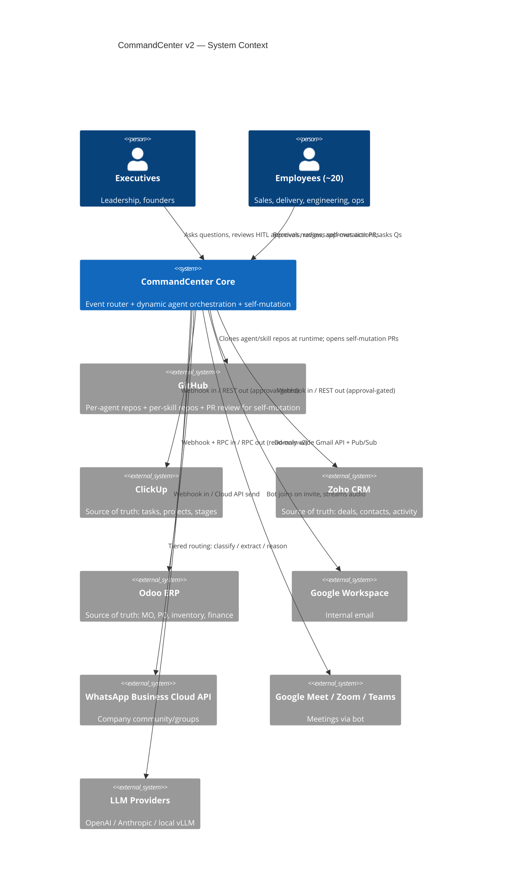
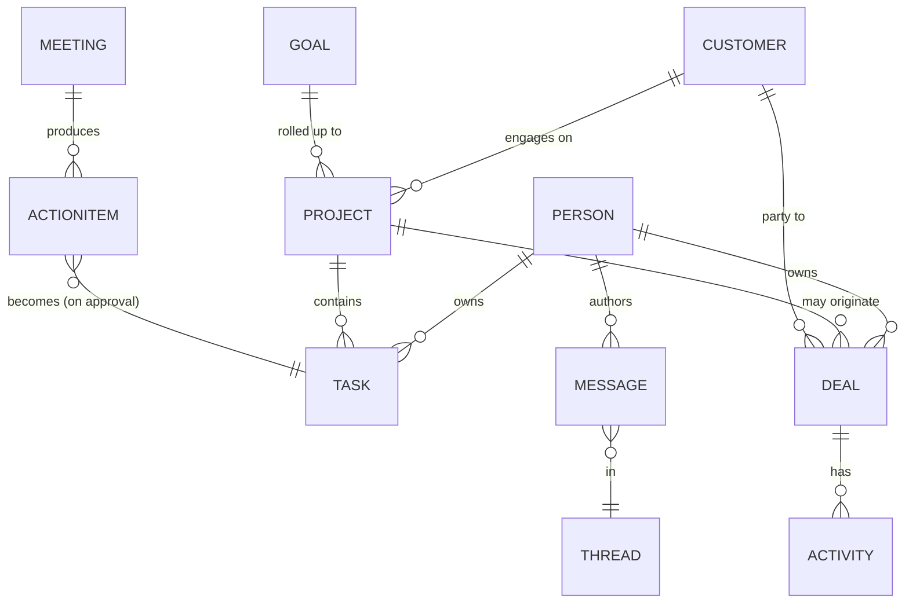
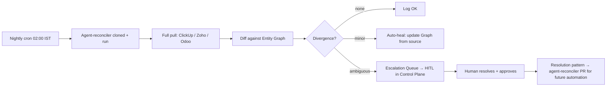

# System Architecture — CommandCenter v2 (Distributed, Self-Mutating Agent Network)

> Project: CommandCenter v2 · Org: Fracktal Works · Date: 2026-06-02
> Status: v2.0 — Decoupled per-agent and per-skill GitHub repos, dynamic runtime loading, self-mutation loop.

---

## 1. Architectural Drivers

- **Source of truth lives in ClickUp, Zoho, Odoo.** CommandCenter is a read-mostly mirror with approval-gated writes.
- **Pull + Push + Ambient** interaction modes must all be supported.
- **Decoupled agent and skill repositories.** Every agent and every skill lives in its own GitHub repository. The Core engine contains no agent logic or skill files.
- **Persistent runtime loading.** Agent and skill repos are cloned once into a persistent local cache and refreshed via `git pull` on each event (~0.5 s). No full re-clone per run; no server redeploy to pick up new agent logic.
- **Ephemeral sandboxed execution.** All agent task execution runs inside short-lived OpenHands containers, destroyed after each run.
- **Hot-patch self-mutation with an audit gate.** When an agent fails, the Self_Mutation_Node applies a tested code fix directly to the persistent local clone (the fix is live immediately) and opens a GitHub PR as an audit record. A human can **merge** (canonicalise the fix in the remote repo) or **reject/close** (Core reverts the local clone to `origin/main`). `max_mutation_attempts = 1` prevents loops.
- **Platform-owned credentials; agent-declared dependencies.** All integration credentials (API keys, OAuth tokens, webhook secrets) are stored encrypted in Core's Integration Registry. Agent `config.json` declares which integrations it needs by name; the Dynamic Agent Loader injects only those credentials into LangGraph state. No credential ever lives in an agent or skill repo.
- **No in-app skill/workflow authoring.** All development happens in VS Code + Git. The Control Plane is for chat, observability, and HITL approval — not editing.
- **Tiered LLM routing** (cheap classifier → expensive reasoner) for cost.
- **MVP-first iterative build** with ~2 engineers + AI assistance.
- **Internal-only scope.**

---

## 2. C4 — Level 1: System Context



---

## 3. C4 — Level 2: Container View

```mermaid
C4Container
    title CommandCenter v2 — Containers
    Person(user, "User", "Executive / Employee")

    Container_Boundary(core, "CommandCenter Core") {
        Container(gw, "Interaction Gateway", "FastAPI + WebSocket", "Listens for webhook/cron events; pull queries; push notifications; approval UI")
        Container(dal, "Dynamic Agent Loader", "Python (importlib + sys.path)", "On event: clones target agent repo + declared skill repos; imports graph.py at runtime; hands StateGraph to LangGraph executor")
        Container(orch, "Orchestrator", "LangGraph + PostgresSaver", "Executes the agent's StateGraph workflow; durable state via Postgres; routes to Self_Mutation_Node on error")
        Container(workers, "OpenHands Worker Containers", "OpenHands SDK (Apache-2.0)", "Ephemeral execution sandboxes per task; each destroyed after run; skills execute here")
        Container(mutator, "Self_Mutation_Node", "OpenHands SDK dev sandbox", "Checks out failing agent's own repo; reads telemetry; fixes code; runs tests; opens GitHub PR; max_mutation_attempts=1; self-destroys")
        Container(ingest, "Ingestion Workers", "Python + MCP servers + LangGraph skills", "Webhook receivers, Pub/Sub consumers, meeting bot drivers; ClickUp/Zoho/Odoo MCP")
        Container(graph, "Entity Graph + Memory", "Postgres + pgvector + Apache AGE + Mem0 + Graphiti", "Entity graph; episodic memory (Mem0); bi-temporal entity KG (Graphiti)")
        Container(actions, "Action Broker", "Python", "Approval queue, audit log, write-back to source systems")
        Container(recon, "Reconciler Agent", "agent-reconciler (cloned at runtime)", "Nightly diff; escalation queue")
        Container(bot, "Meeting Bot Fleet", "Vexa (Apache-2.0, self-hosted)", "Joins Meet/Teams/Zoom; streams audio for transcription")
        Container(stt, "Transcription", "WhisperX + Pyannote", "STT + speaker diarization")
        Container(bus, "Event Bus", "Redis Streams", "Decouples ingestion from orchestration")
        Container(gw_llm, "LLM Gateway", "LiteLLM proxy (MIT)", "Unified API; prompt caching; RouteLLM tier routing; cost metering")
        Container(infer, "Local Inference", "vLLM + Qwen3-8B (Tier 1)", "Automatic Prefix Caching; OpenAI-compatible API")
        Container(scache, "Semantic Cache", "GPTCache (MIT)", "30-70% cost saving on repeated triage queries; 1h TTL")
        Container(compress, "Token Compressor", "LLMLingua-2 (MIT, CPU)", "50-60% compression of long tool outputs")
        Container(obs, "Observability", "Langfuse (MIT, self-hosted) + OpenTelemetry", "LLM traces, cost per tier, eval scores; failure telemetry consumed by Self_Mutation_Node")
        Container(cp, "Control Plane (Workbench)", "Next.js + CopilotKit + AG-UI", "Three panes: (1) Chat / Agent Inbox · (2) Observability (Langfuse embed) · (3) HITL Approval Queue. No skill/workflow editor — authoring is done in VS Code + Git.")
    }

    System_Ext(gh, "GitHub", "Agent repos (agent-*) and skill repos (skill-*). PR review for self-mutation PRs.")
    System_Ext(src, "ClickUp / Zoho / Odoo / Gmail / WhatsApp / Meet", "Sources of truth + capture surfaces")
    System_Ext(llms, "LLM Providers", "Haiku / Sonnet / Opus class")

    Rel(user, gw, "HTTPS / WS")
    Rel(user, cp, "HTTPS / WS")
    Rel(gw, dal, "Route event to agent")
    Rel(dal, gh, "Clone agent repo + skill repos")
    Rel(dal, orch, "Initialise StateGraph from cloned graph.py")
    Rel(orch, workers, "Spawn ephemeral worker containers")
    Rel(orch, mutator, "Route on error (max 1 attempt)")
    Rel(mutator, gh, "Checkout agent repo; open PR with fix")
    Rel(orch, graph, "Query / write entity graph")
    Rel(orch, actions, "Submit action for approval")
    Rel(workers, gw_llm, "All LLM calls via gateway")
    Rel(gw_llm, scache, "Check cache first")
    Rel(gw_llm, infer, "Tier-1 local (Qwen3-8B via vLLM)")
    Rel(gw_llm, llms, "Tier-2/3 via API")
    Rel(compress, gw_llm, "Compressed tool outputs")
    Rel(ingest, src, "Webhooks / API / MCP")
    Rel(ingest, bus, "Publish events")
    Rel(bus, gw, "Trigger ambient workflows")
    Rel(bot, stt, "Audio")
    Rel(stt, ingest, "Transcript")
    Rel(recon, src, "Full pull diff")
    Rel(recon, graph, "Compare + escalate")
    Rel(actions, src, "Approved writes")
    Rel(orch, obs, "OTel spans + failure telemetry")
    Rel(cp, obs, "Embed traces panel")
    Rel(cp, gw, "Chat queries / HITL approvals")
```



---

## 4. Distributed Repository Layout

```
FracktalWorks/CommandCenter-Core           ← Core engine (this repo). FastAPI, Docker infra, LangGraph harness, Postgres state, LiteLLM, Langfuse, Action Broker.
FracktalWorks/agent-task-manager           ← Agent: ClickUp task management + stale-task escalation
FracktalWorks/agent-billing                ← Agent: billing & invoice workflows
FracktalWorks/agent-sales                  ← Agent: Zoho CRM sales pipeline + deal follow-ups
FracktalWorks/agent-delivery               ← Agent: project delivery monitoring + push notifications
FracktalWorks/agent-triage                 ← Agent: email / WhatsApp / meeting triage + routing
FracktalWorks/agent-reconciler             ← Agent: nightly source-of-truth diff + escalation
FracktalWorks/agent-strategy               ← Agent: weekly digest + planning synthesis
FracktalWorks/skill-clickup-sync           ← Skill: ClickUp read/write via MCP
FracktalWorks/skill-zoho-ingest            ← Skill: Zoho CRM webhooks + REST pull
FracktalWorks/skill-gmail-capture          ← Skill: Gmail Pub/Sub ingest + thread parsing
FracktalWorks/skill-whatsapp-send          ← Skill: WhatsApp Meta Cloud API send
FracktalWorks/skill-meeting-transcribe     ← Skill: Vexa bot + WhisperX + Pyannote
FracktalWorks/skill-graph-write            ← Skill: entity graph upsert (Postgres + pgvector)
FracktalWorks/skill-action-broker          ← Skill: approval queue write + audit logging
```

**Agent repo layout:**
```
agent-<name>/
  config.json        # model tier, execution budget, cron/trigger, required skill repos,
                     #   AND required integrations (by name only — no credentials here)
                     # Example:
                     #   {
                     #     "skill_repos": ["skill-clickup-sync", "skill-graph-write"],
                     #     "integrations": ["clickup", "zoho-crm"],
                     #     "model_tier": "tier-2",
                     #     "max_mutation_attempts": 1
                     #   }
  graph.py           # LangGraph StateGraph definition — the agent's business logic
  instructions.md    # Agent persona, operating context, decision guidelines
  tests/             # pytest suite; must pass in CI before any PR can merge
  evals/             # Promptfoo golden cases + Inspect AI scenario tests
  CHANGELOG.md
```

**SECURITY: No credentials in agent repos.** `config.json` lists integration *names*; the Core Integration Registry holds the actual keys. Skills receive credentials via LangGraph `state["integrations"]` — never from environment variables directly.

**Skill repo layout:**
```
skill-<name>/
  pyproject.toml     # pip-installable Python package
  src/<skill>/
    __init__.py      # Exports the entry function (well-typed, single function)
    impl.py          # Business logic
  tests/
  evals/
  CHANGELOG.md
```

---

## 5. Operational Lifecycle

### Step 1 — Event Routing
Webhook/cron → Core FastAPI `gw` container → identifies target agent from payload → calls `Dynamic Agent Loader`.

### Step 2 — Resident Repo Cache + Import
Dynamic Agent Loader:
1. Reads agent name from event metadata.
2. **First call:** `git clone` agent repo into `{agents_clone_dir}/repos/agent-<name>/` (full clone, one-time, ~5–20 s).
   **Subsequent calls:** `git pull --ff-only` on the existing clone (< 0.5 s).
3. Reads `config.json` → `skill_repos` list and `integrations` list.
4. Ensures each skill repo is present and up-to-date via the same clone-once / pull-on-demand strategy.
5. `sys.path.insert(0, clone_dir)` for agent + each skill (cleaned up after each run; clone itself persists).
6. `importlib.import_module('graph')` with a unique per-run module name → `build_graph()`.
7. **Credential injection:** queries Core Integration Registry for each name in `config.json["integrations"]`; injects a typed `IntegrationContext` dict into the initial LangGraph state. Skills read credentials from `state["integrations"]["<name>"]` — never from environment directly.
8. Calls `build_graph()` → returns a `StateGraph` (to be compiled with PostgresSaver checkpointer by executor).

### Step 3 — Stateful Orchestration
LangGraph initialises the `StateGraph` from the returned graph object. `PostgresSaver` connects to persistent Postgres — all state transitions, tool outputs, and error logs are persisted to DB. The graph routes Actions to OpenHands worker containers.

### Step 4 — Sandboxed Execution
OpenHands SDK spins ephemeral worker container. Agent executes its skill functions inside the container. Outputs and errors are piped back to LangGraph state via the SDK. Container is destroyed when the action node completes.

### Step 5 — Hot-Patch Self-Mutation (on error)
```
Error in worker container
        │
        ▼
LangGraph routes to Self_Mutation_Node
        │
        ▼
Check: mutation_attempts_this_run >= 1?
   YES → Skip mutation; log + audit; exit.
   NO  → Continue ↓
        │
        ▼
Work from persistent local clone of agent-<name>
(already authenticated via GITHUB_TOKEN in remote URL;
 bot git identity already configured)
        │
        ▼
Read failure telemetry from Langfuse (error trace, inputs, stack)
        │
        ▼
OpenHands dev sandbox: propose fix in local clone → run pytest
        │
        ▼
     Tests pass?
     │          │
    NO          YES
     │           │
     ▼           ▼
git reset    git commit fix to local clone main branch
--hard HEAD  (fix is now LIVE — next pull will use it)
     │           │
     ▼           ▼
Log failure  Push new branch auto-fix/{run_id[:8]} to origin
             Open GitHub PR:
               Title: "Auto-fix: <error description>"
               Body:  telemetry + diff + test results +
                      "⚠️ Fix is already live in persistent clone.
                       Merge = canonicalise. Close = rollback."
        │
        ▼
mutation_attempts_this_run = 1 (max reached)
        │
        ▼
Destroy dev sandbox containers → log PR URL in audit
        │
        ▼
     Human reviews PR (async)
     │               │
   MERGE           CLOSE / REJECT
     │               │
     ▼               ▼
Remote main now   PR Event Handler receives GitHub webhook
matches live      → Core: git reset --hard origin/main
clone (no         on the agent's local clone
additional        → agent reverts to pre-fix behaviour
action needed)    → logged in audit as rollback
```

**Hot-patch model rationale:** Applying the fix to the live clone immediately means production recovers in minutes (not hours). The PR is not a gate before recovery — it is an audit record and a rollback trigger. Closing it is the human's "I disagree with this fix" button.

**New infrastructure required:** A `POST /webhooks/github` endpoint in Core that receives `pull_request.closed` (unmerged) events from agent repos, identifies the affected local clone, and issues `git reset --hard origin/main`.

---

## 6. Logical Data Model — Entity Graph



**Canonical keys policy:** ClickUp/Zoho/Odoo IDs are authoritative; the graph's own UUID is for cross-system join only. Entity resolution merges duplicates nightly using rules → LLM fallback.

---

## 7. Hardware / Hosting

| Component | v2 | v3 |
|---|---|---|
| Core engine + agent runtime | Single Linux VM (8 vCPU / 32 GB), Docker Compose | K8s cluster (3 nodes) |
| Postgres (state + entity graph) | Hetzner CPX31 (~€12/mo) | Dedicated HA |
| Memory layer | Mem0 + Graphiti on same Postgres | Dedicated memory VM |
| Meeting bot | Vexa on dedicated 4 vCPU VM | Vexa cluster |
| Transcription | WhisperX + Pyannote, self-hosted | Same |
| LLM Tier-1 | vLLM serving Qwen3-8B (Automatic Prefix Caching) | Dedicated GPU VM |
| LLM Tier-2/3 | Haiku / Sonnet via LiteLLM (prompt caching) | Same |
| LLM gateway | LiteLLM proxy + RouteLLM classifier | Same |
| Semantic cache | GPTCache on Redis | Same |
| Token compression | LLMLingua-2 (CPU, same VM) | Same |
| Observability | Langfuse (MIT, self-hosted, Postgres + ClickHouse) | Same |
| Event bus | Redis Streams | Kafka |
| OpenHands worker/dev sandboxes | Docker-in-Docker via host `/var/run/docker.sock` | Same |
| Object store | S3-compatible (audio, attachments) | Same |

**DinD security note:** Core container maps `/var/run/docker.sock` from the host. OpenHands commands child sandbox containers through the host Docker daemon. All sandbox containers are network-isolated from each other and from the Core network.

---

## 8. Sequence — Pull: "Status of Customer X?"

```mermaid
sequenceDiagram
    actor User
    participant CP as Control Plane
    participant GW as Gateway
    participant DAL as Dynamic Agent Loader
    participant Orch as LangGraph Orchestrator
    participant Graph
    participant Worker as OpenHands Worker

    User->>CP: "Status of Customer X?"
    CP->>GW: Pull(query, user_ctx)
    GW->>DAL: Route to agent-sales
    DAL->>DAL: Clone agent-sales + skill-zoho-ingest + skill-graph-write
    DAL->>Orch: Build and run StateGraph
    Orch->>Graph: Resolve "Customer X" → customer_id
    Graph-->>Orch: customer_id
    Orch->>Worker: Spawn worker; run skill-zoho-ingest + skill-graph-write
    Worker-->>Orch: Structured context (deals, projects, messages)
    Orch->>Orch: Synthesise answer with citations via LLM
    Orch-->>GW: Answer + citations
    GW-->>CP: Rendered answer
```

---

## 9. Sequence — Hot-Patch Self-Mutation Flow

```mermaid
sequenceDiagram
    participant Orch as LangGraph Orchestrator
    participant Mut as Self_Mutation_Node
    participant Clone as Persistent Local Clone
    participant OH as OpenHands Dev Sandbox
    participant GH as GitHub (Remote)
    participant PRH as PR Event Handler (Core)
    participant Human as Human Reviewer

    Orch->>Mut: Error in worker (mutation_attempts=0)
    Mut->>OH: Provision dev sandbox (mounts local clone)
    Mut->>OH: Inject failure telemetry from Langfuse
    OH->>Clone: Implement fix in local clone + run pytest
    alt Tests pass
        OH->>Clone: git commit fix (local main branch)
        Note over Clone: Fix is LIVE on next event
        OH->>GH: git push origin auto-fix/{run_id[:8]}
        OH->>GH: Open PR — body: telemetry + diff + "Merge=persist, Close=rollback"
        Mut->>Orch: mutation_attempts=1; PR URL in audit
        Mut->>OH: Destroy dev sandbox
        Note over Human: Async review
        alt Human merges PR
            Human->>GH: Click Merge
            GH->>GH: CI evals pass
            Note over Clone: Next git pull keeps fix
        else Human closes/rejects PR
            Human->>GH: Close PR without merging
            GH->>PRH: webhook: pull_request.closed (unmerged)
            PRH->>Clone: git reset --hard origin/main
            Note over Clone: Agent reverted to pre-fix state
        end
    else Tests fail
        OH->>Clone: git reset --hard HEAD (discard changes)
        Mut->>Orch: mutation failed; logged in audit
        Mut->>OH: Destroy dev sandbox
    end
```

---

## 10. Reconciliation (Anti-Drift)



Resolved escalations produce a new skill or rule proposed as a PR to `agent-reconciler`, following the same self-mutation flow (human must merge before the agent uses it).

---

## 11. Tiered LLM Routing

```mermaid
flowchart TD
    EV[Incoming event / query] --> T0{Rule match?}
    T0 -- yes --> ACT[Direct action]
    T0 -- no --> T1[Tier-1 Classifier<br/>Qwen3-8B via vLLM / Haiku]
    T1 --> CL{Class?}
    CL -- noise --> DROP[Drop + log]
    CL -- structured --> T2[Tier-2 Extractor<br/>Sonnet / 4o]
    CL -- needs reasoning --> T3[Tier-3 Reasoner<br/>Opus / GPT-5-class]
    T2 --> ACT
    T3 --> ACT
    ACT --> AUD[Audit + Langfuse telemetry]
    AUD --> METRIC[Cost/quality metrics → RouteLLM training (Phase 5)]
```

---

## 12. Architecture Decision Records

### ADR-001: LangGraph + PostgresSaver as orchestration substrate
- **Context:** Need durable, inspectable workflows with HITL gates and state persistence.
- **Decision:** LangGraph as the graph runtime; `PostgresSaver` for durable state storage.
- **Consequences:** Durable workflow state survives container restarts; all state transitions auditable in Postgres.

### ADR-002: Postgres + pgvector + Apache AGE for entity graph + vectors
- **Context:** Team of 2 cannot run Neo4j + Pinecone + Postgres separately.
- **Decision:** Single Postgres with `pgvector` for embeddings and Apache AGE for property-graph queries.
- **Consequences:** One DB to back up; AGE sufficient for v2 scale.

### ADR-003: Source-of-truth = external systems; Core = read-mostly mirror with approval-gated writes
- **Context:** Risk of agent corrupting CRM / ERP is unacceptable.
- **Decision:** Writes only via Action Broker with explicit per-action authority tier; nightly reconciliation.
- **Consequences:** Safe; slightly slower for write-heavy workflows.

### ADR-004: Vexa (Apache-2.0) as meeting bot from Day 1
- **Decision:** Vexa on a dedicated 4 vCPU Hetzner VM. WhisperX + Pyannote for transcription + diarization.
- **Consequences:** Zero per-hour SaaS cost; data stays in own infra.

### ADR-005: Tiered LLM routing from day one
- **Decision:** Three tiers + deterministic Tier-0; RouteLLM classifier trained on logged traffic in Phase 5.
- **Consequences:** Significant ongoing cost savings.

### ADR-006: Self-mutation requires human PR merge gate; max_mutation_attempts = 1
- **Context:** Agents that can fix their own code could enter an infinite mutation loop if unconstrained.
- **Decision:** `max_mutation_attempts = 1` per failure event. No further mutation PRs until a human merges and the agent verifies the fix on the next live run.
- **Consequences:** Prevents runaway self-modification; preserves human oversight; slower improvement than fully-autonomous but safe.

### ADR-007: WhatsApp via Meta Cloud API + dedicated agent number
- **Decision:** Provision new business number; LangGraph skill (`skill-whatsapp-send`) handles webhook processing.

### ADR-008: LiteLLM gateway + RouteLLM + Anthropic/OpenAI prompt caching
- **Decision:** LiteLLM proxy for unified routing; Anthropic `cache_control` + OpenAI automatic caching on stable prefixes (50–90% cost reduction); RouteLLM in Phase 5.

### ADR-009: Langfuse (MIT, self-hosted) for LLM observability
- **Decision:** Langfuse via docker-compose on Postgres + ClickHouse. Failure telemetry from Langfuse is the primary input to the Self_Mutation_Node.

### ADR-010: vLLM + Qwen3-8B as Tier-1 local inference
- **Decision:** vLLM with Automatic Prefix Caching; Qwen3-8B-Instruct (BFCL v3 mid-60s% tool-calling).

### ADR-011: Mem0 + Graphiti for agent memory layers
- **Decision:** Mem0 for episodic/per-user memory; Graphiti for bi-temporal entity KG; both on existing Postgres.

### ADR-012: GPTCache + LLMLingua-2 for token efficiency
- **Decision:** GPTCache (MIT) semantic cache in front of LiteLLM (1h TTL); LLMLingua-2 (MIT, CPU) post-processes tool outputs >1k tokens.

### ADR-013: Per-agent and per-skill GitHub repos; persistent clone cache at runtime
- **Context:** Monorepo approach couples agent logic to Core deployments and prevents per-agent independent versioning, CI, and self-mutation. Earlier v2 draft cloned fresh on every event (~2–5 s overhead).
- **Decision:** Every agent lives in its own `agent-<name>` GitHub repo. Every skill lives in its own `skill-<name>` GitHub repo (pip-installable Python package). The Core engine contains no agent logic or skill files. Dynamic Agent Loader **clones once** into a persistent directory (`{agents_clone_dir}/repos/{repo-name}/`) and does `git pull --ff-only` on each event (~0.5 s).
- **Consequences:** Any agent or skill can be updated independently. Self-mutation PRs touch only the agent's own repo. First-event latency is ~5–20 s (clone); all subsequent events are ~0.5 s (pull). The persistent clone is also the working tree for Self_Mutation_Node (no separate sandbox clone needed). Bot git identity is configured once in each clone so all commits carry proper authorship.

### ADR-014: No in-app skill/workflow editor; VS Code + Git is the authoring environment
- **Context:** Previously planned OpenHands-backed Skill Studio pane inside the Control Plane.
- **Decision:** Removed. All agent and skill development happens in VS Code (locally or via GitHub Codespaces), committed to the respective agent/skill repo, merged through the standard PR flow. The Control Plane contains Chat, Observability, and HITL approval — not an IDE. Agents themselves open PRs via the Self_Mutation_Node.
- **Consequences:** Simpler Control Plane; no OpenHands + Monaco integration required in the UI; authoring tools (GitHub Copilot, Claude Code, Cursor) available for free in the dev environment; agents use OpenHands SDK directly for self-mutation, not via a UI wrapper.

### ADR-015: Git is the single source of truth for all agent-editable artefacts; PR + CI gate required for promotion
- **Decision:** Everything editable (agent `graph.py`, `instructions.md`, `config.json`, skill packages, LiteLLM config, Langfuse dataset definitions) lives in GitHub. All changes via PRs. CI runs evals on the agent's `evals/` folder on every PR. Merge is gated on eval pass.

### ADR-016: OpenHands SDK (Apache-2.0) for both worker execution and self-mutation dev sandboxes
- **Context:** Previously planned E2B (Firecracker) for sandbox execution. OpenHands SDK provides a higher-level ephemeral container API that covers both use cases.
- **Decision:** OpenHands SDK for both: (a) worker containers that execute agent skills, and (b) dev sandbox containers for Self_Mutation_Node. Docker-in-Docker via host `/var/run/docker.sock`. E2B removed.
- **Consequences:** Consistent runtime for both execution and mutation; one SDK to learn; OpenHands containers are ephemeral and network-isolated; eliminates separate Firecracker VM.

### ADR-017: Promptfoo + Inspect AI for skill/agent regression evals; CI-gated
- **Decision:** Every agent and skill repo ships an `evals/` folder. Promptfoo (golden-case assertions) + Inspect AI (graded scenario tests). PR cannot merge unless both suites pass.

### ADR-018: importlib + sys.path.append() for safe dynamic agent loading inside FastAPI
- **Context:** Need to load agent repos at runtime without restarting the server; standard Python import system does not support runtime path injection cleanly.
- **Decision:** FastAPI route controllers use `sys.path.append(cloned_agent_path)` and `importlib.import_module('graph')` to load each agent's `graph.py`. Transient paths are cleaned up after each run.
- **Consequences:** Server stays up during agent updates; no monkey-patching of global modules; each run gets a fresh import of the cloned code.

### ADR-019: DinD via host /var/run/docker.sock mapping
- **Decision:** Core container maps `/var/run/docker.sock` from host into the container. OpenHands SDK commands child worker/dev sandbox containers through the host Docker daemon.
- **Consequences:** Enables ephemeral container lifecycle management from within the Core container; standard DinD pattern; containers are isolated at the Docker network level.

### ADR-020: Decoupled per-agent and per-skill GitHub repos
- **See ADR-013.** This is the primary structural decision of v2. Each agent repo is independently deployable, testable, and self-improvable. Each skill repo is a versioned Python package. The Core engine is a pure runtime host.

### ADR-021: Hot-patch self-mutation with audit-gate PR and rollback on rejection
- **Context (revised from ADR-006):** Waiting for human PR merge before a fix is live means production stays broken for hours. The goal of self-mutation is fast recovery — the human gate is for safety and auditability, not for speed.
- **Decision:**
  1. Self_Mutation_Node applies the tested fix directly to the **persistent local clone** (on the live `main` branch). The fix is immediately active for the next event — no wait.
  2. It simultaneously opens a GitHub PR (branch `auto-fix/{run_id[:8]}`) as an **audit record** and a **rollback trigger**.
  3. PR body clearly states: *"This fix is already live in the persistent clone. Merge = persist to remote. Close = Core will revert the clone to `origin/main`."*
  4. `max_mutation_attempts = 1` per failure event — no loop.
  5. A new **PR Event Handler** (`POST /webhooks/github` in Core) receives GitHub `pull_request.closed` events. If closed without merging: `git reset --hard origin/main` on the affected clone.
- **Consequences:** Production recovers in minutes. Human review is still required to canonicalise the fix in the repo. A human who disagrees with the fix closes the PR and the rollback is automatic. CI evals gate the PR merge as normal.

### ADR-022: Platform-level Integration Registry; agent-declared credential dependencies
- **Context:** Integration credentials (API keys, OAuth tokens, webhook secrets) must be accessible to agents and skills at runtime. The naive approaches — storing credentials in agent repos (security risk), or injecting all credentials into all agents (no least-privilege), or per-agent .env files (operational burden) — are all unacceptable.
- **Decision (industry-standard pattern):**
  1. **Core owns the Integration Registry** — all credentials stored encrypted in Postgres (`integrations` table), managed via the Control Plane admin UI and `.env`. Follows the pattern used by n8n, Prefect, Temporal, and GitHub Actions.
  2. **Agent `config.json` declares dependencies** by integration *name* only: `"integrations": ["clickup", "zoho-crm"]`. No credential values ever appear in agent repos.
  3. **Dynamic Agent Loader injects** only the declared integrations as a typed `IntegrationContext` dict in the initial LangGraph state (`state["integrations"]`). An agent that doesn't declare an integration cannot access it.
  4. **Skills read from state**, not from environment variables: `ctx = state["integrations"]["clickup"]` → `ctx.api_token`, `ctx.webhook_secret`, etc.
  5. **OAuth lifecycle** (token refresh, PKCE flows) is managed by Core, not by individual skills. Skills call a `Core.ensure_token("zoho-crm")` helper that handles refresh transparently.
- **Consequences:** Credentials never in agent repos (no GitHub secret leak risk). Least-privilege enforced at load time. Adding a new integration to an agent is a one-line `config.json` change + admin UI registration. OAuth rotation happens once in Core and propagates to all agents automatically. Skills remain stateless and testable without real credentials (mock `IntegrationContext` in tests).

---

## 13. Chat Interface, Session Management & Memory Architecture

### 13.1 Chat surface — Control Plane

The Control Plane (`workbench/control_plane`) exposes a dedicated **`/chat` page** as the primary human-facing interface to Jannet. This is a full-page chat (not just the floating CopilotSidebar overlay) with session management.

**Technology:** CopilotKit v1.57 (`@copilotkit/react-core`, `@copilotkit/react-ui`, `@copilotkit/runtime`). CopilotKit also developed the **AG-UI Protocol** — the emerging standard for bi-directional agent↔UI streaming — which is used as the upgrade path to full LangGraph backend.

**Chat page layout:**
```
+--chat page-------------------------------------------+
| Left panel (w-72)          | Main chat area           |
|   - Session list           |   - CopilotChat          |
|   - "New session" button   |   - Session header       |
|   - Memory panel           |   (per-session threadId) |
|     (Mem0 stored facts)    |                          |
+-----------------------------+--------------------------+
```

**Session isolation:** Each `ChatSession` is assigned a UUID stored in localStorage. `CopilotKitProvider` receives this UUID as `threadId`, isolating message history per session. When upgrading to LangGraph backend, this UUID becomes the LangGraph `thread_id` checkpointer key — maintaining continuity.

### 13.2 Memory stack (how memory improves over time)

```
User sends a message
        │
        ▼
CopilotKit frontend
  useCopilotReadable injects:
    • Stored Mem0 memories (fetched from /api/chat/memories)
    • Current session context
        │
        ▼
/api/copilot (Next.js route)
  → CopilotRuntime → BuiltInAgent (now) / LangGraphAgent (upgrade)
  → LLM receives memories as readable context
        │
        ▼
User switches session or navigates away
        │
        ▼
Chat page auto-saves conversation
  → POST /api/chat/memories { userId, messages }
        │
        ▼
Mem0 extracts semantic facts from conversation
  (e.g. "User prefers weekly project summaries on Monday morning")
        │
        ▼
Facts stored in Mem0 (self-hosted, backed by Postgres)
        │
        ▼
Next conversation: facts retrieved and injected as context ↑
Next orchestrator run: executor.py queries Mem0 for user context ↑
```

**Improvement loop:** Every conversation enriches Mem0. The orchestrator and agents query Mem0 at run-start so accumulated knowledge improves *all* interactions — not just the chat UI. A delivery agent scheduling a push notification, for example, will know the user prefers WhatsApp over email because that preference was captured in a past chat session.

### 13.3 CopilotKit ↔ LangGraph ↔ OpenHands integration

The three layers are cleanly separated and compose vertically:

| Layer | Component | Role |
|---|---|---|
| **UI** | CopilotKit `CopilotChat` + `useCopilotReadable` | Renders chat, streams responses, injects memory context |
| **Bridge** | CopilotKit `LangGraphAgent` → `POST /api/copilot` | Connects frontend to backend via AG-UI/streaming protocol |
| **Orchestrator** | LangGraph `StateGraph` + `PostgresSaver` | Stateful workflow; routes to skill nodes, mutation node |
| **Execution** | OpenHands SDK worker container | Executes individual skill functions in an ephemeral sandbox |
| **Memory** | Mem0 + Graphiti on Postgres | Episodic + entity memory; read by both chat UI and orchestrator |

**Current backend:** `BuiltInAgent` (LiteLLM proxy) — fast, no orchestrator dependency, suitable for conversational Q&A.

**Upgrade path (when orchestrator is stable):**
```typescript
// In /api/copilot/route.ts — replace BuiltInAgent with:
import { LangGraphAgent } from "@copilotkit/runtime";
const agent = new LangGraphAgent({
  name: "orchestrator",
  deploymentUrl: process.env.GATEWAY_URL + "/agent/langgraph",
  // threadId forwarded from CopilotKitProvider.threadId → LangGraph checkpointer
});
```
This routes every chat message through the full LangGraph orchestrator, giving the chat UI access to all agents, skills, and OpenHands execution. The `threadId` becomes the LangGraph checkpoint key so conversation state persists across page reloads.

**OpenHands is NOT directly connected to CopilotKit.** It is the execution layer *under* LangGraph. The dependency is:
```
CopilotKit → LangGraph → OpenHands (one-way, orchestrator pulls execution results)
```

### 13.4 Memory API

| Endpoint | Method | Purpose |
|---|---|---|
| `/api/chat/memories?userId=<id>` | GET | Fetch up to 20 stored memories for a user |
| `/api/chat/memories` | POST | Save a conversation to Mem0 (fires after session) |
| `/api/chat/memories?id=<memoryId>` | DELETE | Delete a specific memory |

Memory is **best-effort** — if `MEM0_API_URL` is not set, all endpoints return empty / no-op. The chat UI degrades gracefully. Orchestrator still runs without memory context.

### ADR-023: CopilotKit as the chat UI layer; Mem0 as the cross-surface memory store

- **Context:** Chat UI needs to maintain session state and improve over time. Memory accumulated in chat should benefit background agent runs, not just the chat session that created it.
- **Decision:**
  1. CopilotKit (`/chat` page, `useCopilotReadable`, `CopilotChat`) is the Control Plane chat surface.
  2. Each chat session is isolated by UUID `threadId` in `CopilotKitProvider`. The same UUID becomes the LangGraph checkpoint key when upgraded.
  3. After every chat session, Mem0 is called to extract and persist semantic facts (async, fire-and-forget — not on the critical path).
  4. At run-start, the LangGraph executor queries Mem0 for user-relevant memories and injects them into the initial agent state alongside the `IntegrationContext` (ADR-022).
  5. Backend is `BuiltInAgent` until the LangGraph gateway exposes an AG-UI-compatible endpoint, then upgraded to `LangGraphAgent` via a config flag.
- **Consequences:** Memory improves continuously with use. Chat context, agent execution context, and entity graph (Graphiti/ADR-011) are all enriched from the same Mem0 store. No separate memory stack needed for chat vs agents.

---

### ADR-024: Dispatch & supervision plane between the Gateway and ephemeral OpenHands runs

- **Context:** The base model is event-driven and ephemeral: a webhook/cron event hits the Interaction Gateway, the agent is loaded, runs, and is torn down. This cleanly covers *externally triggered* work, but leaves several automatic / long-running use cases unhandled — internally generated work, burst protection, redelivered (at-least-once) webhooks, hung or non-converging runs, and runaway budget. Mission Control (MIT, builderz-labs/mission-control) solves these with a durable task queue plus per-agent supervision; we adopt the same shape without abandoning our ephemeral-execution model.
- **Decision:** Insert a thin **Dispatch & Supervision plane** between the Gateway and the OpenHands executor. It has two halves:
  1. **Durable dispatch queue.** Triggers (webhook, cron, *and agent-to-agent / human-created tasks*) enqueue a durable `Task` row in Postgres rather than invoking the loader directly. A dispatcher drains the queue with **bounded worker concurrency**, **retry with backoff**, a **dead-letter sink** for runs that crash before `Self_Mutation_Node`, and an **idempotency key** per trigger so a redelivered webhook never double-spawns an agent.
  2. **Long-run supervisor.** Each in-flight run reports a **heartbeat**; a watchdog enforces a **max-runtime** ceiling and reaps/escalates hung runs, a **loop / non-convergence detector** (no state progress over N steps) kills spinning agents, and the agent's declared `execution_budget` is enforced as a **hard mid-run abort** (not just an advisory config value).
  3. **Recurring = template + dated child runs.** A recurring (cron/NL) schedule is stored as an immutable template; each fire spawns a dated child `Task`, keeping the schedule definition unmutated and giving clean per-run history.
- **Consequences:** Long-running and autonomous agents gain liveness, bounded resource use, and idempotent triggering. Self_Mutation_Node still owns *error* recovery; the supervisor owns *liveness/cost* failures that have no code fix (hang, loop, budget). Adds one Postgres-backed queue and a supervisor loop to Core — no new external dependency (reuses Postgres + LangGraph). The dispatch queue is also the natural home for the future internal "agent inbox" / task board (L2-13 operator surface).

---

## 14. Open Questions for PDR

1. **Confidence thresholds** — what success rate per agent justifies promotion to autonomous write authority?
2. **Retention** — how long do raw transcripts and message bodies live? (Legal/HR review needed.)
3. **RBAC v2** — when do we add per-team scoping?
4. **Odoo writes** — when do we open write authority to Odoo? (High-risk; v2 read-only is safe.)
5. **WhatsApp community ingestion** — confirm Meta's policy on the agent reading group messages as a participant.
6. **Self-mutation PR auto-close** — should unmerged self-mutation PRs expire after N days, or stay open indefinitely?
7. **Multiple failing agents** — if three agents fail simultaneously, do all three open PRs concurrently? (Currently: yes, one PR each, each limited to 1 attempt. Confirm acceptable.)
8. **Dispatch concurrency ceiling** — what is the bounded worker-pool size per host, and is concurrency capped globally or per-agent? (ADR-024.)
9. **Watchdog thresholds** — default max-runtime and loop-detection step count before a long-running agent is reaped/escalated. (ADR-024.)
- **Source of truth lives in ClickUp, Zoho, Odoo.** The brain is a *read-mostly mirror* with approval-gated writes.
