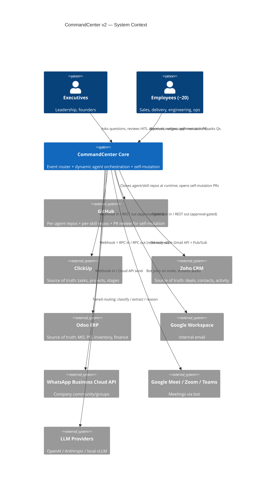
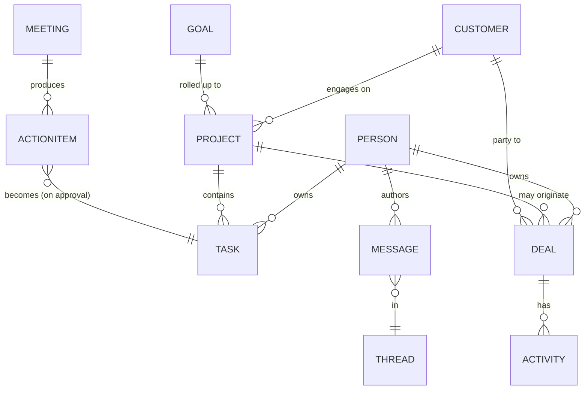
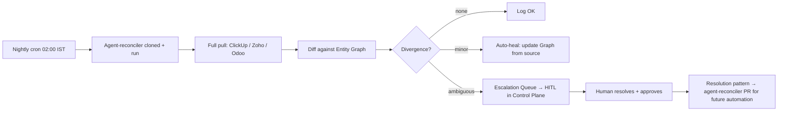

# System Architecture — CommandCenter v2 (Distributed, Self-Mutating Agent Network)

> Project: CommandCenter v2 · Org: Fracktal Works · Date: 2026-06-02
> Status: v2.0 — Decoupled per-agent and per-skill GitHub repos, dynamic runtime loading, self-mutation loop.

---

## 1. Architectural Drivers

- **Source of truth lives in ClickUp, Zoho, Odoo.** CommandCenter is a read-mostly mirror with approval-gated writes.
- **Pull + Push + Ambient** interaction modes must all be supported.
- **Decoupled agent and skill repositories.** Every agent and every skill lives in its own GitHub repository. The Core engine contains no agent logic or skill files.
- **Dynamic runtime loading.** Agent and skill repos are cloned and imported at event time, not at server startup. A running Core server never needs a redeploy to pick up new agent logic.
- **Ephemeral sandboxed execution.** All agent task execution runs inside short-lived OpenHands containers, destroyed after each run.
- **Self-mutation with a human gate.** Agents fix their own source code in isolated dev sandboxes and open PRs. `max_mutation_attempts = 1` prevents loops. Humans must merge before the live system consumes any self-authored change.
- **No in-app skill/workflow authoring.** All development happens in VS Code + Git. The Control Plane is for chat, observability, and HITL approval — not editing.
- **Tiered LLM routing** (cheap classifier → expensive reasoner) for cost.
- **MVP-first iterative build** with ~2 engineers + AI assistance.
- **Internal-only scope.**

---

## 2. C4 — Level 1: System Context



---

## 3. C4 — Level 2: Container View

```mermaid
C4Container
    title CommandCenter v2 — Containers
    Person(user, "User", "Executive / Employee")

    Container_Boundary(core, "CommandCenter Core") {
        Container(gw, "Interaction Gateway", "FastAPI + WebSocket", "Listens for webhook/cron events; pull queries; push notifications; approval UI")
        Container(dal, "Dynamic Agent Loader", "Python (importlib + sys.path)", "On event: clones target agent repo + declared skill repos; imports graph.py at runtime; hands StateGraph to LangGraph executor")
        Container(orch, "Orchestrator", "LangGraph + PostgresSaver", "Executes the agent's StateGraph workflow; durable state via Postgres; routes to Self_Mutation_Node on error")
        Container(workers, "OpenHands Worker Containers", "OpenHands SDK (Apache-2.0)", "Ephemeral execution sandboxes per task; each destroyed after run; skills execute here")
        Container(mutator, "Self_Mutation_Node", "OpenHands SDK dev sandbox", "Checks out failing agent's own repo; reads telemetry; fixes code; runs tests; opens GitHub PR; max_mutation_attempts=1; self-destroys")
        Container(ingest, "Ingestion Workers", "Python + MCP servers + LangGraph skills", "Webhook receivers, Pub/Sub consumers, meeting bot drivers; ClickUp/Zoho/Odoo MCP")
        Container(graph, "Entity Graph + Memory", "Postgres + pgvector + Apache AGE + Mem0 + Graphiti", "Entity graph; episodic memory (Mem0); bi-temporal entity KG (Graphiti)")
        Container(actions, "Action Broker", "Python", "Approval queue, audit log, write-back to source systems")
        Container(recon, "Reconciler Agent", "agent-reconciler (cloned at runtime)", "Nightly diff; escalation queue")
        Container(bot, "Meeting Bot Fleet", "Vexa (Apache-2.0, self-hosted)", "Joins Meet/Teams/Zoom; streams audio for transcription")
        Container(stt, "Transcription", "WhisperX + Pyannote", "STT + speaker diarization")
        Container(bus, "Event Bus", "Redis Streams", "Decouples ingestion from orchestration")
        Container(gw_llm, "LLM Gateway", "LiteLLM proxy (MIT)", "Unified API; prompt caching; RouteLLM tier routing; cost metering")
        Container(infer, "Local Inference", "vLLM + Qwen3-8B (Tier 1)", "Automatic Prefix Caching; OpenAI-compatible API")
        Container(scache, "Semantic Cache", "GPTCache (MIT)", "30-70% cost saving on repeated triage queries; 1h TTL")
        Container(compress, "Token Compressor", "LLMLingua-2 (MIT, CPU)", "50-60% compression of long tool outputs")
        Container(obs, "Observability", "Langfuse (MIT, self-hosted) + OpenTelemetry", "LLM traces, cost per tier, eval scores; failure telemetry consumed by Self_Mutation_Node")
        Container(cp, "Control Plane (Workbench)", "Next.js + CopilotKit + AG-UI", "Three panes: (1) Chat / Agent Inbox · (2) Observability (Langfuse embed) · (3) HITL Approval Queue. No skill/workflow editor — authoring is done in VS Code + Git.")
    }

    System_Ext(gh, "GitHub", "Agent repos (agent-*) and skill repos (skill-*). PR review for self-mutation PRs.")
    System_Ext(src, "ClickUp / Zoho / Odoo / Gmail / WhatsApp / Meet", "Sources of truth + capture surfaces")
    System_Ext(llms, "LLM Providers", "Haiku / Sonnet / Opus class")

    Rel(user, gw, "HTTPS / WS")
    Rel(user, cp, "HTTPS / WS")
    Rel(gw, dal, "Route event to agent")
    Rel(dal, gh, "Clone agent repo + skill repos")
    Rel(dal, orch, "Initialise StateGraph from cloned graph.py")
    Rel(orch, workers, "Spawn ephemeral worker containers")
    Rel(orch, mutator, "Route on error (max 1 attempt)")
    Rel(mutator, gh, "Checkout agent repo; open PR with fix")
    Rel(orch, graph, "Query / write entity graph")
    Rel(orch, actions, "Submit action for approval")
    Rel(workers, gw_llm, "All LLM calls via gateway")
    Rel(gw_llm, scache, "Check cache first")
    Rel(gw_llm, infer, "Tier-1 local (Qwen3-8B via vLLM)")
    Rel(gw_llm, llms, "Tier-2/3 via API")
    Rel(compress, gw_llm, "Compressed tool outputs")
    Rel(ingest, src, "Webhooks / API / MCP")
    Rel(ingest, bus, "Publish events")
    Rel(bus, gw, "Trigger ambient workflows")
    Rel(bot, stt, "Audio")
    Rel(stt, ingest, "Transcript")
    Rel(recon, src, "Full pull diff")
    Rel(recon, graph, "Compare + escalate")
    Rel(actions, src, "Approved writes")
    Rel(orch, obs, "OTel spans + failure telemetry")
    Rel(cp, obs, "Embed traces panel")
    Rel(cp, gw, "Chat queries / HITL approvals")
```



---

## 4. Distributed Repository Layout

```
FracktalWorks/CommandCenter-Core           ← Core engine (this repo). FastAPI, Docker infra, LangGraph harness, Postgres state, LiteLLM, Langfuse, Action Broker.
FracktalWorks/agent-task-manager           ← Agent: ClickUp task management + stale-task escalation
FracktalWorks/agent-billing                ← Agent: billing & invoice workflows
FracktalWorks/agent-sales                  ← Agent: Zoho CRM sales pipeline + deal follow-ups
FracktalWorks/agent-delivery               ← Agent: project delivery monitoring + push notifications
FracktalWorks/agent-triage                 ← Agent: email / WhatsApp / meeting triage + routing
FracktalWorks/agent-reconciler             ← Agent: nightly source-of-truth diff + escalation
FracktalWorks/agent-strategy               ← Agent: weekly digest + planning synthesis
FracktalWorks/skill-clickup-sync           ← Skill: ClickUp read/write via MCP
FracktalWorks/skill-zoho-ingest            ← Skill: Zoho CRM webhooks + REST pull
FracktalWorks/skill-gmail-capture          ← Skill: Gmail Pub/Sub ingest + thread parsing
FracktalWorks/skill-whatsapp-send          ← Skill: WhatsApp Meta Cloud API send
FracktalWorks/skill-meeting-transcribe     ← Skill: Vexa bot + WhisperX + Pyannote
FracktalWorks/skill-graph-write            ← Skill: entity graph upsert (Postgres + pgvector)
FracktalWorks/skill-action-broker          ← Skill: approval queue write + audit logging
```

**Agent repo layout:**
```
agent-<name>/
  config.json        # model tier, execution budget, cron/trigger, required skill repos (by GitHub URL)
  graph.py           # LangGraph StateGraph definition — the agent's business logic
  instructions.md    # Agent persona, operating context, decision guidelines
  tests/             # pytest suite; must pass in CI before any PR can merge
  evals/             # Promptfoo golden cases + Inspect AI scenario tests
  CHANGELOG.md
```

**Skill repo layout:**
```
skill-<name>/
  pyproject.toml     # pip-installable Python package
  src/<skill>/
    __init__.py      # Exports the entry function (well-typed, single function)
    impl.py          # Business logic
  tests/
  evals/
  CHANGELOG.md
```

---

## 5. Operational Lifecycle

### Step 1 — Event Routing
Webhook/cron → Core FastAPI `gw` container → identifies target agent from payload → calls `Dynamic Agent Loader`.

### Step 2 — Dynamic Cloning + Import
Dynamic Agent Loader:
1. Reads agent name from event metadata.
2. `git clone https://github.com/FracktalWorks/agent-<name>` into `/tmp/agents/<run_id>/agent`.
3. Reads `config.json`; clones each listed skill repo into `/tmp/agents/<run_id>/skills/<skill>`.
4. `sys.path.append('/tmp/agents/<run_id>/agent')` + `sys.path.append('/tmp/agents/<run_id>/skills/<skill>')` for each skill.
5. `importlib.import_module('graph')` → obtains `build_graph()` function.
6. Calls `build_graph()` → returns a compiled LangGraph `StateGraph`.

### Step 3 — Stateful Orchestration
LangGraph initialises the `StateGraph` from the returned graph object. `PostgresSaver` connects to persistent Postgres — all state transitions, tool outputs, and error logs are persisted to DB. The graph routes Actions to OpenHands worker containers.

### Step 4 — Sandboxed Execution
OpenHands SDK spins ephemeral worker container. Agent executes its skill functions inside the container. Outputs and errors are piped back to LangGraph state via the SDK. Container is destroyed when the action node completes.

### Step 5 — Self-Mutation (on error)
```
Error in worker container
        │
        ▼
LangGraph routes to Self_Mutation_Node
        │
        ▼
Check: mutation_attempts_this_run >= 1?
   YES → Skip mutation; log; exit.
   NO  → Continue ↓
        │
        ▼
Provision new OpenHands dev sandbox
        │
        ▼
Clone agent's own repo (agent-<name>) into sandbox
        │
        ▼
Read failure telemetry from Langfuse (error trace, inputs, stack)
        │
        ▼
Agent proposes code fix → implements in cloned repo → runs pytest
        │
        ▼
Tests pass? → commit fix to new branch → GitHub API opens PR:
             Title: "Auto-fix: <error description>"
             Body:  failure telemetry + diff + test results
        │
        ▼
mutation_attempts_this_run = 1 (max reached)
        │
        ▼
Destroy all sandbox containers → log PR URL in audit
        │
        ▼
Human reviews + merges PR (required before live system adopts change)
        │
        ▼
CI runs evals on PR branch → on pass, Core picks up new agent code on next event
```

**Human gate is non-negotiable.** The live system will not execute any self-authored code change until a human clicks Merge on the PR.

---

## 6. Logical Data Model — Entity Graph



**Canonical keys policy:** ClickUp/Zoho/Odoo IDs are authoritative; the graph's own UUID is for cross-system join only. Entity resolution merges duplicates nightly using rules → LLM fallback.

---

## 7. Hardware / Hosting

| Component | v2 | v3 |
|---|---|---|
| Core engine + agent runtime | Single Linux VM (8 vCPU / 32 GB), Docker Compose | K8s cluster (3 nodes) |
| Postgres (state + entity graph) | Hetzner CPX31 (~€12/mo) | Dedicated HA |
| Memory layer | Mem0 + Graphiti on same Postgres | Dedicated memory VM |
| Meeting bot | Vexa on dedicated 4 vCPU VM | Vexa cluster |
| Transcription | WhisperX + Pyannote, self-hosted | Same |
| LLM Tier-1 | vLLM serving Qwen3-8B (Automatic Prefix Caching) | Dedicated GPU VM |
| LLM Tier-2/3 | Haiku / Sonnet via LiteLLM (prompt caching) | Same |
| LLM gateway | LiteLLM proxy + RouteLLM classifier | Same |
| Semantic cache | GPTCache on Redis | Same |
| Token compression | LLMLingua-2 (CPU, same VM) | Same |
| Observability | Langfuse (MIT, self-hosted, Postgres + ClickHouse) | Same |
| Event bus | Redis Streams | Kafka |
| OpenHands worker/dev sandboxes | Docker-in-Docker via host `/var/run/docker.sock` | Same |
| Object store | S3-compatible (audio, attachments) | Same |

**DinD security note:** Core container maps `/var/run/docker.sock` from the host. OpenHands commands child sandbox containers through the host Docker daemon. All sandbox containers are network-isolated from each other and from the Core network.

---

## 8. Sequence — Pull: "Status of Customer X?"

```mermaid
sequenceDiagram
    actor User
    participant CP as Control Plane
    participant GW as Gateway
    participant DAL as Dynamic Agent Loader
    participant Orch as LangGraph Orchestrator
    participant Graph
    participant Worker as OpenHands Worker

    User->>CP: "Status of Customer X?"
    CP->>GW: Pull(query, user_ctx)
    GW->>DAL: Route to agent-sales
    DAL->>DAL: Clone agent-sales + skill-zoho-ingest + skill-graph-write
    DAL->>Orch: Build and run StateGraph
    Orch->>Graph: Resolve "Customer X" → customer_id
    Graph-->>Orch: customer_id
    Orch->>Worker: Spawn worker; run skill-zoho-ingest + skill-graph-write
    Worker-->>Orch: Structured context (deals, projects, messages)
    Orch->>Orch: Synthesise answer with citations via LLM
    Orch-->>GW: Answer + citations
    GW-->>CP: Rendered answer
```

---

## 9. Sequence — Self-Mutation Flow

```mermaid
sequenceDiagram
    participant Orch as LangGraph Orchestrator
    participant Mut as Self_Mutation_Node
    participant OH as OpenHands Dev Sandbox
    participant GH as GitHub API
    participant Human as Human Reviewer

    Orch->>Mut: Error in worker (mutation_attempts=0)
    Mut->>OH: Provision dev sandbox
    Mut->>OH: git clone agent-<name>
    Mut->>OH: Inject failure telemetry (stack, inputs, trace)
    OH->>OH: Propose code fix + run pytest
    OH->>GH: Open PR "Auto-fix: <error description>"
    Mut->>Orch: mutation_attempts=1; PR URL logged
    Mut->>OH: Destroy dev sandbox
    Note over Human: Async review
    Human->>GH: Review diff + test results
    Human->>GH: Click Merge
    GH->>GH: CI evals pass
    Note over Orch: Next event for this agent
    Orch->>Orch: Dynamic Agent Loader pulls updated repo
```

---

## 10. Reconciliation (Anti-Drift)



Resolved escalations produce a new skill or rule proposed as a PR to `agent-reconciler`, following the same self-mutation flow (human must merge before the agent uses it).

---

## 11. Tiered LLM Routing

```mermaid
flowchart TD
    EV[Incoming event / query] --> T0{Rule match?}
    T0 -- yes --> ACT[Direct action]
    T0 -- no --> T1[Tier-1 Classifier<br/>Qwen3-8B via vLLM / Haiku]
    T1 --> CL{Class?}
    CL -- noise --> DROP[Drop + log]
    CL -- structured --> T2[Tier-2 Extractor<br/>Sonnet / 4o]
    CL -- needs reasoning --> T3[Tier-3 Reasoner<br/>Opus / GPT-5-class]
    T2 --> ACT
    T3 --> ACT
    ACT --> AUD[Audit + Langfuse telemetry]
    AUD --> METRIC[Cost/quality metrics → RouteLLM training (Phase 5)]
```

---

## 12. Architecture Decision Records

### ADR-001: LangGraph + PostgresSaver as orchestration substrate
- **Context:** Need durable, inspectable workflows with HITL gates and state persistence.
- **Decision:** LangGraph as the graph runtime; `PostgresSaver` for durable state storage.
- **Consequences:** Durable workflow state survives container restarts; all state transitions auditable in Postgres.

### ADR-002: Postgres + pgvector + Apache AGE for entity graph + vectors
- **Context:** Team of 2 cannot run Neo4j + Pinecone + Postgres separately.
- **Decision:** Single Postgres with `pgvector` for embeddings and Apache AGE for property-graph queries.
- **Consequences:** One DB to back up; AGE sufficient for v2 scale.

### ADR-003: Source-of-truth = external systems; Core = read-mostly mirror with approval-gated writes
- **Context:** Risk of agent corrupting CRM / ERP is unacceptable.
- **Decision:** Writes only via Action Broker with explicit per-action authority tier; nightly reconciliation.
- **Consequences:** Safe; slightly slower for write-heavy workflows.

### ADR-004: Vexa (Apache-2.0) as meeting bot from Day 1
- **Decision:** Vexa on a dedicated 4 vCPU Hetzner VM. WhisperX + Pyannote for transcription + diarization.
- **Consequences:** Zero per-hour SaaS cost; data stays in own infra.

### ADR-005: Tiered LLM routing from day one
- **Decision:** Three tiers + deterministic Tier-0; RouteLLM classifier trained on logged traffic in Phase 5.
- **Consequences:** Significant ongoing cost savings.

### ADR-006: Self-mutation requires human PR merge gate; max_mutation_attempts = 1
- **Context:** Agents that can fix their own code could enter an infinite mutation loop if unconstrained.
- **Decision:** `max_mutation_attempts = 1` per failure event. No further mutation PRs until a human merges and the agent verifies the fix on the next live run.
- **Consequences:** Prevents runaway self-modification; preserves human oversight; slower improvement than fully-autonomous but safe.

### ADR-007: WhatsApp via Meta Cloud API + dedicated agent number
- **Decision:** Provision new business number; LangGraph skill (`skill-whatsapp-send`) handles webhook processing.

### ADR-008: LiteLLM gateway + RouteLLM + Anthropic/OpenAI prompt caching
- **Decision:** LiteLLM proxy for unified routing; Anthropic `cache_control` + OpenAI automatic caching on stable prefixes (50–90% cost reduction); RouteLLM in Phase 5.

### ADR-009: Langfuse (MIT, self-hosted) for LLM observability
- **Decision:** Langfuse via docker-compose on Postgres + ClickHouse. Failure telemetry from Langfuse is the primary input to the Self_Mutation_Node.

### ADR-010: vLLM + Qwen3-8B as Tier-1 local inference
- **Decision:** vLLM with Automatic Prefix Caching; Qwen3-8B-Instruct (BFCL v3 mid-60s% tool-calling).

### ADR-011: Mem0 + Graphiti for agent memory layers
- **Decision:** Mem0 for episodic/per-user memory; Graphiti for bi-temporal entity KG; both on existing Postgres.

### ADR-012: GPTCache + LLMLingua-2 for token efficiency
- **Decision:** GPTCache (MIT) semantic cache in front of LiteLLM (1h TTL); LLMLingua-2 (MIT, CPU) post-processes tool outputs >1k tokens.

### ADR-013: Per-agent and per-skill GitHub repos; dynamic cloning at runtime
- **Context:** Monorepo approach couples agent logic to Core deployments and prevents per-agent independent versioning, CI, and self-mutation.
- **Decision:** Every agent lives in its own `agent-<name>` GitHub repo. Every skill lives in its own `skill-<name>` GitHub repo (pip-installable Python package). The Core engine (`CommandCenter-Core`) contains no agent logic or skill files. Dynamic Agent Loader clones repos into a transient volume at event time.
- **Consequences:** Any agent or skill can be updated, versioned, tested, and deployed independently. Self-mutation PRs only touch the relevant agent's own repo — not Core. The running Core server never needs redeploy to adopt new agent logic. Dynamic cloning adds ~2–5s to cold-start latency (acceptable vs the 30s NFR-01 target).

### ADR-014: No in-app skill/workflow editor; VS Code + Git is the authoring environment
- **Context:** Previously planned OpenHands-backed Skill Studio pane inside the Control Plane.
- **Decision:** Removed. All agent and skill development happens in VS Code (locally or via GitHub Codespaces), committed to the respective agent/skill repo, merged through the standard PR flow. The Control Plane contains Chat, Observability, and HITL approval — not an IDE. Agents themselves open PRs via the Self_Mutation_Node.
- **Consequences:** Simpler Control Plane; no OpenHands + Monaco integration required in the UI; authoring tools (GitHub Copilot, Claude Code, Cursor) available for free in the dev environment; agents use OpenHands SDK directly for self-mutation, not via a UI wrapper.

### ADR-015: Git is the single source of truth for all agent-editable artefacts; PR + CI gate required for promotion
- **Decision:** Everything editable (agent `graph.py`, `instructions.md`, `config.json`, skill packages, LiteLLM config, Langfuse dataset definitions) lives in GitHub. All changes via PRs. CI runs evals on the agent's `evals/` folder on every PR. Merge is gated on eval pass.

### ADR-016: OpenHands SDK (Apache-2.0) for both worker execution and self-mutation dev sandboxes
- **Context:** Previously planned E2B (Firecracker) for sandbox execution. OpenHands SDK provides a higher-level ephemeral container API that covers both use cases.
- **Decision:** OpenHands SDK for both: (a) worker containers that execute agent skills, and (b) dev sandbox containers for Self_Mutation_Node. Docker-in-Docker via host `/var/run/docker.sock`. E2B removed.
- **Consequences:** Consistent runtime for both execution and mutation; one SDK to learn; OpenHands containers are ephemeral and network-isolated; eliminates separate Firecracker VM.

### ADR-017: Promptfoo + Inspect AI for skill/agent regression evals; CI-gated
- **Decision:** Every agent and skill repo ships an `evals/` folder. Promptfoo (golden-case assertions) + Inspect AI (graded scenario tests). PR cannot merge unless both suites pass.

### ADR-018: importlib + sys.path.append() for safe dynamic agent loading inside FastAPI
- **Context:** Need to load agent repos at runtime without restarting the server; standard Python import system does not support runtime path injection cleanly.
- **Decision:** FastAPI route controllers use `sys.path.append(cloned_agent_path)` and `importlib.import_module('graph')` to load each agent's `graph.py`. Transient paths are cleaned up after each run.
- **Consequences:** Server stays up during agent updates; no monkey-patching of global modules; each run gets a fresh import of the cloned code.

### ADR-019: DinD via host /var/run/docker.sock mapping
- **Decision:** Core container maps `/var/run/docker.sock` from host into the container. OpenHands SDK commands child worker/dev sandbox containers through the host Docker daemon.
- **Consequences:** Enables ephemeral container lifecycle management from within the Core container; standard DinD pattern; containers are isolated at the Docker network level.

### ADR-020: Decoupled per-agent and per-skill GitHub repos
- **See ADR-013.** This is the primary structural decision of v2. Each agent repo is independently deployable, testable, and self-improvable. Each skill repo is a versioned Python package. The Core engine is a pure runtime host.

### ADR-021: Self-mutation loop with max_mutation_attempts = 1 and mandatory human PR gate
- **See ADR-006.** This is the primary safety constraint of v2. `Self_Mutation_Node` may open exactly one PR per failure event. The live system cannot consume the fix until a human merges. PR has no self-merge permission; CI must pass; same eval gate as any human-authored PR.

---

## 13. Open Questions for PDR

1. **Confidence thresholds** — what success rate per agent justifies promotion to autonomous write authority?
2. **Retention** — how long do raw transcripts and message bodies live? (Legal/HR review needed.)
3. **RBAC v2** — when do we add per-team scoping?
4. **Odoo writes** — when do we open write authority to Odoo? (High-risk; v2 read-only is safe.)
5. **WhatsApp community ingestion** — confirm Meta's policy on the agent reading group messages as a participant.
6. **Self-mutation PR auto-close** — should unmerged self-mutation PRs expire after N days, or stay open indefinitely?
7. **Multiple failing agents** — if three agents fail simultaneously, do all three open PRs concurrently? (Currently: yes, one PR each, each limited to 1 attempt. Confirm acceptable.)
- **Source of truth lives in ClickUp, Zoho, Odoo.** The brain is a *read-mostly mirror* with approval-gated writes.
